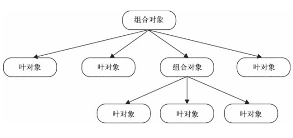

<h2 align="center">
  
:paw_prints: 前端杂烩，记录我脱离低级趣味的点点滴滴

</h2>

<div align="center">

  

</div>

## 设计模式

在程序设计中有很多使用的设计模式，而其中大部分语言的实现都是基于 `类`

### 设计原则

##### 一、单一设计原则

    一个对象或方法只做一件事情。如果一个方法成单率过多的职责，那么在需求的变迁过程中，需要改写这个方法的可能性就越大

##### 二、最少知识原则

     一个软件实体应当尽可能少的与其他实体发生相互作用，尽量减少对象之间的交互，如果两个对象之间不必彼此直接通信，那么这两个对象就不要发生直接的相互联系，可以交给第三方进行处理

##### 三、开放-封闭原则

    软件实体（类、模块、函数）等应该是可以扩展的，但是不可修改。当需要改变一个程序的功能或者给这个程序增加新功能的时候，可以使用增加代码的方式，尽量避免改动程序的代码，防止影响原系统的稳定

### 什么是设计模式

> 假设有一个空房间，我们要日复一日地往里 面放一些东西。最简单的办法当然是把这些东西 直接扔进去，但是时间久了，就会发现很难从这 个房子里找到自己想要的东西，要调整某几样东 西的位置也不容易。所以在房间里做一些柜子也 许是个更好的选择，虽然柜子会增加我们的成 本，但它可以在维护阶段为我们带来好处。使用 这些柜子存放东西的规则，或许就是一种模式

### 模式介绍

- [一、单例模式](#1单例模式)
- [二、策略模式](#2策略模式)
- [三、代理模式](#3代理模式)
- [四、迭代器模式](#4迭代器模式)
- [五、发布-订阅模式](#5发布-订阅模式)
- [六、命令模式](#6命令模式)
- [七、组合模式](#7组合模式)
- [八、模块方法模式](#8模块方法模式)
- [九、享元模式](#9享元模式)
- [十、职责链模式](#10职责链模式)
- [十一、中介者模式](#11中介者模式)
- [十二、装饰者模式](#12装饰者模式)
- [十三、状态模式](#13状态模式)
- [十四、适配器模式](#14适配器模式)
- [十五、外观模式](#15外观模式)

#### 1.单例模式

##### 1.1 定义

保证一个类仅有一个实例，并提供一个访问它的全局访问点

##### 1.2 核心

确保只有一个实例，并提供全局访问

##### 1.3 实现

假设要设置一个职位，多次调用也仅仅设置一次，我们可以使用闭包的方式缓存一个内部变量来实现这个单例

```javascript
// 提取出通用的单例
function getSingleton(fn) {
  var instance = null;

  return function() {
    if (!instance) {
      instance = fn.apply(this, arguments);
    }

    return instance;
  };
}

// 设置管理员
function SetManager(manager) {
  this.manager = manager;
}

SetManager.prototype.getManager = function() {
  console.log(this.manager);
};

var SingletonSetManager = getSingleton(function(manager) {
  var manager = new SetManager(manager);
  return manager;
});

SingletonSetManager("a").getManager(); // a
SingletonSetManager("b").getManager(); // a

// 由于单例我们提取出来了就可以复用设置管理员的方式去设置别的职位
// 比如设置Hr
function SetHr(hr) {
  this.hr = hr;
}

SetHr.prototype.getHr = function() {
  console.log(this.hr);
};

var SingletonSetHr = getSingleton(function(hr) {
  var hr = new SetHr(hr);
  return hr;
});
SingletonSetHr("hr1").getHr(); // hr1
SingletonSetHr("hr2").getHr(); // hr1
```

#### 2.策略模式

##### 2.1 定义

定义一系列的算法，把它们一个个封装起来，并且使他们可以互相替换

##### 2.2 核心

将算方法的使用规则和实现逻辑分离开来。
一个基于策略模式的程序至少由两部分组成：
第一部分：环境类，接受客户的请求，随后把请求委托给策略类
第二部分：策略类，封装了具体负责计算过程的算法

环境类和策略类之间的映射关系多用来来处理 `if` 、`else if` 的判断逻辑

##### 2.3 实现

策略模式可以用于组合一系列算法，也可用于组合一系列业务规则。

假设需要通过成绩等级来计算学生的最终得分，每个成绩等级有对应的加权值。我们可以利用对象字面量的形式直接定义这个组策略

```javascript
// 加权映射关系
var levelMap = {
  S: 10,
  A: 8,
  B: 6,
  C: 4
};

// 组策略
var scoreLevel = {
  basicScore: 80,

  S: function() {
    return this.basicScore + levelMap["S"];
  },

  A: function() {
    return this.basicScore + levelMap["A"];
  },

  B: function() {
    return this.basicScore + levelMap["B"];
  },

  C: function() {
    return this.basicScore + levelMap["C"];
  }
};

// 调用
function getScore(level) {
  return scoreLevel[level] ? scoreLevel[level]() : 0;
}

console.log(getScore("S"), getScore("A"), getScore("B"), getScore("C"), getScore("D")); // 90 88 86 84 0
```

在组合业务规则方面，比较经典的是表单的验证方法。这里列出比较关键的部分

```javascript
// 错误提示
var errorMsgs = {
  default: "输入数据格式不正确",
  minLength: "输入数据长度不足",
  isNumber: "请输入数字",
  required: "内容不为空"
};

// 规则集
var rules = {
  minLength: function(value, length, errorMsg) {
    if (value.length < length) {
      return errorMsg || errorMsgs["minLength"];
    }
  },
  isNumber: function(value, errorMsg) {
    if (!/\d+/.test(value)) {
      return errorMsg || errorMsgs["isNumber"];
    }
  },
  required: function(value, errorMsg) {
    if (value === "") {
      return errorMsg || errorMsgs["required"];
    }
  }
};

// 校验器
function Validator() {
  this.items = [];
}

Validator.prototype = {
  constructor: Validator,

  // 添加校验规则
  add: function(value, rule, errorMsg) {
    var arg = [value];

    if (rule.indexOf("minLength") !== -1) {
      var temp = rule.split(":");
      arg.push(temp[1]);
      rule = temp[0];
    }

    arg.push(errorMsg);

    this.items.push(function() {
      // 进行校验
      return rules[rule].apply(this, arg);
    });
  },

  // 开始校验
  start: function() {
    for (var i = 0; i < this.items.length; ++i) {
      var ret = this.items[i]();

      if (ret) {
        console.log(ret);
        // return ret;
      }
    }
  }
};

// 测试数据
function testTel(val) {
  return val;
}

var validate = new Validator();

validate.add(testTel("ccc"), "isNumber", "只能为数字"); // 只能为数字
validate.add(testTel(""), "required"); // 内容不为空
validate.add(testTel("123"), "minLength:5", "最少5位"); // 最少5位
validate.add(testTel("12345"), "minLength:5", "最少5位");

var ret = validate.start();

console.log(ret);
```

#### 3.代理模式

##### 3.1 定义

为一个对象提供一个代用品或占位符，以便控制对它的访问

##### 3.2 核心

当用户不方便直接访问一个对象或者不满足需要的时候，提供一个替身对象来控制对这个对象的访问，客户实际上是对替身对象的访问，替身对象对请求作出一些处理之后，再把请求转交给本体对象

##### 3.3 实现

代理模式主要有三种：`保护代理`、`虚拟代理`、`缓存代理`

保护代理主要实现了访问主体的限制行为，以过滤字符作为简单例子

```javascript
// 主体，发送消息
function sendMsg(msg) {
  console.log(msg);
}

// 代理，对消息进行过滤
function proxySendMsg(msg) {
  // 无消息则直接返回
  if (typeof msg === "undefined") {
    console.log("deny");
    return;
  }

  // 有消息则进行过滤
  msg = ("" + msg).replace(/泥\s*煤/g, "");

  sendMsg(msg);
}

sendMsg("泥煤呀泥 煤呀"); // 泥煤呀泥 煤呀
proxySendMsg("泥煤呀泥 煤"); // 呀
proxySendMsg(); // deny
```

它的意图很明显，在访问主题之前进行控制，没有消息的时候直接在代理中返回，或拒绝访问主体。有消息的时候对敏感字符进行了处理，这属于虚拟代理的模式

虚拟代理在控制对主体的访问时，加入了一些额外的操作。在浏览器滚动事件触发的时候，我们通常引入的 [函数节流](https://github.com/lodash/lodash/blob/master/debounce.js) 就是一种虚拟代理的实现

```javascript
// 函数防抖，频繁操作中不处理，直到操作完成之后（再过 delay 的时间）才一次性处理
function debounce(fn, delay) {
  delay = delay || 200;

  var timer = null;

  return function() {
    var arg = arguments;

    // 每次操作时，清除上次的定时器
    clearTimeout(timer);
    timer = null;

    // 定义新的定时器，一段时间后进行操作
    timer = setTimeout(function() {
      fn.apply(this, arg);
    }, delay);
  };
}

var count = 0;

// 主体
function scrollHandle(e) {
  console.log(e.type, ++count); // scroll
}

// 代理
var proxyScrollHandle = (function() {
  return debounce(scrollHandle, 500);
})();

window.onscroll = proxyScrollHandle;
```

缓存代理可以为一些开销大的算法结果提供暂时的缓存，提升效率。React 的常用依赖 [memoize-one](https://github.com/alexreardon/memoize-one) 就是个典型的例子

还是举个简单的例子，缓存加法

```javascript
// 主体
function add() {
  var arg = [].slice.call(arguments);

  return arg.reduce(function(a, b) {
    return a + b;
  });
}

// 代理
var proxyAdd = (function() {
  var cache = [];

  return function() {
    var arg = [].slice.call(arguments).join(",");

    // 如果有，则直接从缓存返回
    if (cache[arg]) {
      return cache[arg];
    } else {
      var ret = add.apply(this, arguments);
      return ret;
    }
  };
})();

console.log(
  add(1, 2, 3, 4),
  add(1, 2, 3, 4),

  proxyAdd(10, 20, 30, 40),
  proxyAdd(10, 20, 30, 40)
); // 10 10 100 100
```

#### 4.迭代器模式

##### 4.1 定义

迭代器模式是指提供一种方法顺序访问一个聚合对象中的各个元素，而又不需要暴露该对象的内部表示

##### 4.2 核心

在使用迭代器模式之后，即使不关心对象的内部构造，也可以按顺序访问其中的每个元素

##### 4.3 实现

ES5 数组的 map 方式`forEach`已经内置了迭代器

```javascript
[1, 2, 3].forEach(function(item, index, arr) {
  console.log(item, index, arr);
});
```

类似的遍历方式还有`map`、`filter`、`some`、`every`、`reduce`、`reduceRight`

不过对于对象的遍历，往往不能同数组一样，我们可以封装一下

```javascript
function each(obj, cb) {
  var value;

  if (Array.isArray(obj)) {
    for (var i = 0; i < obj.length; ++i) {
      value = cb.call(obj[i], i, obj[i]);

      if (value === false) {
        break;
      }
    }
  } else {
    for (var i in obj) {
      value = cb.call(obj[i], i, obj[i]);

      if (value === false) {
        break;
      }
    }
  }
}

each([1, 2, 3], function(index, value) {
  console.log(index, value);
});

each({ a: 1, b: 2 }, function(index, value) {
  console.log(index, value);
});

// 0 1
// 1 2
// 2 3

// a 1
// b 2
```

#### 5.发布-订阅模式

##### 5.1 定义

也叫做观察者模式，定义了对象间的一种一对多的依赖关系。当一个对象的状态发生改变时，所有依赖它的对象都将得到通知

##### 5.2 核心

取代对象之间硬编码的通知机制，一个对象不再显示的调用另一个对象的某个接口。这是一个十分重要的设计模式，在工作和面试中用的特别多，Vue 源码主要使用了 [发布订阅模式](#发布-订阅模式) 和 [代理模式](#代理模式)

##### 5.3 实现

JS 中的事件就是典型的`发布-订阅模式`的实现

```javascript
// 订阅
document.body.addEventListener(
  "click",
  function() {
    console.log("click1");
  },
  false
);

document.body.addEventListener(
  "click",
  function() {
    console.log("click2");
  },
  false
);

// 发布
document.body.click(); // click1  click2
```

自己实现一下对成绩和岗位的`发布-订阅模式`

```javascript
// 观察者
var observer = {
  // 订阅集合
  subscribes: {},

  // 订阅
  subscribe: function(type, fn) {
    if (!this.subscribes[type]) {
      this.subscribes[type] = [];
    }

    // 收集订阅者的处理
    typeof fn === "function" && this.subscribes[type].push(fn);
  },

  // 发布  可能会携带一些信息发布出去
  publish: function() {
    var type = [].shift.call(arguments),
      fns = this.subscribes[type];

    // 不存在的订阅类型，以及订阅时未传入处理回调的
    if (!fns || !fns.length) {
      return;
    }

    // 挨个处理调用
    for (var i = 0; i < fns.length; ++i) {
      fns[i].apply(this, arguments);
    }
  },

  // 删除订阅
  remove: function(type, fn) {
    // 删除全部
    if (typeof type === "undefined") {
      this.subscribes = {};
      return;
    }

    var fns = this.subscribes[type];

    // 不存在的订阅类型，以及订阅时未传入处理回调的
    if (!fns || !fns.length) {
      return;
    }

    if (typeof fn === "undefined") {
      delete fns;
      return;
    }

    // 挨个处理删除
    for (var i = 0; i < fns.length; ++i) {
      if (fns[i] === fn) {
        fns.splice(i, 1);
      }
    }
  }
};

// 订阅岗位列表
function jobListForA(jobs) {
  console.log("A", jobs);
}

function jobListForB(jobs) {
  console.log("B", jobs);
}

// A订阅了笔试成绩
observer.subscribe("job", jobListForA);
// B订阅了笔试成绩
observer.subscribe("job", jobListForB);

// A订阅了笔试成绩
observer.subscribe("examinationA", function(score) {
  console.log(score);
});

// B订阅了笔试成绩
observer.subscribe("examinationB", function(score) {
  console.log(score);
});

// A订阅了面试结果
observer.subscribe("interviewA", function(result) {
  console.log(result);
});

observer.publish("examinationA", 100); // 100
observer.publish("examinationB", 80); // 80
observer.publish("interviewA", "备用"); // 备用

observer.publish("job", ["前端", "后端", "测试"]); // 输出A和B的岗位

// B取消订阅了笔试成绩
observer.remove("examinationB");
// A都取消订阅了岗位
observer.remove("job", jobListForA);

observer.publish("examinationB", 80); // 没有可匹配的订阅，无输出
observer.publish("job", ["前端", "后端", "测试"]); // 输出B的岗位
```

##### 5.4 优缺点

###### 优点：

    一为时间上解耦，二为对象之间解耦

###### 缺点：

    创建订阅者本身要消耗一定的时间和内存，订阅的处理函数不一定会被执行，驻留内存有性能开销

    弱化了对象之间的联系，复杂情况下可能导致程序难以跟踪维护和理解

#### 6.命令模式

##### 6.1 定义

用一种松耦合的方式来设计程序，使得请求发送者和请求接收者能够消除彼此之间的耦合关系。命令（command）指的是一个执行某些特定事情的指令

##### 6.2 核心

命令中带有 execute `执行` 、undo `撤销` 、redo `重做` 等相关命令方法，建议显示地指示这些方法名

##### 6.3 实现

下来的例子是一个自增命令，提供执行、撤销、重做功能。采用对象创建处理的方式，定义这个自增

```javascript
// 自增
function IncrementCommand() {
  // 当前值
  this.val = 0;
  // 命令栈
  this.stack = [];
  // 栈指针位置
  this.stackPosition = -1;
}

IncrementCommand.prototype = {
  constructor: IncrementCommand,

  // 执行
  execute: function() {
    this._clearRedo();

    // 定义执行的处理
    var command = function() {
      this.val += 10;
    }.bind(this);

    // 执行并缓存起来
    command();

    this.stack.push(command);

    this.stackPosition++;

    this.getValue();
  },

  canUndo: function() {
    return this.stackPosition >= 0;
  },

  canRedo: function() {
    return this.stackPosition < this.stack.length - 1;
  },

  // 撤销
  undo: function() {
    if (!this.canUndo()) {
      return;
    }

    this.stackPosition--;

    // 命令的撤销，与执行的处理相反
    var command = function() {
      this.val -= 10;
    }.bind(this);

    // 撤销后不需要缓存
    command();

    this.getValue();
  },

  // 重做
  redo: function() {
    if (!this.canRedo()) {
      return;
    }

    // 执行栈顶的命令
    this.stack[++this.stackPosition]();

    this.getValue();
  },

  // 在执行时，已经撤销的部分不能再重做
  _clearRedo: function() {
    this.stack = this.stack.slice(0, this.stackPosition + 1);
  },

  // 获取当前值
  getValue: function() {
    console.log(this.val);
  }
};
```

再实例化进行测试，模拟执行、撤销、重做操作

```javascript
var incrementCommand = new IncrementCommand();

// 模拟事件触发，执行命令
var eventTrigger = {
  // 某个事件的处理中，直接调用命令的处理方法
  increment: function() {
    incrementCommand.execute();
  },

  incrementUndo: function() {
    incrementCommand.undo();
  },

  incrementRedo: function() {
    incrementCommand.redo();
  }
};

eventTrigger["increment"](); // 10
eventTrigger["increment"](); // 20

eventTrigger["incrementUndo"](); // 10

eventTrigger["increment"](); // 20

eventTrigger["incrementUndo"](); // 10
eventTrigger["incrementUndo"](); // 0
eventTrigger["incrementUndo"](); // 无输出

eventTrigger["incrementRedo"](); // 10
eventTrigger["incrementRedo"](); // 20
eventTrigger["incrementRedo"](); // 无输出

eventTrigger["increment"](); // 30
```

此外，还可以实现简单的宏命令

```javascript
var MacroCommand = {
  commands: [],

  add: function(command) {
    this.commands.push(command);

    return this;
  },

  remove: function(command) {
    if (!command) {
      this.commands = [];
      return;
    }

    for (var i = 0; i < this.commands.length; ++i) {
      if (this.commands[i] === command) {
        this.commands.splice(i, 1);
      }
    }
  },

  execute: function() {
    for (var i = 0; i < this.commands.length; ++i) {
      this.commands[i].execute();
    }
  }
};

var showTime = {
  execute: function() {
    console.log("time");
  }
};

var showName = {
  execute: function() {
    console.log("name");
  }
};

var showAge = {
  execute: function() {
    console.log("age");
  }
};

MacroCommand.add(showTime)
  .add(showName)
  .add(showAge);

MacroCommand.remove(showName);

MacroCommand.execute(); // time age
```

#### 7.组合模式

##### 7.1 定义

是用小的 <abbr title="叶子节点">子对象</abbr> 来构建更大的对象，而这些小的子对象本身也许是由更小的 <abbr title="叶子节点">孙对象</abbr> 构成的。

##### 7.2 核心

可以用树形结构来表示这种 `部分 - 整体` 的层次结构。调用组合对象的`执行`方法，程序会递归调用组合对象下面的叶对象的`执行`方法

<div align=center>



</div>

但要注意的是，组合模式不是父子关系，它是一种`HAS-A（聚合)`的关系，将请求委托给它所包含的所有叶对象。基于这种委托，就需要保证组合对象和叶对象拥有相同的接口

此外，也要保证用一致的方式对待 列表中的每个叶对象，即叶对象属于同一类，不需要过多特殊的额外操作

##### 7.3 实现

使用组合模式来实现扫描文件夹中的文件

```javascript
// 文件夹 组合对象
function Folder(name) {
  this.name = name;
  this.parent = null;
  this.files = [];
}

Folder.prototype = {
  constructor: Folder,

  add: function(file) {
    file.parent = this;
    this.files.push(file);

    return this;
  },

  scan: function() {
    // 委托给叶对象处理
    for (var i = 0; i < this.files.length; ++i) {
      this.files[i].scan();
    }
  },

  remove: function(file) {
    if (typeof file === "undefined") {
      this.files = [];
      return;
    }
    for (var i = 0; i < this.files.length; ++i) {
      if (this.files[i] === file) {
        this.files.splice(i, 1);
      }
    }
  }
};

// 文件 叶对象
function File(name) {
  this.name = name;
  this.parent = null;
}

File.prototype = {
  constructor: File,

  add: function() {
    console.log("文件里面不能添加文件");
  },

  scan: function() {
    var name = [this.name];
    var parent = this.parent;
    while (parent) {
      name.unshift(parent.name);
      parent = parent.parent;
    }
    console.log(name.join(" / "));
  }
};
```

构造好组合对象与叶对象的关系后，实例化，在组合对象中插入组合或叶对象

```javascript
var web = new Folder("Web");
var fe = new Folder("前端");
var css = new Folder("CSS");
var js = new Folder("js");
var rd = new Folder("后端");

web.add(fe).add(rd);

var file1 = new File("HTML权威指南.pdf");
var file2 = new File("CSS权威指南.pdf");
var file3 = new File("JavaScript权威指南.pdf");
var file4 = new File("MySQL基础.pdf");
var file5 = new File("Web安全.pdf");
var file6 = new File("Linux菜鸟.pdf");

css.add(file2);

fe.add(file1)
  .add(file3)
  .add(css)
  .add(js);

rd.add(file4).add(file5);

web.add(file6);

rd.remove(file4);

// 进行扫描
web.scan();
/**
 * Web / 前端 / HTML权威指南.pdf
 * Web / 前端 / JavaScript权威指南.pdf
 * Web / 前端 / CSS / CSS权威指南.pdf
 * Web / 后端 / Web安全.pdf
 * Web / Linux菜鸟.pdf
 */
```

##### 7.4 优缺点

###### 优点：

    可以方便的构造一棵树来表示对象的部分-整体结构。在数的构造完成后，只需要通过请求树的最顶层对象，就能对整棵树做统一一致的操作

###### 缺点：

    创建出来的对象长得都差不多，可能会使代码不好理解，创建大量对象会消耗内存，对性能造成影响

#### 8.模块方法模式

##### 8.1 定义

模板方法模式由两部分结构组成：`抽象父类` 和 `实现子类`

##### 8.2 核心

在抽象父类中封装子类的算法框架，它的`主方法`可作为一个算法的模板，指导子类以何种顺序去执行哪些方法。由父类分离出公共部分，要求子类重写某些父类的（易变化的）抽象方法

##### 8.3 实现

模板方法模式一般的实现方式为`继承`。以运动作为例子，运动有比较通用的一些处理，这部分可以抽离开来，在父类中实现。具体某项运动的特殊性则有自类来重写实现。最终子类直接调用父类的模板函数来执行

```javascript
// 体育运动
function Sport() {}

Sport.prototype = {
  constructor: Sport,

  // 主方法，按顺序执行
  init: function() {
    this.stretch();
    this.jog();
    this.deepBreath();
    this.start();

    var free = this.end();

    // 运动后还有空的话，就拉伸一下
    if (free !== false) {
      this.stretch();
    }
  },

  // 拉伸
  stretch: function() {
    console.log("拉伸");
  },

  // 慢跑
  jog: function() {
    console.log("慢跑");
  },

  // 深呼吸
  deepBreath: function() {
    console.log("深呼吸");
  },

  // 开始运动,强制重写
  start: function() {
    throw new Error("子类必须重写此方法");
  },

  // 结束运动
  end: function() {
    console.log("运动结束");
  }
};

// 篮球
function Basketball() {}

Basketball.prototype = new Sport();

// 重写相关的方法
Basketball.prototype.start = function() {
  console.log("先投上几个三分");
};

Basketball.prototype.end = function() {
  console.log("运动结束了，有事先走一步");
  return false;
};

// 马拉松
function Marathon() {}

Marathon.prototype = new Sport();

var basketball = new Basketball();
var marathon = new Marathon();

// 子类调用，最终会按照父类定义的顺序执行
basketball.init();

marathon.init();
/**
 * 拉伸
 * 慢跑
 * 深呼吸
 * 先投上几个三分
 * 运动结束了，有事先走一步
 * 拉伸
 * 慢跑
 * 深呼吸
 * Error: 子类必须重写此方法
 */
```

#### 9.享元模式

##### 9.1 定义

享元模式是一种用于性能优化的模式，它的目标是尽量减少共享对象的数量

##### 9.2 核心

运用共享技术来有效支持大量细粒度的对象。强调将对象的属性划分为 `内部状态` 与 `外部状态` 。内部状态用于对象的共享，通常不变；而外部状态则剥离开来，由具体的场景决定。

##### 9.3 实现

某商家有 50 种男款内衣和 50 种款女款内衣, 要展示它们

方案一: 造 50 个塑料男模和 50 个塑料女模, 让他们穿上展示, 代码如下:

```javascript
const Model = function(gender, underwear) {
  this.gender = gender;
  this.underwear = underwear;
};
Model.prototype.takephoto = function() {
  console.log(`${this.gender}穿着${this.underwear}`);
};
for (let i = 1; i < 51; i++) {
  const maleModel = new Model("male", `第${i}款衣服`);
  maleModel.takephoto();
}
for (let i = 1; i < 51; i++) {
  const female = new Model("female", `第${i}款衣服`);
  female.takephoto();
}
```

方案二: 造 1 个塑料男模特 1 个塑料女模特, 分别试穿 50 款内衣

```javascript
const Model = function(gender) {
  this.gender = gender;
};
Model.prototype.takephoto = function() {
  console.log(`${this.gender}穿着${this.underwear}`);
};
const maleModel = new Model("male");
const femaleModel = new Model("female");
for (let i = 1; i < 51; i++) {
  maleModel.underwear = `第${i}款衣服`;
  maleModel.takephoto();
}
for (let i = 1; i < 51; i++) {
  femaleModel.underwear = `第${i}款衣服`;
  femaleModel.takephoto();
}
```

对比发现: 方案一创建了 100 个对象, 方案二只创建了 2 个对象, 在上面示例中, `gender`(性别) 是内部对象, `underwear`(穿着) 是外部对象。

当然在方案二的中, 还可以进一步改善:

> 1 一开始就通过构造函数显示地创建实例, 可用工场模式将其升级成可控生成

> 2 在实例上手动添加 `underwear` 不是很优雅, 可以在外部单独在写个 `manager` 函数

```javascript
const Model = function(gender) {
  this.gender = gender;
};

Model.prototype.takephoto = function() {
  console.log(`${this.gender}穿着${this.underwear}`);
};

const modelFactory = (function() {
  // 优化第一点
  const modelGender = {};
  return {
    createModel: function(gender) {
      if (modelGender[gender]) {
        return modelGender[gender];
      }
      return (modelGender[gender] = new Model(gender));
    }
  };
})();

const modelManager = (function() {
  const modelObj = {};
  return {
    add: function(gender, i) {
      modelObj[i] = {
        underwear: `第${i}款衣服`
      };
      return modelFactory.createModel(gender);
    },
    copy: function(model, i) {
      // 优化第二点
      model.underwear = modelObj[i].underwear;
    }
  };
})();

for (let i = 1; i < 51; i++) {
  const maleModel = modelManager.add("male", i);
  modelManager.copy(maleModel, i);
  maleModel.takephoto();
}
for (let i = 1; i < 51; i++) {
  const femaleModel = modelManager.add("female", i);
  modelManager.copy(femaleModel, i);
  femaleModel.takephoto();
}
```

#### 10.职责链模式

##### 10.1 定义

使多个对象都有机会处理请求，从而避免请求的发送者和接受者之间的耦合关系，将这些对象连成一条链，并沿着这条链传递该请求，直到有一个对象处理它为止

##### 10.2 核心

请求发送者只需要知道链中第一个节点，弱化发送者和一组接受者之间的强联系，可以便捷地在职责链中增加或删除一个节点，同样，指定谁是第一个节点也很便捷

##### 10.3 实现

设置一条职责链，实际上是为了免去多重难以维护和阅读的`if`条件分支，以下面小学生请假流程为例

> 设计小学的请假流程是学生要提交请假申请给自己的老师，5 天以下的假期老师可以直接批准，以上的不超过 8 天的需要教导处批准，时间再长的需要校长亲自审批。

这个例子中：请求发送者只需要知道链中的第一个节点，从而弱化了发送者和一组接收者之间的强联系。如果不使用职责链模式，那么就得需要先搞清谁能处理学生的请假，才能去找到他完成请假申请

```javascript
// 定义链的某一项，请求在对象之间传递，避免请求的发送者与接收者的耦合关系
class Leader {
  constructor() {}
  // 模拟抽象方法
  approval() {
    throw new Error("请添加该阶段处理人");
  }
  // 下一节点
  setNext(nextLeader) {
    this.nextLeader = nextLeader;
    return nextLeader;
  }
  // 转到链的下一项执行
  toNext() {
    if (this.nextLeader) {
      this.nextLeader.approval(...arguments);
    } else {
      const [days, person] = arguments;
      console.log(`请假人:${person.name}, 请假：${days}天, 暂无承接人`);
    }
  }
}

class Teacher extends Leader {
  approval(days, person) {
    if (days < 5) {
      console.log(`请假人:${person.name}，请假：${days}天, 老师已审批`);
    } else {
      this.toNext(days, person);
    }
  }
}

class GuidanceDepartment extends Leader {
  approval(days, person) {
    if (5 <= days && days < 8) {
      console.log(`请假人:${person.name}, 请假：${days}天, 教务处已审批`);
    } else {
      this.toNext(days, person);
    }
  }
}

class HeadMaster extends Leader {
  approval(days, person) {
    if (8 <= days && days < 20) {
      console.log(`请假人:${person.name}, 请假：${days}天, 校长已审批`);
    } else {
      this.toNext(days, person);
    }
  }
}

var teacher = new Teacher();
var guidanceDepartment = new GuidanceDepartment();
var headMaster = new HeadMaster();
// 设置teacher下一责任链
teacher.setNext(guidanceDepartment).setNext(headMaster);
teacher.approval(2, {
  name: "小红"
});
teacher.approval(6, {
  name: "小王"
});
teacher.approval(10, {
  name: "小明"
});
teacher.approval(30, {
  name: "小李"
});
/**
 * 请假人:小红，请假：2天, 老师已审批
 * 请假人:小朱, 请假：5天, 教务处已审批
 * 请假人:小明, 请假：10天, 校长已审批
 * 请假人:小李, 请假：30天, 暂无承接人
 */
```

如果再需要添加一条职责链处理额外需求，则设立完成之后改变职责链的构成就可以

```javascript
class BureauEducation extends Leader {
  approval(days, person) {
    if (20 <= days) {
      console.log(`请假人:${person.name}, 请假：${days}天, 请带领家长办理休学手续`);
    } else {
      this.toNext(days, person);
    }
  }
}

var bureauEducation = new BureauEducation();
// 设置teacher下一责任链
teacher
  .setNext(guidanceDepartment)
  .setNext(headMaster)
  .setNext(bureauEducation);

/**
 * ...
 * 请假人:小李, 请假：30天, 请带领家长办理休学手续
 */
```

#### 11.中介者模式

##### 11.1 定义

所有的相关对象都通过`中介者`对象来通信，而不是互相引用，所以当一个对象发生改变时，只需要通知`中介者`对象即可

##### 11.2 核心

<div align=center>


</div>

复杂的调度处理交给`中介者`，使网状的`多对多`关系变成了相对简单的`一对一`关系

##### 11.3 实现

多个对象，指的不一定是实例化的对象，也可以将其理解成互为独立的多个项。当这些项在处理时，需要知晓并通过其它项的数据来处理。如果每个项都直接处理，程序会非常复杂，修改某个地方就得在多个项内部修改。我们将这个处理过程抽离出来，封装成`中介者`来处理，各项需要处理时，通知`中介者`即可

```javascript
var A = {
  score: 10,

  changeTo: function(score) {
    this.score = score;

    // 自己获取
    this.getRank();
  },

  // 直接获取
  getRank: function() {
    var scores = [this.score, B.score, C.score].sort(function(a, b) {
      return a < b;
    });

    console.log(scores.indexOf(this.score) + 1);
  }
};

var B = {
  score: 20,

  changeTo: function(score) {
    this.score = score;

    // 通过中介者获取
    rankMediator(B);
  }
};

var C = {
  score: 30,

  changeTo: function(score) {
    this.score = score;

    rankMediator(C);
  }
};

// 中介者，计算排名
function rankMediator(person) {
  var scores = [A.score, B.score, C.score].sort(function(a, b) {
    return a < b;
  });

  console.log(scores.indexOf(person.score) + 1);
}

// A通过自身来处理
A.changeTo(100); // 1

// B和C交由中介者处理
B.changeTo(200); // 1
C.changeTo(50); // 3
```

#### 12.装饰者模式

##### 12.1 定义

装饰者模式（Decorator Pattern）允许向一个现有的对象添加新的功能，同时又不改变其结构。这种类型的设计模式属于结构型模式，它是作为现有的类的一个包装。

##### 12.2 核心

这种模式创建了一个装饰类，用来包装原有的类，并在保持类方法签名完整性的前提下，提供了额外的功能

##### 12.3 实现

> JS 中的`Decorator`在原理和功能上简单明了，简而言之就是对对象进行包装，返回一个新的对象描述（descriptor）。这个概念其实和 React 中的 [高阶组件](https://react.docschina.org/docs/higher-order-components.html) 也类似，大家可以用高阶组件的方式来理解它。

最简单的装饰者，就是重写对象的属性.使用传统面向对象的方法来实现装饰，添加技能

```javascript
function Person() {}

Person.prototype.skill = function() {
  console.log("数学");
};

// 装饰器，还会音乐
function MusicDecorator(person) {
  this.person = person;
}

MusicDecorator.prototype.skill = function() {
  this.person.skill();
  console.log("音乐");
};

// 装饰器，还会跑步
function RunDecorator(person) {
  this.person = person;
}

RunDecorator.prototype.skill = function() {
  this.person.skill();
  console.log("跑步");
};

var person = new Person();

// 装饰一下
var decoratorPerson;
decoratorPerson = new MusicDecorator(person);
decoratorPerson = new RunDecorator(decoratorPerson);

person.skill(); // 数学
decoratorPerson.skill(); // 数学 音乐 跑步
```

在 JS 中，函数为一等对象，所以我们也可以使用更通用的装饰函数

```javascript
// 装饰器，在当前函数执行前先执行另一个函数
function decoratorBefore(fn, beforeFn) {
  return function() {
    var ret = beforeFn.apply(this, arguments);

    // 在前一个函数中判断，不需要执行当前函数
    if (ret !== false) {
      fn.apply(this, arguments);
    }
  };
}

function skill() {
  console.log("数学");
}

function skillMusic() {
  console.log("音乐");
}

function skillRun() {
  console.log("跑步");
}

var skillDecorator = decoratorBefore(skill, skillMusic);
skillDecorator = decoratorBefore(skillDecorator, skillRun);

skillDecorator(); // 跑步 音乐 数学
```

#### 13.状态模式

##### 13.1 定义

状态模式 (State) 允许一个对象在其内部状态改变的时候改变它的行为，对象看起来似乎修改了它的类。其实就是用一个对象或者数组记录一组状态，每个状态对应一个实现，实现的时候根据状态挨个去运行实现。

##### 13.2 核心

首先创建一个状态对象或者数组，内部保存状态变量，然后内部封装好每种动作对应的状态，然后状态对象返回一个接口对象，它可以对内部的状态修改或者调用。

##### 13.3 实现

状态机分包含：`有限状态机` （FSM） 和 `分层状态机` （HFSM）。在实际工作中，我们可以借助 [javascript-state-machine](https://github.com/jakesgordon/javascript-state-machine) 来实现基于状态机的组件，它是有限状态机这种模型的一个 JS 的实现库，下面我们讲个有限状态机的实例

> 比如超级玛丽游戏中，可能同时有好几个状态比如 跳跃，移动，射击，蹲下等，如果对这些动作一个个进行处理判断，需要多个`if-else`或者`switch`不仅丑陋不说，而且在遇到有组合动作的时候，实现就会变的更为复杂，这里可以使用`状态模式`来实现。

```javascript
class SuperMarry {
  constructor() {
    this._currentState = [];
    this.states = {
      jump() {
        console.log("跳跃!");
      },
      move() {
        console.log("移动!");
      },
      shoot() {
        console.log("射击!");
      },
      squat() {
        console.log("蹲下!");
      }
    };
  }

  change(arr) {
    // 更改当前动作
    this._currentState = arr;
    return this;
  }

  go() {
    console.log("触发动作");
    this._currentState.forEach(T => this.states[T] && this.states[T]());
    return this;
  }
}

new SuperMarry()
  .change(["jump", "shoot"])
  .go() // 触发动作  跳跃!  射击!
  .change(["squat"])
  .go(); // 触发动作  蹲下!
```

##### 13.4 优缺点

###### 优点：

    一个状态状态对应行为，封装在一个类里，更直观清晰，易于维护

    状态与状态间，行为与行为间彼此独立互不干扰

    避免事物对象本身不断膨胀，条件判断语句过多

###### 缺点：

    需要将事物的不同状态以及对应的行为拆分出来，有时候会无法避免的拆分的很细，有的时候涉及业务逻辑，一个动作拆分出对应的两个状态，动作就拆不明白了，过度设计

    必然会增加事物类和动作类的个数，有时候动作类再根据单一原则，按照功能拆成几个类，会反而使得代码混乱，可读性降低

#### 14.适配器模式

##### 14.1 定义

适配器模式 (Adapter) 将一个类的接口转换成客户希望的另外一个接口，使得原本由于 [接口](https://www.tslang.cn/docs/handbook/interfaces.html) 不兼容而不能一起工作的那些类可以一起工作。

##### 14.2 核心

是解决两个软件实体间的接口不兼容的问题，对不兼容的部分进行适配

##### 14.3 实现

在前端项目中，适配器模式的使用场景一般有以下三种情况：`库的适配` 、`参数的适配` 和 `数据的适配`。我们举一个简单的数据格式转换的适配器的例子

```javascript
// 渲染数据，格式限制为数组了
function renderData(data) {
  data.forEach(function(item) {
    console.log(item);
  });
}

// 对非数组的进行转换适配
function arrayAdapter(data) {
  if (typeof data !== "object") {
    return [];
  }

  if (Object.prototype.toString.call(data) === "[object Array]") {
    return data;
  }

  var temp = [];

  for (var item in data) {
    if (data.hasOwnProperty(item)) {
      temp.push(data[item]);
    }
  }

  return temp;
}

var data = {
  0: "A",
  1: "B",
  2: "C"
};

renderData(arrayAdapter(data)); // A B C
```

> 适配器模式本质上是一个亡羊补牢的模式，它解决的是现存的两个接口之间不兼容的问题，你不应该在软件的初期开发阶段就使用该模式；如果在设计之初我们就能够统筹的规划好接口的一致性，那么适配器就应该尽量减少使用。

#### 15.外观模式

##### 15.1 定义

为子系统中的一组接口提供一个一致的界面，定义一个高层接口，这个接口使子系统更加容易使用

##### 15.2 核心

外观模式经常使用在架构系统的模式定义中出现，可以通过请求外观接口来达到访问子系统，也可以选择越过外观来直接访问子系统

##### 15.3 实现

外观模式在 JS 中，可以认为是一组函数的集合

```javascript
// 三个处理函数
function start() {
  console.log("start");
}

function doing() {
  console.log("doing");
}

function end() {
  console.log("end");
}

// 外观函数，将一些处理统一起来，方便调用
function execute() {
  start();
  doing();
  end();
}

// 调用init开始执行
function init() {
  // 此处直接调用了高层函数，也可以选择越过它直接调用相关的函数
  execute();
}

init(); // start doing end
```

##### 15.4 优缺点

###### 优点：

    简化复杂接口。解耦和，屏蔽使用者对子系统的直接访问
