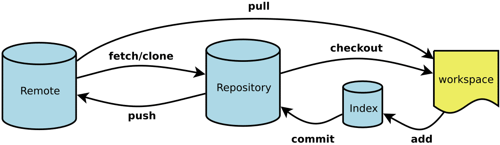
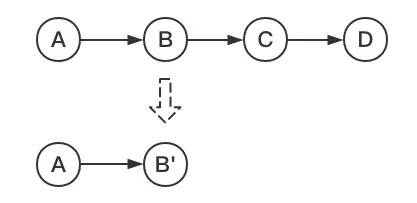
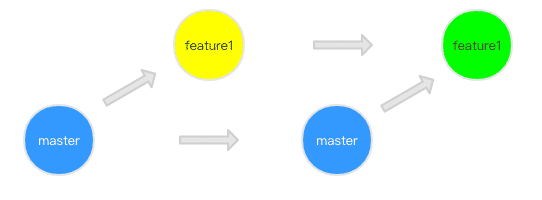
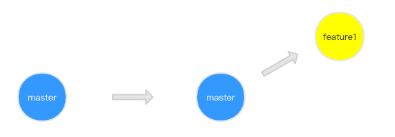

<div align="center">

## 前端物语 - Git

  

</div>

---

> 团队协作能力一直是我们招聘开发人员的重要考核指标之一。而考核这个能力的原因很简单：一般公司都不会只有一个开发…而一旦涉及多人协作开发，良好的协作能力和习惯能显著提高整个团队的开发效率。:hourglass: == :moneybag:！

### Git & SVN

| Git                                    | SVN                                |
| -------------------------------------- | ---------------------------------- |
| Git 是一个 **分布式** 的版本控制工具   | SVN 是 **集中式** 版本控制工具     |
| 它属于第 3 代版本控制工具              | 它属于第 2 代版本控制工具          |
| 客户端可以在其本地系统上克隆整个存储库 | 版本历史记录存储在服务器端存储库中 |
| 即使离线也可以提交                     | 只允许在线提交                     |
| `push` / `pull` 操作更快               | `push` / `pull` 操作较慢           |
| 工程可以用 `commit` 自动共享           | 没有任何东西自动共享               |

### Git 基础命令

<div align=center>

常见的 `gitFlow` 场景为



</div>

> - Workspace：工作区
> - Index / Stage：暂存区
> - Repository：仓库区（或本地仓库）
> - Remote：远程仓库

##### 命令简介

```bash
# 新建一个目录，将其初始化为Git代码库
$ git init [project-name]

# 下载一个项目和它的整个代码历史
$ git clone [url]

# 添加当前目录的所有文件到暂存区
$ git add .

# 提交暂存区到仓库区
$ git commit -m [message]

# 拉取远程仓库的变化
$ git pull

# 上传本地commit到当前分支
$ git push

# 强行推送当前分支到远程仓库，即使有冲突。慎用
$ git push [remote] --force

# 下载远程仓库的所有变动
$ git fetch [remote]

# 列出所有本地分支
$ git branch

# 新建一个分支，并切换到该分支
$ git checkout -b [branch]

# 切换到指定分支，并更新工作区
$ git checkout [branch-name]

# 删除分支
$ git branch -d [branch-name]

# 删除远程分支，往往需要操作权限
$ git push origin --delete [branch-name]

# 合并指定分支到当前分支
$ git merge [branch]

# 选择一个commit，合并进当前分支
$ git cherry-pick [commit]

# 暂时将未提交的变化移入缓存。拉代码时候解决冲突很好用
$ git stash

# 将最近一次缓存的代码恢复
$ git stash pop

# 显示有变更的文件
$ git status

# 显示当前分支的版本历史
$ git log

# 显示指定文件是什么人在什么时间修改过
$ git blame [file]


# 新建一个tag在当前commit
$ git tag [tag]

# 删除本地tag
$ git tag -d [tag]

# 删除远程tag，往往需要操作权限
$ git push origin :refs/tags/[tagName]
```

### git reset、git revert 和 git checkout 的区别

git 仓库的三个组成部分为：『 工作区 』 Working Directory、『 暂存区 』Stage、『 历史记录区 』History

> 工作区：在 git 管理下的正常目录都算是工作区，我们平时的编辑工作都是在工作区完成。  
> 暂存区：临时区域。里面存放将要提交文件的快照。  
> 历史记录区：git commit 后的记录区。

##### 相同点

> 都是用来撤销代码仓库中的某些更改

##### 不同点

###### 从 `commit` 层面来说

- git reset 可以将一个分支的末端指向之前的一个 commit。然后在下次 git 执行垃圾回收的时候，会把这个 commit 之后的 commit 都遗弃。git reset 还支持三种标记，用来标记 reset 指令影响的范围：
  - --mixed：会影响到暂存区和历史记录区。也是默认选项；
  - --soft：只影响历史记录区。`推荐使用，工作区修改会保留`；
  - --hard：影响工作区、暂存区和历史记录区。

> :warning:注意：因为 git reset 是直接删除 commit 记录，从而会影响到其他开发人员的分支，所以不要在公共分支（比如 develop）做这个操作。

- git checkout 可以将 HEAD 移到一个新的分支，并更新工作目录。因为可能会覆盖本地的修改，所以执行这个指令之前，最好 stash 或者 commit 缓存区和工作区的修改。

- git revert 和 git reset 的目的一样，但是做法不同，它会以创建新的 commit 的方式来撤销 commit，这样能保留之前的 commit 历史，比较安全。另外，同样因为可能会覆盖本地的修改，所以最好 stash 或者 commit 缓存区和工作区的修改。

###### 从 `文件` 层面来说

- git reset 只是把文件从历史记录区拿到缓存区，不影响工作区的内容
- git checkout 则是把文件从历史记录区拿到工作区，不影响暂存区的内容
- git revert 不支持文件层面的操作

##### 问题关键点

- 对于 commit 层面和文件层面，三个指令的差别
- git revert 不支持文件层面的操作
- 不要在公共分支做 git reset 操作

### 关于 git rebase

> :warning:注意：不要通过 rebase 对任何已经提交到公共仓库中的 commit 进行修改（你自己一个人玩的分支除外）。

###### 应用场景一：合并多个 commit 为一个完整 commit

当我们在本地仓库中提交了多次，在我们把本地提交 push 到公共仓库中之前，为了让提交记录更简洁明了，我们希望把如下分支 B、C、D 三个提交记录合并为一个完整的提交，然后再 push 到公共仓库。

<div align=center>



</div>

1. 合并最近的 3 次提交纪录，我们执行：

   ```bash
   git rebase -i HEAD~3
   ```

2. 进入 vi 编辑模式，根据以下指令修改合并信息

   ```bash
   # 指令说明
   pick：保留该commit（缩写:p）
   reword：保留该commit，但我需要修改该commit的注释（缩写:r）
   edit：保留该commit, 但我要停下来修改该提交(不仅仅修改注释)（缩写:e）
   squash：将该commit和前一个commit合并（缩写:s）
   fixup：将该commit和前一个commit合并，但我不要保留该提交的注释信息（缩写:f）
   exec：执行shell命令（缩写:x）
   drop：我要丢弃该commit（缩写:d）
   ```

3. 保存后就完成 commit 的合并了

###### 应用场景二：分支合并

> 如果只是复制某一两个提交到其他分支，完全可以使用 [上面](#命令简介) 介绍过更简单的命令：git cherry-pick

在 commit 的历史中看见 merge 场景不是一个新鲜的事情 🙈🙈🙈

<div align=center>



</div>

相比 merge 来说 git rebase 能有效避免这种情况的发生,从而减少分支合并的记录。下面是执行 `git rebase master` 后

<div align=center>



</div>

这里补充一点：rebase 做了什么操作呢？

> 首先，git 会把 feature1 分支里面的每个 commit 取消掉；  
> 其次，把上面的操作临时保存成 patch 文件，存在 .git/rebase 目录下；  
> 然后，把 feature1 分支更新到最新的 master 分支；  
> 最后，把上面保存的 patch 文件应用到 feature1 分支上；

也因为这些操作，git rebase 是一个危险命令，因为它改变了历史。除非你可以肯定需要 rebase 分支只有你自己使用，否则我们应该谨慎使用

### Git 修改 commit message

1. 修改最近一次的 commit 信息

   ```bash
   # 然后就会进入 vim 编辑模式
   git commit --amend
   ```

2. 比如要修改的 commit 是倒数第三条，使用下述命令：

   ```bash
   git rebase -i HEAD~3
   ```

3. `:wq` 退出保存，然后提交更新

   ```bash
   git rebase --continue
   # 推送到服务端
   git push -f
   ```

### Git 撤销已经推送至远端仓库的提交信息

1. 首先，通过 git log 查看提交信息，以便获取需要回退至的版本号

2. 通过 git reset –-soft <版本号>重置至指定版本的提交

3. 通过 git push origin master --force 强制提交当前版本号
