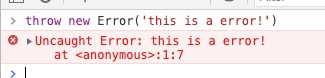
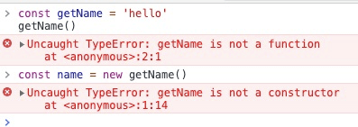
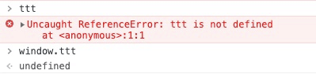
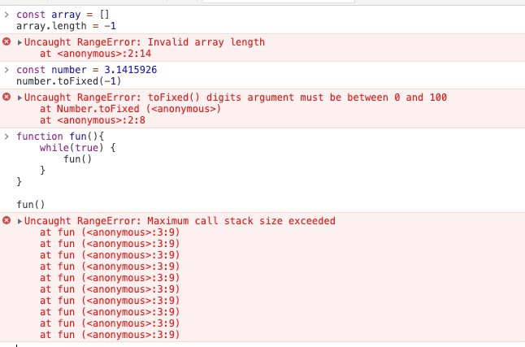
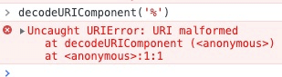

<div align="center">

## 前端物语 - 常识

  

</div>

---

#### 前端登录需要处理的流程

1. 登录前发送一个 GET 请求拿到一个验证码
2. 通过验证码进行加密账号密码发送 POST
3. 后端通过验证码解密账号密码通过返回 token 存入缓存。
4. 页面跳转前读取用户信息。如果没有用户信息（第一次登录和刷新页面），通过 token 拉取用户信息存储。
5. 用户信息等存 session（刷新页面保证用户信息最新性）。通过用户权限重写路由信息。
6. 如果通过 token 过期，发送请求 401，重定向到登录页面重新登录

> 以上是本人在项目登录实现上的一些总结，仅代表个人建议。token 超时的判定可以根据项目需求做逻辑判定，加密推荐使用 [crypto-js](https://github.com/brix/crypto-js)

#### HTTP 缓存机制

##### 强制缓存

> 服务器通知浏览器一个缓存时间，在缓存时间内，下次请求直接使用缓存，不在就执行比较缓存策略。

##### 比较缓存

> 将缓存信息中的 Etag 和 Last-Modified 通过请求发给服务器，由服务器校验，返回 304 状态码时候，浏览器直接启用缓存

#### HTTP 常见状态码

- 2 \*\*：成功
  - 200：一切 ok
- 3 \*\*：重定向
  - 301：永久重定向
  - 302：临时重定向
  - 304：之前缓存的
- 4 \*\*：客户端错误
  - 400：请求语法有误
  - 401：没有认证，token 失效
  - 403：对应资源禁止访问
  - 404：找不到对应资源
- 5 \*\*：服务端错误
  - 500：服务器内部错误
  - 503：服务器挂了

#### 常见 HTTP 的 Header

```bash

content-type # 请求字段格式/类型
connection # tcp 长链接
Keep-Alive: # 长链接时长
referer # 请求来源
accept # 接收 reponse 数据类型
Accept-Encoding # 接收内容压缩类型
Accept-Language # 接收语言
cookie # 发送请求时会把同域名下的 cookie 发送过去
```

#### 关于 HTTPS 的安全性

Q: HTTPS 为什么安全？

> `HTTPS` 通过对称加密和非对称加密和 hash 算法共同作用，在性能和安全性上达到了一个平衡。使得传输过程中不被监听、数据不会被窃取，保证网站的真实性。

Q: HTTPS 的传输过程是怎样的？

> 客户端发起 `HTTPS` 请求，服务端返回 `CA` 数字证书，客户端对证书进行验证，验证通过后本地生成用于改造对称加密算法的随机数，通过证书中的公钥对随机数进行加密传输到服务端，服务端接收后通过私钥解密得到随机数，之后的数据交互通过对称加密算法进行加解密。

Q: 为什么需要 CA 数字证书？

> 1、身份授权。确保浏览器访问的网站是经过 `CA` 验证的可信任的网站。
> 2、分发公钥。每个数字证书都包含了注册者生成的公钥（验证确保是合法的，非伪造的公钥）。在 `SSL` 握手时会通过 `certificate` 消息传输给客户端。
> 3、验证证书合法性。客户端接收到数字证书后，会对证书合法性进行验证。只有验证通过后的证书，才能够进行后续通信过程。

Q: 使用 HTTPS 会被抓包吗？

> 会被抓包，`HTTPS` 只防止用户在不知情的情况下通信被监听，如果用户主动授信，代理软件是可以对传输内容进行解密的。

#### 第一方 cookie 和第三方 cookie

##### 第一方 Cookie 的优势和应用：

> 第一方 Cookie 的最大优势是接受率高。一般主流的浏览器的都会有隐私的设置，可以让用户设置是否接受 Cookie，接受哪些 Cookie。除了 完全不接受 Cookie 这个设置以外，其他情况下，第一方 Cookie 都是会被用户接受的（不接受的话，是没办法把那小块数据保存下来的）。所以，如果没有特殊要求，使用第一方 Cookie 会比第三方 Cookie，我们通过分析工具得到的数据会更准确。

##### 第三方 Cookie 的优势和应用：

> 第三方 Cookie 的接受率不如第一方 Cookie（不过主流的浏览器默认的设置下也接受带 P3P 协议的第三方 Cookie，我的经验是接受率能达 到 90％，甚至 95％以上），但在某些特定情况下可以实现第一方 Cookie 无法实现的功能。比如，当我们有多个域名的网站需要跟踪，我们希望了解到用户点击某个广告到达域名 A 下的网页，然后可能浏览了不论那个域名下的页面，最后在域名 B 下的网页完成注册的情况。广告可以在域名 A 下的网页被跟踪到，而注册可以在域名 B 下的网页跟踪到。如果我们使用第一方 Cookie，会为域名 A 建立一个 Cookie，为域名 B 再建立一个 Cookie，他们可以关联各自域名下网页上的行为，但是无法关联起来。而使用第三方 Cookie，那么无论多少个域，都只有一个 Cookie，一个属于第三方域的 Cookie，网站下所有域都能共享这个 Cookie，那么所有的行为都能被关联起来分析。

#### 常见异常类型

##### 一、Error

`Error` 是最基本的错误类型，其他的错误类型都继承自该类型。`Error` 对象主要有两个重要属性 `message` 和 `name` 分别表示错误信息和错误名称。

  

> 程序运行过程中抛出的异常一般都有具体的类型，`Error` 类型一般都是开发人员自己抛出的异常。

##### 二、SyntaxError - 语法错误

语法错误也称为解析错误，在任何编程语言中都是最常见的错误类型。`JavaScript` 是一门解释性语言，`SyntaxError` 错误是在生成 `AST` 语法树的时候抛出来的，表示不符合编程语言的语法规范。

  

> 因此 `SyntaxError` 应该和其他类型的异常区分开，此类异常发生在 `JavaScript` 解析/编译时，此类异常一旦发生，导致整个 `js` 文件都无法执行，而其他异常发生在代码运行时，这一类的错误会导致在错误出现的那一行之后的代码无法执行，但在那一行之前的代码不会受到影响。

##### 三、TypeError - 类型错误

运行时最常见的异常，表示变量或参数不是预期类型，比如 `new` 关键字后面必须为『 构造函数 』、`()`前必须为『 函数 』。

  

##### 四、ReferenceError - 引用错误

引用一个不存在的变量时发生的错误，每当我们创建或定义一个变量时，变量名称都会写入一个变量存储中心中。这个变量存储中心就像键值存储一样，每当我们引用变量时，它都去存储中找到 `key` 并提取并返回 `value`，如果我们要找的变量不在存储中，就会抛出 `ReferenceError`。


> 如果我们调用的是一个已经存在的变量的一个不存在的属性，则不会抛出 `ReferenceError`，因为变量本身已经在存储中了，调用它不存在的属性只会是未定义状态，也就是 `undefined`。

##### 五、RangeError - 边界错误

表示超出有效范围时发生的异常，主要的有以下几种情况：

- 数组长度为负数或超长；
- 数字类型的方法参数超出预定义范围；
- 函数堆栈调用超过最大值；



##### 六、URIError - URL 错误

在调用 URI 相关的方法中 URL 无效时抛出的异常，主要包括 `encodeURI(）`、`decodeURI()`、`encodeURIComponent()`、`decodeURIComponent()`、`escape()`和 `unescape(）`几个函数。


#### CSRF 攻击实例

CSRF 跨站域请求伪造 **_Cross Site Request Forgery_**：可以在受害者毫不知情的情况下以受害者名义伪造请求发送给受攻击站点，从而在并未授权的情况下执行在权限保护之下的操作。

> 比如说，受害者 Bob 在银行有一笔存款，通过对银行的网站发送请求 `http://bank.example/withdraw?account=bob&amount=1000000&for=bob2`可以使 Bob 把 1000000 的存款转到 bob2 的账号下。通常情况下，该请求发送到网站后，服务器会先验证该请求是否来自一个合法的 session，并且该 session 的用户 Bob 已经成功登陆。黑客 Mallory 自己在该银行也有账户，他知道上文中的 URL 可以把钱进行转帐操作。Mallory 可以自己发送一个请求给银行：`http://bank.example/withdraw?account=bob&amount=1000000&for=Mallory`。但是这个请求来自 Mallory 而非 Bob，他不能通过安全认证，因此该请求不会起作用。这时，Mallory 想到使用 CSRF 的攻击方式，他先自己做一个网站，在网站中放入如下代码： `src=”http://bank.example/withdraw?account=bob&amount=1000000&for=Mallory ”`，并且通过广告等诱使 Bob 来访问他的网站。当 Bob 访问该网站时，上述 url 就会从 Bob 的浏览器发向银行，而这个请求会附带 Bob 浏览器中的 cookie 一起发向银行服务器。大多数情况下，该请求会失败，因为他要求 Bob 的认证信息。但是，如果 Bob 当时恰巧刚访问他的银行后不久，他的浏览器与银行网站之间的 session 尚未过期，浏览器的 cookie 之中含有 Bob 的认证信息。这时，悲剧发生了，这个 url 请求就会得到响应，钱将从 Bob 的账号转移到 Mallory 的账号，而 Bob 当时毫不知情。等以后 Bob 发现账户钱少了，即使他去银行查询日志，他也只能发现确实有一个来自于他本人的合法请求转移了资金，没有任何被攻击的痕迹。而 Mallory 则可以拿到钱后逍遥法外。

#### 当前防御 CSRF 的几种策略

在业界目前防御 CSRF 攻击主要有三种策略：

- 验证 HTTP `Referer` 字段；(同域访问，在不同浏览器环境下，有些方法可以篡改 `referer` 的值)
- 在请求地址中添加 token 并验证；(a 和 form 标签中加 token，黑客可以通过 `referer` 方式获得 token)
- 在 HTTP 头中自定义属性并验证。(把验证加入到 http 头部的自定义属性(`Authorization`)中去。通过 `XMLHttpRequest` 类可以添加。在非 [SPA](https://baike.baidu.com/item/SPA/17536313?fr=aladdin) 中实现中 `进行前进`、 `后退` 、`刷新` 、`收藏` 等操作不是由这个类发起的，失去效果。代价太大)

#### XSS 跨站脚本攻击

XSS 又叫 CSS (**_Cross Site Script_**)，指的是恶意攻击者往 Web 页面里插入恶意 html 代码，当用户浏览该页之时，嵌入其中 Web 里面的 html 代码会被执行，从而达到恶意用户的特殊目的。

可以分成三类:

- 反射型：经过后端，不经过数据库(一般表现为带 XSS 攻击向量的链接，非持久性攻击)
- 存储型：经过后端，经过数据库(将攻击代码存入数据库中)
- DOM：不经过后端,DOM - based XSS 漏洞是基于文档对象模型 (Document Objeet Model,DOM)的一种漏洞,dom - xss 是通过 url 传入参数去控制触发的。(用户通过交互进行攻击)
  也可以分成两种类型：
  - 1.非持久型攻击
  - 2.持久型攻击

#### MVVM 和 MVC 的区别

###### MVC

> MVC 模式可以这样理解。将 html 看成 view，js 看成 controller，处理用户与应用的交互，响应对 view 的操作（对事件的监听），调用 Model 对数据进行操作，完成 model 与 view 的同步（根据 model 的改变，通过选择器对 view 进行操作），将 js 的 ajax 当做 Model，从服务器获取数据，MVC 是单向的。

###### MVVM

> 它实现了 View 和 Model 的自动同步，也就是当 Model 的属性改变时，我们不用再自己手动操作 Dom 元素，来改变 View 的显示，而是改变属性后该属性对应 View 层显示会自动改变，MVVM 是双向的。

#### 五大浏览器和四大内核

###### 五大浏览器

`IE浏览器`、`Opera浏览器`、`Safari浏览器`、`Firefox浏览器`、`Chrome浏览器`

###### 四大内核

- **Trident**：俗称 IE 内核，也被叫做 MSHTML 引擎，目前在使用的浏览器有 IE11 -，以及各种国产多核浏览器中的 IE 兼容模块。另外微软的 Edge 浏览器不再使用 MSHTML 引擎，而是使用类全新的引擎 EdgeHTML。

- **Gecko**：俗称 Firefox 内核，Netscape6 开始采用的内核，后来的 Mozilla FireFox（火狐浏览器）也采用了该内核，Gecko 的特点是代码完全公开，因此，其可开发程度很高，全世界的程序员都可以为其编写代码，增加功能。因为这是个开源内核，因此受到许多人的青睐，Gecko 内核的浏览器也很多，这也是 Gecko 内核虽然年轻但市场占有率能够迅速提高的重要原因。

- **Webkit**：Safari 内核，也是 Chrome 内核原型，主要是 Safari 浏览器在使用的内核，也是特性上表现较好的浏览器内核。也被大量使用在移动端浏览器上。

- **Blink**： 由 Google 和 Opera Software 开发，在 Chrome（28 及往后版本）、Opera（15 及往后版本）和 Yandex 浏览器中使用。Blink 其实是 Webkit 的一个分支，添加了一些优化的新特性，例如跨进程的 iframe，将 DOM 移入 JavaScript 中来提高 JavaScript 对 DOM 的访问速度等，目前较多的移动端应用内嵌的浏览器内核也渐渐开始采用 Blink。

- <s>**_Presto_**</s>：Opera 前内核，为啥说是前内核呢？因为 Opera12.17 以后便拥抱了 Google Chrome 的 Blink 内核，此内核就没了寄托

| 浏览器         | 内核                                                                      | 描述                                                 |
| -------------- | ------------------------------------------------------------------------- | ---------------------------------------------------- |
| IE 浏览器      | Trident 内核，也是俗称的 IE 内核                                          | IE 是微软公司旗下浏览器，是目国内用户量最多的浏览器  |
| Opera 浏览器   | 最初是自己的 Presto 内核，后来是 Webkit，现在是 Blink 内核                | Opera 是挪威 Opera Software ASA 公司旗下的浏览器     |
| Safari 浏览器  | Webkit 内核                                                               | 第二次浏览器大战是从苹果公司发布 Safari 浏览器开始的 |
| Firefox 浏览器 | Gecko 内核，俗称 Firefox 内核                                             | Firefox 浏览器是 Mozilla 公司旗下浏览器              |
| Chrome 浏览器  | 统称为 Chromium 内核或 Chrome 内核，以前是 Webkit 内核，现在是 Blink 内核 | Chrome 浏览器是 google 旗下的浏览器，开发人员最爱    |

#### 关于 npm 和 yarn

###### node 的版本管理

- 1、安装 n 模块：

  ```bash
    npm install -g n
  ```

- 2、升级 node.js 到最新稳定版

  ```bash
    n stable
  ```

- 3、安装指定版本：

  ```bash
    n v6.11.5
  ```

- > 安装指定版本 yarn 可以通过 npm npm install -g yarn@版本号

###### npm install 的-save 和-save-dev

```bash
  npm install lodash # 安装模块到项目目录下

  npm install -g lodash # -g 的意思是将模块安装到全局，具体安装到磁盘哪个位置，要看 npm config prefix 的位置。

  npm install -save lodash # -save 的意思是将模块安装到项目目录下，并在package文件的dependencies节点写入依赖。

  npm install -save-dev lodash # -save-dev 的意思是将模块安装到项目目录下，并在package文件的devDependencies节点写入依赖。
```

###### npm 和 yarn 应用对比

| npm                            | yarn                       | 描述                                 |
| ------------------------------ | -------------------------- | ------------------------------------ |
| npm install                    | yarn                       | 安装 package.json 依赖               |
| npm rebuild                    | yarn install --force       | 重构一下依赖                         |
| npm install --save react       | yarn add react             | 安装模块，写入 dependencies 节点     |
| npm install --save-dev react   | yarn add react --dev/-D    | 安装模块，写入 devDependencies 节点  |
| npm uninstall --save react     | yarn remove react          | 移除模块，删除 dependencies 对应节点 |
| npm uninstall --save-dev react | yarn remove react          | 移除模块，删除 dependencies 对应节点 |
| npm update --save 包名@版本    | yarn upgrade 包名@版本     | 更新模块到固定版本                   |
| npm install -g react           | yarn global add react      | 将包安装到全局                       |
| npm list -g --depth=0          | yarn global list --depth=0 | 查看全局安装的包                     |
