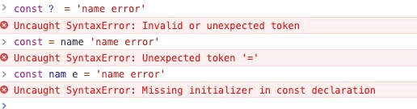

<div align="center">

## 前端物语 - 常识

  

</div>

---

#### 前端登录需要处理的流程

1. 登录前发送一个 GET 请求拿到一个验证码
2. 通过验证码进行加密账号密码发送 POST
3. 后端通过验证码解密账号密码通过返回 token 存入缓存。
4. 页面跳转前读取用户信息。如果没有用户信息（第一次登录和刷新页面），通过 token 拉取用户信息存储。
5. 用户信息等存 session（刷新页面保证用户信息最新性）。通过用户权限重写路由信息。
6. 如果通过 token 过期，发送请求 401，重定向到登录页面重新登录

> 以上是本人在项目登录实现上的一些总结，仅代表个人建议。token 超时的判定可以根据项目需求做逻辑判定，加密推荐使用 [crypto-js](https://github.com/brix/crypto-js)

#### HTTP 缓存机制

1. 浏览器发送请求前，根据请求头的`expries`和`cache-control`判断是否命中强缓存策略。如果命中，直接从缓存中获取资源，并不会发送请求。如果没有命中，则进行下一步。
2. 没有命中强缓存规则，浏览器会发送请求，根据请求头的`last-modified`和`etag`判断是否命中协商缓存。如果命中，直接从缓存中获取资源。如果没有命中，则进行下一步。
3. 如果前两步都没有命中，直接从服务端获取资源。

  

#### HTTP 常见状态码

- 2 \*\*：成功
  - 200：一切 ok
- 3 \*\*：重定向
  - 301：永久重定向
  - 302：临时重定向
  - 304：之前缓存的
- 4 \*\*：客户端错误
  - 400：请求语法有误
  - 401：没有认证，token 失效
  - 403：对应资源禁止访问
  - 404：找不到对应资源
- 5 \*\*：服务端错误
  - 500：服务器内部错误
  - 503：服务器挂了

#### 常见 HTTP 的 Header

```bash

content-type # 请求字段格式/类型
connection # tcp 长链接
Keep-Alive: # 长链接时长
referer # 请求来源
accept # 接收 reponse 数据类型
Accept-Encoding # 接收内容压缩类型
Accept-Language # 接收语言
cookie # 发送请求时会把同域名下的 cookie 发送过去
```

#### 关于 HTTPS 的安全性

Q: HTTPS 为什么安全？

> `HTTPS` 通过对称加密和非对称加密和 hash 算法共同作用，在性能和安全性上达到了一个平衡。使得传输过程中不被监听、数据不会被窃取，保证网站的真实性。

Q: HTTPS 的传输过程是怎样的？

> 1. 客户端发起 `HTTPS` 请求，服务端返回 `CA` 数字证书
> 2. 客户端对证书进行验证，验证通过后本地生成用于改造对称加密算法的随机数
> 3. 通过证书中的公钥对随机数进行加密传输到服务端
> 4. 服务端接收后通过私钥解密得到随机数
> 5. 之后的数据交互通过对称加密算法进行加解密。

Q: 为什么需要 CA 数字证书？

> 1、身份授权。确保浏览器访问的网站是经过 `CA` 验证的可信任的网站。
> 2、分发公钥。每个数字证书都包含了注册者生成的公钥（验证确保是合法的，非伪造的公钥）。在 `SSL` 握手时会通过 `certificate` 消息传输给客户端。
> 3、验证证书合法性。客户端接收到数字证书后，会对证书合法性进行验证。只有验证通过后的证书，才能够进行后续通信过程。

Q: 使用 HTTPS 会被抓包吗？

> 会被抓包，`HTTPS` 只防止用户在不知情的情况下通信被监听，如果用户主动授信，代理软件是可以对传输内容进行解密的。

#### 第一方 cookie 和第三方 cookie

##### 第一方 Cookie 的优势和应用：

> 第一方 Cookie 的最大优势是接受率高。一般主流的浏览器的都会有隐私的设置，可以让用户设置是否接受 Cookie，接受哪些 Cookie。除了 完全不接受 Cookie 这个设置以外，其他情况下，第一方 Cookie 都是会被用户接受的（不接受的话，是没办法把那小块数据保存下来的）。所以，如果没有特殊要求，使用第一方 Cookie 会比第三方 Cookie，我们通过分析工具得到的数据会更准确。

##### 第三方 Cookie 的优势和应用：

> 第三方 Cookie 的接受率不如第一方 Cookie（不过主流的浏览器默认的设置下也接受带 P3P 协议的第三方 Cookie，我的经验是接受率能达 到 90％，甚至 95％以上），但在某些特定情况下可以实现第一方 Cookie 无法实现的功能。比如，当我们有多个域名的网站需要跟踪，我们希望了解到用户点击某个广告到达域名 A 下的网页，然后可能浏览了不论那个域名下的页面，最后在域名 B 下的网页完成注册的情况。广告可以在域名 A 下的网页被跟踪到，而注册可以在域名 B 下的网页跟踪到。如果我们使用第一方 Cookie，会为域名 A 建立一个 Cookie，为域名 B 再建立一个 Cookie，他们可以关联各自域名下网页上的行为，但是无法关联起来。而使用第三方 Cookie，那么无论多少个域，都只有一个 Cookie，一个属于第三方域的 Cookie，网站下所有域都能共享这个 Cookie，那么所有的行为都能被关联起来分析。

#### 常见异常类型

##### 一、Error

`Error` 是最基本的错误类型，其他的错误类型都继承自该类型。`Error` 对象主要有两个重要属性 `message` 和 `name` 分别表示错误信息和错误名称。

  

> 程序运行过程中抛出的异常一般都有具体的类型，`Error` 类型一般都是开发人员自己抛出的异常。

##### 二、SyntaxError - 语法错误

语法错误也称为解析错误，在任何编程语言中都是最常见的错误类型。`JavaScript` 是一门解释性语言，`SyntaxError` 错误是在生成 `AST` 语法树的时候抛出来的，表示不符合编程语言的语法规范。

  

> 因此 `SyntaxError` 应该和其他类型的异常区分开，此类异常发生在 `JavaScript` 解析/编译时，此类异常一旦发生，导致整个 `js` 文件都无法执行，而其他异常发生在代码运行时，这一类的错误会导致在错误出现的那一行之后的代码无法执行，但在那一行之前的代码不会受到影响。

##### 三、TypeError - 类型错误

运行时最常见的异常，表示变量或参数不是预期类型，比如 `new` 关键字后面必须为『 构造函数 』、`()`前必须为『 函数 』。

  

##### 四、ReferenceError - 引用错误

引用一个不存在的变量时发生的错误，每当我们创建或定义一个变量时，变量名称都会写入一个变量存储中心中。这个变量存储中心就像键值存储一样，每当我们引用变量时，它都去存储中找到 `key` 并提取并返回 `value`，如果我们要找的变量不在存储中，就会抛出 `ReferenceError`。


> 如果我们调用的是一个已经存在的变量的一个不存在的属性，则不会抛出 `ReferenceError`，因为变量本身已经在存储中了，调用它不存在的属性只会是未定义状态，也就是 `undefined`。

##### 五、RangeError - 边界错误

表示超出有效范围时发生的异常，主要的有以下几种情况：

- 数组长度为负数或超长；
- 数字类型的方法参数超出预定义范围；
- 函数堆栈调用超过最大值；


##### 六、URIError - URL 错误

在调用 URI 相关的方法中 URL 无效时抛出的异常，主要包括 `encodeURI(）`、`decodeURI()`、`encodeURIComponent()`、`decodeURIComponent()`、`escape()`和 `unescape(）`几个函数。


#### CSRF 攻击实例

CSRF 跨站域请求伪造 **_Cross Site Request Forgery_**：可以在受害者毫不知情的情况下以受害者名义伪造请求发送给受攻击站点，从而在并未授权的情况下执行在权限保护之下的操作。

> 比如说，受害者 Bob 在银行有一笔存款，通过对银行的网站发送请求 `http://bank.example/withdraw?account=bob&amount=1000000&for=bob2`可以使 Bob 把 1000000 的存款转到 bob2 的账号下。通常情况下，该请求发送到网站后，服务器会先验证该请求是否来自一个合法的 session，并且该 session 的用户 Bob 已经成功登陆。黑客 Mallory 自己在该银行也有账户，他知道上文中的 URL 可以把钱进行转帐操作。Mallory 可以自己发送一个请求给银行：`http://bank.example/withdraw?account=bob&amount=1000000&for=Mallory`。但是这个请求来自 Mallory 而非 Bob，他不能通过安全认证，因此该请求不会起作用。这时，Mallory 想到使用 CSRF 的攻击方式，他先自己做一个网站，在网站中放入如下代码： `src=”http://bank.example/withdraw?account=bob&amount=1000000&for=Mallory ”`，并且通过广告等诱使 Bob 来访问他的网站。当 Bob 访问该网站时，上述 url 就会从 Bob 的浏览器发向银行，而这个请求会附带 Bob 浏览器中的 cookie 一起发向银行服务器。大多数情况下，该请求会失败，因为他要求 Bob 的认证信息。但是，如果 Bob 当时恰巧刚访问他的银行后不久，他的浏览器与银行网站之间的 session 尚未过期，浏览器的 cookie 之中含有 Bob 的认证信息。这时，悲剧发生了，这个 url 请求就会得到响应，钱将从 Bob 的账号转移到 Mallory 的账号，而 Bob 当时毫不知情。等以后 Bob 发现账户钱少了，即使他去银行查询日志，他也只能发现确实有一个来自于他本人的合法请求转移了资金，没有任何被攻击的痕迹。而 Mallory 则可以拿到钱后逍遥法外。

#### 当前防御 CSRF 的几种策略

在业界目前防御 CSRF 攻击主要有三种策略：

- 验证 HTTP `Referer` 字段；(同域访问，在不同浏览器环境下，有些方法可以篡改 `referer` 的值)
- 在请求地址中添加 token 并验证；(a 和 form 标签中加 token，黑客可以通过 `referer` 方式获得 token)
- 在 HTTP 头中自定义属性并验证。(把验证加入到 http 头部的自定义属性(`Authorization`)中去。通过 `XMLHttpRequest` 类可以添加。在非 [SPA](https://baike.baidu.com/item/SPA/17536313?fr=aladdin) 中实现中 `进行前进`、 `后退` 、`刷新` 、`收藏` 等操作不是由这个类发起的，失去效果。代价太大)

#### XSS 跨站脚本攻击

XSS 又叫 CSS (**_Cross Site Script_**)，指的是恶意攻击者往 Web 页面里插入恶意 html 代码，当用户浏览该页之时，嵌入其中 Web 里面的 html 代码会被执行，从而达到恶意用户的特殊目的。

可以分成三类:

- 反射型：经过后端，不经过数据库(一般表现为带 XSS 攻击向量的链接，非持久性攻击)
- 存储型：经过后端，经过数据库(将攻击代码存入数据库中)
- DOM：不经过后端,DOM - based XSS 漏洞是基于文档对象模型 (Document Objeet Model,DOM)的一种漏洞,dom - xss 是通过 url 传入参数去控制触发的。(用户通过交互进行攻击)
  也可以分成两种类型：
  - 1.非持久型攻击
  - 2.持久型攻击

#### MVVM 和 MVC 的区别

###### MVC

> MVC 模式可以这样理解。将 html 看成 view，js 看成 controller，处理用户与应用的交互，响应对 view 的操作（对事件的监听），调用 Model 对数据进行操作，完成 model 与 view 的同步（根据 model 的改变，通过选择器对 view 进行操作），将 js 的 ajax 当做 Model，从服务器获取数据，MVC 是单向的。

###### MVVM

> 它实现了 View 和 Model 的自动同步，也就是当 Model 的属性改变时，我们不用再自己手动操作 Dom 元素，来改变 View 的显示，而是改变属性后该属性对应 View 层显示会自动改变，MVVM 是双向的。

#### 五大浏览器和四大内核

###### 五大浏览器

`IE浏览器`、`Opera浏览器`、`Safari浏览器`、`Firefox浏览器`、`Chrome浏览器`

###### 四大内核

- **Trident**：俗称 IE 内核，也被叫做 MSHTML 引擎，目前在使用的浏览器有 IE11 -，以及各种国产多核浏览器中的 IE 兼容模块。另外微软的 Edge 浏览器不再使用 MSHTML 引擎，而是使用类全新的引擎 EdgeHTML。

- **Gecko**：俗称 Firefox 内核，Netscape6 开始采用的内核，后来的 Mozilla FireFox（火狐浏览器）也采用了该内核，Gecko 的特点是代码完全公开，因此，其可开发程度很高，全世界的程序员都可以为其编写代码，增加功能。因为这是个开源内核，因此受到许多人的青睐，Gecko 内核的浏览器也很多，这也是 Gecko 内核虽然年轻但市场占有率能够迅速提高的重要原因。

- **Webkit**：Safari 内核，也是 Chrome 内核原型，主要是 Safari 浏览器在使用的内核，也是特性上表现较好的浏览器内核。也被大量使用在移动端浏览器上。

- **Blink**： 由 Google 和 Opera Software 开发，在 Chrome（28 及往后版本）、Opera（15 及往后版本）和 Yandex 浏览器中使用。Blink 其实是 Webkit 的一个分支，添加了一些优化的新特性，例如跨进程的 iframe，将 DOM 移入 JavaScript 中来提高 JavaScript 对 DOM 的访问速度等，目前较多的移动端应用内嵌的浏览器内核也渐渐开始采用 Blink。

- <s>**_Presto_**</s>：Opera 前内核，为啥说是前内核呢？因为 Opera12.17 以后便拥抱了 Google Chrome 的 Blink 内核，此内核就没了寄托

| 浏览器         | 内核                                                                      | 描述                                                 |
| -------------- | ------------------------------------------------------------------------- | ---------------------------------------------------- |
| IE 浏览器      | Trident 内核，也是俗称的 IE 内核                                          | IE 是微软公司旗下浏览器，是目国内用户量最多的浏览器  |
| Opera 浏览器   | 最初是自己的 Presto 内核，后来是 Webkit，现在是 Blink 内核                | Opera 是挪威 Opera Software ASA 公司旗下的浏览器     |
| Safari 浏览器  | Webkit 内核                                                               | 第二次浏览器大战是从苹果公司发布 Safari 浏览器开始的 |
| Firefox 浏览器 | Gecko 内核，俗称 Firefox 内核                                             | Firefox 浏览器是 Mozilla 公司旗下浏览器              |
| Chrome 浏览器  | 统称为 Chromium 内核或 Chrome 内核，以前是 Webkit 内核，现在是 Blink 内核 | Chrome 浏览器是 google 旗下的浏览器，开发人员最爱    |

#### 关于快数组、慢数组

`JavaScript` 中， `JSArray` 继承自 `JSObject` ，或者说它就是一个特殊的对象，内部是以 `key-value` 形式存储数据，所以 `JavaScript` 中的数组可以存放不同类型的值。它有两种存储方式，快数组与慢数组，初始化空数组时，使用快数组，快数组使用连续的内存空间，当数组长度达到最大时，`JSArray` 会进行动态的扩容，以存储更多的元素，相对慢数组，性能要好得多。当数组中 `hole` 太多时，会转变成慢数组，即以哈希表的方式（ `key-value `的形式）存储数据，以节省内存空间。

#### 关于 npm 和 yarn

###### node 的版本管理

- 1、安装 n 模块：

  ```bash
    npm install -g n
  ```

- 2、升级 node.js 到最新稳定版

  ```bash
    n stable
  ```

- 3、安装指定版本：

  ```bash
    n v6.11.5
  ```

- > 安装指定版本 yarn 可以通过 npm npm install -g yarn@版本号

###### npm install 的-save 和-save-dev

```bash
  npm install lodash # 安装模块到项目目录下

  npm install -g lodash # -g 的意思是将模块安装到全局，具体安装到磁盘哪个位置，要看 npm config prefix 的位置。

  npm install -save lodash # -save 的意思是将模块安装到项目目录下，并在package文件的dependencies节点写入依赖。

  npm install -save-dev lodash # -save-dev 的意思是将模块安装到项目目录下，并在package文件的devDependencies节点写入依赖。
```

###### npm 和 yarn 应用对比

| npm                            | yarn                       | 描述                                 |
| ------------------------------ | -------------------------- | ------------------------------------ |
| npm install                    | yarn                       | 安装 package.json 依赖               |
| npm rebuild                    | yarn install --force       | 重构一下依赖                         |
| npm install --save react       | yarn add react             | 安装模块，写入 dependencies 节点     |
| npm install --save-dev react   | yarn add react --dev/-D    | 安装模块，写入 devDependencies 节点  |
| npm uninstall --save react     | yarn remove react          | 移除模块，删除 dependencies 对应节点 |
| npm uninstall --save-dev react | yarn remove react          | 移除模块，删除 dependencies 对应节点 |
| npm update --save 包名@版本    | yarn upgrade 包名@版本     | 更新模块到固定版本                   |
| npm install -g react           | yarn global add react      | 将包安装到全局                       |
| npm list -g --depth=0          | yarn global list --depth=0 | 查看全局安装的包                     |

#### 关于 require 和 import

##### require/exports 的使用方式

```javascript
const fs = require("fs");
exports.fs = fs;
module.exports = fs;
```

`exports` 是对 `module.exports` 的引用，相当于

```javascript
exports = module.exports = {};
```

##### import/export 的使用方式

```javascript
import fs from "fs";
import { readFile } from "fs"; //从 fs 导入 readFile 模块
import { default as fs } from "fs"; //从 fs 中导入使用 export default 导出的模块
import * as fileSystem from "fs"; //从 fs 导入所有模块，引用对象名为 fileSystem
import { readFile as read } from "fs"; //从 fs 导入 readFile 模块，引用对象名为 read
import("/modules/my-module.js") //动态导入
  .then((module) => {
    // Do something with the module.
  });
```

```javascript
export default fs
export const fs
export function readFile
export {readFile, read}
export * from 'fs'
```

> 建议 1：建议明确列出我们要引用的内容。，使用 `*` 虽然很方便，但是不利于现代的构建工具检测未被使用的函数，影响代码优化。

> 建议 2: 请不要滥用动态导入 `import()`（只有在必要情况下采用）。静态框架能更好的初始化依赖，而且更有利于静态分析工具和 `tree shaking` 发挥作用

##### 差异性

| 差异点     | require                                                                                               | import                                                                                                                                                                                                                  |
| ---------- | ----------------------------------------------------------------------------------------------------- | ----------------------------------------------------------------------------------------------------------------------------------------------------------------------------------------------------------------------- |
| 出现的时间 | 2009 年出自 CommonJS                                                                                  | 2015 年出自 ES6                                                                                                                                                                                                         |
| 使用背景   | 为服务器端开发设计的                                                                                  | 浏览器端，契合异步加载脚本文件的特性                                                                                                                                                                                    |
| 加载方式   | 同步加载，运行时动态加载。 加载的是一个对象（即 module.exports 属性），该对象只有在脚本运行完才会生成 | 异步加载，静态编译，ES6 模块不是对象，它的对外接口只是一种静态定义，在代码静态解析阶段就会生成                                                                                                                          |
| 输出对比   | 输出的是一个值的拷贝，一旦输出一个值，模块内部的变化不会影响到这个值                                  | 输出的是值的引用，JS 引擎对脚本静态分析的时候，遇到模块加载命令 import，就会生成一个只读引用。等到脚本真正执行时，再根据这个只读引用，到被加载的那个模块里面去取值。若文件引用的模块值改变，import 引入的模块值会改变。 |
| 使用方式   | require/exports                                                                                       | import/export                                                                                                                                                                                                           |

#### import 最后被解析成了什么

##### import 经过 `webpack` 编译打包后最终变成了什么？

> `import` 经过 `webpack` 打包以后变成一些 `Map` `对象，key` 为模块路径，`value` 为模块的可执行函数；

##### 在浏览器中是怎么运行的？

> 代码加载到浏览器以后从入口模块开始执行，其中执行的过程中，最重要的就是 `webpack` 定义的`__webpack_require__`函数，负责实际的模块加载并执行这些模块内容，返回执行结果，其实就是读取 `Map` 对象，然后执行相应的函数；

##### 说说 import 异步方法

> `import('xxModule')`它会单独打成一个包，采用动态加载的方式，具体过程：当用户触发其加载的动作时，会动态的在 `head` 标签中创建一个 `script` 标签，然后发送一个 `http` 请求，加载模块，模块加载完成以后自动执行其中的代码，主要的工作有两个，更改缓存中模块的状态，另一个就是执行模块代码。

#### 函数式编程

命令式编程中 `典型` 的方法和过程都深深地根植于它们所在的环境中，通过状态、依赖和有效作用达成；纯函数与此相反，它与环境无关，只要我们愿意，可以在任何地方运行它

> 面向对象语言的问题是，它们永远都要随身携带那些隐式的环境。你只需要一个香蕉，但却得到一个拿着香蕉的大猩猩...以及整个丛林

##### 函数与其他数据类型一样，处于平等地位

可作为变量一样被传递、返回或者在函数中嵌套函数。可作为参数。使用总有返回值的表达式而不是语句

##### 函数应该纯天然，无副作用

副作用是指，函数内部与外部互动，产生运算以外的其他结果。 例如在函数调用的过程中，利用并修改到了外部的变量，那么就是一个有副作用的函数。副作用包含：

- 改变了任何外部变量或对象属性（例如，全局变量，或者一个在父级函数作用域链上的变量）
- 写日志
- 在屏幕输出
- 写文件
- 发网络请求
- 触发任何外部进程
- 调用另一个有副作用的函数

##### 引用透明

纯函数的运行不应该依赖于外部变量或状态，只依赖于输入的参数。对于相同的输入参数，返回的结果一定相同。

##### 不可变量

如果要改变变量，则需要把数据 deep copy 出去进行修改

###### 题外话

_`react` 在 `16.8` 引入了 `hooks` 目的就是为了拥抱`函数式编程`，让函数式组件有了状态和其他 `react` 特性。_

#### PWA 简介

`渐进式网络应用`（PWA）是谷歌在 2015 年底提出的概念。基本上算是 `web` 应用程序，但在外观和感觉上与原生 `app` 类似。支持 `PWA` 的网站可以提供脱机工作、推送通知和设备硬件访问等功能。具有以下优点：

**1.更小更快**：渐进式的 web 应用程序比原生应用程序小得多。他们甚至不需要安装。这是他们没有浪费磁盘空间和加载速度非常快。
**2.响应式界面**：PWA 支持的网页能够自动适应各种屏幕大小。它可以是手机、平板、台式机或笔记本。
**3.无需更新**：大多数移动应用程序需要每周定期更新。与普通网站一样，每当用户交互发生且不需要应用程序或游戏商店批准时，PWA 总是加载最新更新版本。
**4.高性价比**：原生移动应用需要分别为 Android 和 iOS 设备开发，开发成本非常高。另一方面，PWAs 有着相同的功能，但只是先前价格的一小部分，开发成本低。
**5.SEO 优势**：搜索引擎可以发现 PWAs，并且加载速度非常快。就像其他网站一样，它们的链接也可以共享。提供良好的用户体验和结果，在 SEO 排名提高。
**6.脱机功能**：由于 service worker API 的支持，可以在脱机或低 internet 连接中访问 PWAs。
**7.安全性**：PWAs 通过 HTTPS 连接传递，并在每次交互中保护用户数据。
**8.推送通知**：通过推送通知的支持，PWAs 轻松地与用户进行交互，提供非常棒的用户体验。
**9.绕过应用商店**：原生 app 如果需要任何新的更新,需要应用商店几天的审批，且有被拒绝或禁止的可能性,对于这方面来说，PWAs 有它独特的优势，不需要 App Store 支持。更新版本可以直接从 web 服务器加载，无需 App Store 批准。
**10.零安装**：在浏览过程中，PWA 会在手机和平板电脑上有自己的图标，就像移动应用程序一样，但不需要经过冗长的安装过程。

#### web worker 简介

Javascript 是运行在单线程环境中，无法同时运行多个脚本，当运行代码被阻塞时会出现交互卡顿的现象，如果将这段代码交给 Web Worker 去运行，浏览器会在后台启动一个独立的 worker 线程来专门负责这段代码的运行。

##### 强大的计算能力

可以加载一个 `JS` 进行大量的复杂计算而不挂起主进程，并通过 `postMessage`，`onmessage` 进行通信，解决了大量计算对 `UI` 渲染的阻塞问题。

##### 典型应用场景

**1.数学运算**：`Web Worker` 最简单的应用就是用来做后台计算，对 `CPU` 密集型的场景再适合不过了。
**2.图像处理**：通过使用从`<canvas>`中获取的数据，可以把图像分割成几个不同的区域并且把它们推送给并行的不同 `Workers` 来做计算，对图像进行像素级的处理，再把处理完成的图像数据返回给主页面。
**3.大数据的处理**：目前 `mvvm` 框架越来越普及，基于数据驱动的开发模式也越愈发流行，未来大数据的处理也可能转向到前台，这时，将大数据的处理交给在 `Web Worker` 也是上上之策了吧。

### 说说对 SSR 的了解

`SSR` 也就是服务端渲染，也就是将 `Vue` 在客户端把标签渲染成 `HTML` 的工作放在服务端完成，然后再把 `html` 直接返回给客户端

#### SSR 的优势

- 更好的 `SEO`
- 首屏加载速度更快

#### SSR 的缺点

- 开发条件会受到限制，服务器端渲染只支持 `beforeCreate` 和 `created` 两个钩子
- 当我们需要一些外部扩展库时需要特殊处理，服务端渲染应用程序也需要处于 `Node.js` 的运行环境
- 更多的服务端负载

### 跨标签页的通信方式

#### 对于同源的标签页

- **广播模式**：Broadcast Channe / Service Worker / LocalStorage + StorageEvent
- **共享存储模式**：Shared Worder / IndexedDB / Cookie
- **基于服务端**：Websocket / Comet / SSE 等
- **口口相传**：window.open + window.opener

#### 对于非同源标签页

可以嵌入同源 `iframe` 作为“桥”，将非同源标签页通信转化为同源标签页通信。

### 性能指标 RAIL

- R：response 响应
- A：animation 动画
- I：idle 浏览器空置状态
- L：load 加载

| Response                 | Animation                           | Idle                   | Load                            |
| ------------------------ | ----------------------------------- | ---------------------- | ------------------------------- |
| 轻触后 100 ms 内需要响应 | 每一帧渲染 16 ms 内完成             | 合理利用浏览器空余时间 | 加载的过程需要满足“响应”目标    |
|                          | 拖拽后的页面渲染也要在 16 ms 内完成 | 任务要在 50 ms 内完成  | 最终内容要在 1000 ms 内加载完成 |
