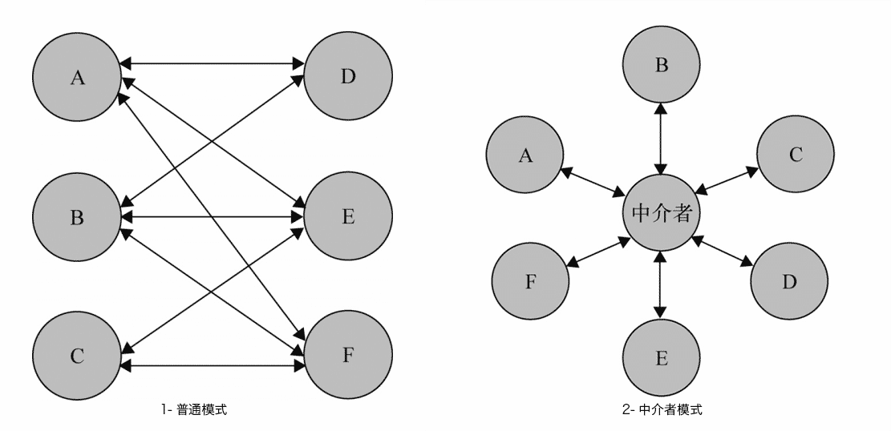

<div align="center">

## 设计模式 - 丙篇

  

</div>

---

#### 模块方法模式

> 重要程度：⭐⭐  
> 难度：⭐  
> 命名建议：xxx（具体实现）

##### 1 定义

模板方法模式由两部分结构组成：`抽象父类` 和 `实现子类`

##### 2 核心

在抽象父类中封装子类的算法框架，它的`主方法`可作为一个算法的模板，指导子类以何种顺序去执行哪些方法。由父类分离出公共部分，要求子类重写某些父类的（易变化的）抽象方法

##### 3 实现

模板方法模式一般的实现方式为`继承`。以运动作为例子，运动有比较通用的一些处理，这部分可以抽离开来，在父类中实现。具体某项运动的特殊性则有自类来重写实现。最终子类直接调用父类的模板函数来执行

```javascript
// 体育运动
function Sport() {}

Sport.prototype = {
  constructor: Sport,

  // 主方法，按顺序执行
  init: function() {
    this.stretch();
    this.jog();
    this.deepBreath();
    this.start();

    var free = this.end();

    // 运动后还有空的话，就拉伸一下
    if (free !== false) {
      this.stretch();
    }
  },

  // 拉伸
  stretch: function() {
    console.log("拉伸");
  },

  // 慢跑
  jog: function() {
    console.log("慢跑");
  },

  // 深呼吸
  deepBreath: function() {
    console.log("深呼吸");
  },

  // 开始运动,强制重写
  start: function() {
    throw new Error("子类必须重写此方法");
  },

  // 结束运动
  end: function() {
    console.log("运动结束");
  }
};

// 篮球
function Basketball() {}

Basketball.prototype = new Sport();

// 重写相关的方法
Basketball.prototype.start = function() {
  console.log("先投上几个三分");
};

Basketball.prototype.end = function() {
  console.log("运动结束了，有事先走一步");
  return false;
};

// 马拉松
function Marathon() {}

Marathon.prototype = new Sport();

var basketball = new Basketball();
var marathon = new Marathon();

// 子类调用，最终会按照父类定义的顺序执行
basketball.init();

marathon.init();
/**
 * 拉伸
 * 慢跑
 * 深呼吸
 * 先投上几个三分
 * 运动结束了，有事先走一步
 * 拉伸
 * 慢跑
 * 深呼吸
 * Error: 子类必须重写此方法
 */
```

#### 享元模式

重要程度：⭐  
难度：⭐⭐  
命名建议：xxx（具体实现）

##### 1 定义

享元模式是一种用于性能优化的模式，它的目标是尽量减少共享对象的数量

##### 2 核心

运用共享技术来有效支持大量细粒度的对象。强调将对象的属性划分为 `内部状态` 与 `外部状态` 。内部状态用于对象的共享，通常不变；而外部状态则剥离开来，由具体的场景决定。

##### 3 实现

某商家有 50 种男款内衣和 50 种款女款内衣, 要展示它们

方案一: 造 50 个塑料男模和 50 个塑料女模, 让他们穿上展示, 代码如下:

```javascript
const Model = function(gender, underwear) {
  this.gender = gender;
  this.underwear = underwear;
};
Model.prototype.takephoto = function() {
  console.log(`${this.gender}穿着${this.underwear}`);
};
for (let i = 1; i < 51; i++) {
  const maleModel = new Model("male", `第${i}款衣服`);
  maleModel.takephoto();
}
for (let i = 1; i < 51; i++) {
  const female = new Model("female", `第${i}款衣服`);
  female.takephoto();
}
```

方案二: 造 1 个塑料男模特 1 个塑料女模特, 分别试穿 50 款内衣

```javascript
const Model = function(gender) {
  this.gender = gender;
};
Model.prototype.takephoto = function() {
  console.log(`${this.gender}穿着${this.underwear}`);
};
const maleModel = new Model("male");
const femaleModel = new Model("female");
for (let i = 1; i < 51; i++) {
  maleModel.underwear = `第${i}款衣服`;
  maleModel.takephoto();
}
for (let i = 1; i < 51; i++) {
  femaleModel.underwear = `第${i}款衣服`;
  femaleModel.takephoto();
}
```

对比发现: 方案一创建了 100 个对象, 方案二只创建了 2 个对象, 在上面示例中, `gender`(性别) 是内部对象, `underwear`(穿着) 是外部对象。

当然在方案二的中, 还可以进一步改善:

> 1 一开始就通过构造函数显示地创建实例, 可用工场模式将其升级成可控生成

> 2 在实例上手动添加 `underwear` 不是很优雅, 可以在外部单独在写个 `manager` 函数

```javascript
const Model = function(gender) {
  this.gender = gender;
};

Model.prototype.takephoto = function() {
  console.log(`${this.gender}穿着${this.underwear}`);
};

const modelFactory = (function() {
  // 优化第一点
  const modelGender = {};
  return {
    createModel: function(gender) {
      if (modelGender[gender]) {
        return modelGender[gender];
      }
      return (modelGender[gender] = new Model(gender));
    }
  };
})();

const modelManager = (function() {
  const modelObj = {};
  return {
    add: function(gender, i) {
      modelObj[i] = {
        underwear: `第${i}款衣服`
      };
      return modelFactory.createModel(gender);
    },
    copy: function(model, i) {
      // 优化第二点
      model.underwear = modelObj[i].underwear;
    }
  };
})();

for (let i = 1; i < 51; i++) {
  const maleModel = modelManager.add("male", i);
  modelManager.copy(maleModel, i);
  maleModel.takephoto();
}
for (let i = 1; i < 51; i++) {
  const femaleModel = modelManager.add("female", i);
  modelManager.copy(femaleModel, i);
  femaleModel.takephoto();
}
```

#### 职责链模式

> 重要程度：⭐⭐⭐⭐  
> 难度：⭐⭐⭐  
> 命名建议：xxxBridge，xxx（具体实现）

##### 1 定义

使多个对象都有机会处理请求，从而避免请求的发送者和接受者之间的耦合关系，将这些对象连成一条链，并沿着这条链传递该请求，直到有一个对象处理它为止

##### 2 核心

请求发送者只需要知道链中第一个节点，弱化发送者和一组接受者之间的强联系，可以便捷地在职责链中增加或删除一个节点，同样，指定谁是第一个节点也很便捷

##### 3 实现

设置一条职责链，实际上是为了免去多重难以维护和阅读的`if`条件分支，以下面小学生请假流程为例

> 设计小学的请假流程是学生要提交请假申请给自己的老师，5 天以下的假期老师可以直接批准，以上的不超过 8 天的需要教导处批准，时间再长的需要校长亲自审批。

这个例子中：请求发送者只需要知道链中的第一个节点，从而弱化了发送者和一组接收者之间的强联系。如果不使用职责链模式，那么就得需要先搞清谁能处理学生的请假，才能去找到他完成请假申请

```javascript
// 定义链的某一项，请求在对象之间传递，避免请求的发送者与接收者的耦合关系
class Leader {
  constructor() {}
  // 模拟抽象方法
  approval() {
    throw new Error("请添加该阶段处理人");
  }
  // 下一节点
  setNext(nextLeader) {
    this.nextLeader = nextLeader;
    return nextLeader;
  }
  // 转到链的下一项执行
  toNext() {
    if (this.nextLeader) {
      this.nextLeader.approval(...arguments);
    } else {
      const [days, person] = arguments;
      console.log(`请假人:${person.name}, 请假：${days}天, 暂无承接人`);
    }
  }
}

class Teacher extends Leader {
  approval(days, person) {
    if (days < 5) {
      console.log(`请假人:${person.name}，请假：${days}天, 老师已审批`);
    } else {
      this.toNext(days, person);
    }
  }
}

class GuidanceDepartment extends Leader {
  approval(days, person) {
    if (5 <= days && days < 8) {
      console.log(`请假人:${person.name}, 请假：${days}天, 教务处已审批`);
    } else {
      this.toNext(days, person);
    }
  }
}

class HeadMaster extends Leader {
  approval(days, person) {
    if (8 <= days && days < 20) {
      console.log(`请假人:${person.name}, 请假：${days}天, 校长已审批`);
    } else {
      this.toNext(days, person);
    }
  }
}

var teacher = new Teacher();
var guidanceDepartment = new GuidanceDepartment();
var headMaster = new HeadMaster();
// 设置teacher下一责任链
teacher.setNext(guidanceDepartment).setNext(headMaster);
teacher.approval(2, {
  name: "小红"
});
teacher.approval(6, {
  name: "小王"
});
teacher.approval(10, {
  name: "小明"
});
teacher.approval(30, {
  name: "小李"
});
/**
 * 请假人:小红，请假：2天, 老师已审批
 * 请假人:小朱, 请假：5天, 教务处已审批
 * 请假人:小明, 请假：10天, 校长已审批
 * 请假人:小李, 请假：30天, 暂无承接人
 */
```

如果再需要添加一条职责链处理额外需求，则设立完成之后改变职责链的构成就可以

```javascript
class BureauEducation extends Leader {
  approval(days, person) {
    if (20 <= days) {
      console.log(`请假人:${person.name}, 请假：${days}天, 请带领家长办理休学手续`);
    } else {
      this.toNext(days, person);
    }
  }
}

var bureauEducation = new BureauEducation();
// 设置teacher下一责任链
teacher
  .setNext(guidanceDepartment)
  .setNext(headMaster)
  .setNext(bureauEducation);

/**
 * ...
 * 请假人:小李, 请假：30天, 请带领家长办理休学手续
 */
```

#### 中介者模式

> 重要程度：⭐⭐⭐⭐⭐  
> 难度：⭐⭐⭐⭐  
> 命名建议：xxxCotroller，xxxMiddleWare，xxx(具体实现)

##### 1 定义

所有的相关对象都通过`中介者`对象来通信，而不是互相引用，所以当一个对象发生改变时，只需要通知`中介者`对象即可

##### 2 核心

<div align=center>



</div>

复杂的调度处理交给`中介者`，使网状的`多对多`关系变成了相对简单的`一对一`关系

##### 3 实现

多个对象，指的不一定是实例化的对象，也可以将其理解成互为独立的多个项。当这些项在处理时，需要知晓并通过其它项的数据来处理。如果每个项都直接处理，程序会非常复杂，修改某个地方就得在多个项内部修改。我们将这个处理过程抽离出来，封装成`中介者`来处理，各项需要处理时，通知`中介者`即可

```javascript
var A = {
  score: 10,

  changeTo: function(score) {
    this.score = score;

    // 自己获取
    this.getRank();
  },

  // 直接获取
  getRank: function() {
    var scores = [this.score, B.score, C.score].sort(function(a, b) {
      return a < b;
    });

    console.log(scores.indexOf(this.score) + 1);
  }
};

var B = {
  score: 20,

  changeTo: function(score) {
    this.score = score;

    // 通过中介者获取
    rankMiddleWare(B);
  }
};

var C = {
  score: 30,

  changeTo: function(score) {
    this.score = score;

    rankMiddleWare(C);
  }
};

// 中介者，计算排名
function rankMiddleWare(person) {
  var scores = [A.score, B.score, C.score].sort(function(a, b) {
    return a < b;
  });

  console.log(scores.indexOf(person.score) + 1);
}

// A通过自身来处理
A.changeTo(100); // 1

// B和C交由中介者处理
B.changeTo(200); // 1
C.changeTo(50); // 3
```
