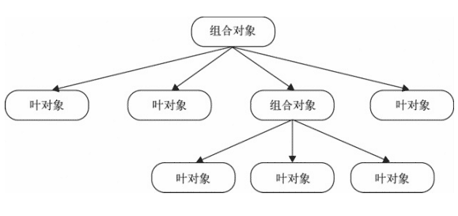

<div align="center">

## 设计模式 - 乙篇

  

</div>

---

#### 迭代器模式

重要程度：⭐  
难度：⭐  
命名建议：xxx（具体实现）

##### 1 定义

迭代器模式是指提供一种方法顺序访问一个聚合对象中的各个元素，而又不需要暴露该对象的内部表示

##### 2 核心

在使用迭代器模式之后，即使不关心对象的内部构造，也可以按顺序访问其中的每个元素

##### 3 实现

ES5 数组的 map 方式`forEach`已经内置了迭代器

```javascript
[1, 2, 3].forEach(function(item, index, arr) {
  console.log(item, index, arr);
});
```

类似的遍历方式还有`map`、`filter`、`some`、`every`、`reduce`、`reduceRight`

不过对于对象的遍历，往往不能同数组一样，我们可以封装一下

```javascript
function each(obj, cb) {
  var value;

  if (Array.isArray(obj)) {
    for (var i = 0; i < obj.length; ++i) {
      value = cb.call(obj[i], i, obj[i]);

      if (value === false) {
        break;
      }
    }
  } else {
    for (var i in obj) {
      value = cb.call(obj[i], i, obj[i]);

      if (value === false) {
        break;
      }
    }
  }
}

each([1, 2, 3], function(index, value) {
  console.log(index, value);
});

each({ a: 1, b: 2 }, function(index, value) {
  console.log(index, value);
});

// 0 1
// 1 2
// 2 3

// a 1
// b 2
```

#### 发布-订阅模式

> 重要程度：⭐⭐⭐⭐⭐  
> 难度：⭐⭐⭐  
> 命名建议：xxxObserver，xxxEventHandler

##### 1 定义

也叫做观察者模式，定义了对象间的一种一对多的依赖关系。当一个对象的状态发生改变时，所有依赖它的对象都将得到通知

##### 2 核心

取代对象之间硬编码的通知机制，一个对象不再显示的调用另一个对象的某个接口。这是一个十分重要的设计模式，在工作和面试中用的特别多，Vue 源码主要使用了 `发布-订阅模式` 和 `代理模式`

##### 3 实现

JS 中的事件就是典型的`发布-订阅模式`的实现

```javascript
// 订阅
document.body.addEventListener(
  "click",
  function() {
    console.log("click1");
  },
  false
);

document.body.addEventListener(
  "click",
  function() {
    console.log("click2");
  },
  false
);

// 发布
document.body.click(); // click1  click2
```

自己实现一下对成绩和岗位的`发布-订阅模式`

```javascript
// 观察者
var observer = {
  // 订阅集合
  subscribes: {},

  // 订阅
  subscribe: function(type, fn) {
    if (!this.subscribes[type]) {
      this.subscribes[type] = [];
    }

    // 收集订阅者的处理
    typeof fn === "function" && this.subscribes[type].push(fn);
  },

  // 发布  可能会携带一些信息发布出去
  publish: function() {
    var type = [].shift.call(arguments),
      fns = this.subscribes[type];

    // 不存在的订阅类型，以及订阅时未传入处理回调的
    if (!fns || !fns.length) {
      return;
    }

    // 挨个处理调用
    for (var i = 0; i < fns.length; ++i) {
      fns[i].apply(this, arguments);
    }
  },

  // 删除订阅
  remove: function(type, fn) {
    // 删除全部
    if (typeof type === "undefined") {
      this.subscribes = {};
      return;
    }

    var fns = this.subscribes[type];

    // 不存在的订阅类型，以及订阅时未传入处理回调的
    if (!fns || !fns.length) {
      return;
    }

    if (typeof fn === "undefined") {
      delete fns;
      return;
    }

    // 挨个处理删除
    for (var i = 0; i < fns.length; ++i) {
      if (fns[i] === fn) {
        fns.splice(i, 1);
      }
    }
  }
};

// 订阅岗位列表
function jobListForA(jobs) {
  console.log("A", jobs);
}

function jobListForB(jobs) {
  console.log("B", jobs);
}

// A订阅了笔试成绩
observer.subscribe("job", jobListForA);
// B订阅了笔试成绩
observer.subscribe("job", jobListForB);

// A订阅了笔试成绩
observer.subscribe("examinationA", function(score) {
  console.log(score);
});

// B订阅了笔试成绩
observer.subscribe("examinationB", function(score) {
  console.log(score);
});

// A订阅了面试结果
observer.subscribe("interviewA", function(result) {
  console.log(result);
});

observer.publish("examinationA", 100); // 100
observer.publish("examinationB", 80); // 80
observer.publish("interviewA", "备用"); // 备用

observer.publish("job", ["前端", "后端", "测试"]); // 输出A和B的岗位

// B取消订阅了笔试成绩
observer.remove("examinationB");
// A都取消订阅了岗位
observer.remove("job", jobListForA);

observer.publish("examinationB", 80); // 没有可匹配的订阅，无输出
observer.publish("job", ["前端", "后端", "测试"]); // 输出B的岗位
```

##### 4 优缺点

###### 优点：

    一为时间上解耦，二为对象之间解耦

###### 缺点：

    创建订阅者本身要消耗一定的时间和内存，订阅的处理函数不一定会被执行，驻留内存有性能开销

    弱化了对象之间的联系，复杂情况下可能导致程序难以跟踪维护和理解

#### 命令模式

> 重要程度：⭐⭐⭐⭐⭐  
> 难度：⭐⭐⭐  
> 命名建议：xxxCommand

##### 1 定义

用一种松耦合的方式来设计程序，使得请求发送者和请求接收者能够消除彼此之间的耦合关系。命令（command）指的是一个执行某些特定事情的指令

##### 2 核心

命令中带有 execute `执行` 、undo `撤销` 、redo `重做` 等相关命令方法，建议显示地指示这些方法名

##### 3 实现

下来的例子是一个自增命令，提供执行、撤销、重做功能。采用对象创建处理的方式，定义这个自增

```javascript
// 自增
function IncrementCommand() {
  // 当前值
  this.val = 0;
  // 命令栈
  this.stack = [];
  // 栈指针位置
  this.stackPosition = -1;
}

IncrementCommand.prototype = {
  constructor: IncrementCommand,

  // 执行
  execute: function() {
    this._clearRedo();

    // 定义执行的处理
    var command = function() {
      this.val += 10;
    }.bind(this);

    // 执行并缓存起来
    command();

    this.stack.push(command);

    this.stackPosition++;

    this.getValue();
  },

  canUndo: function() {
    return this.stackPosition >= 0;
  },

  canRedo: function() {
    return this.stackPosition < this.stack.length - 1;
  },

  // 撤销
  undo: function() {
    if (!this.canUndo()) {
      return;
    }

    this.stackPosition--;

    // 命令的撤销，与执行的处理相反
    var command = function() {
      this.val -= 10;
    }.bind(this);

    // 撤销后不需要缓存
    command();

    this.getValue();
  },

  // 重做
  redo: function() {
    if (!this.canRedo()) {
      return;
    }

    // 执行栈顶的命令
    this.stack[++this.stackPosition]();

    this.getValue();
  },

  // 在执行时，已经撤销的部分不能再重做
  _clearRedo: function() {
    this.stack = this.stack.slice(0, this.stackPosition + 1);
  },

  // 获取当前值
  getValue: function() {
    console.log(this.val);
  }
};
```

再实例化进行测试，模拟执行、撤销、重做操作

```javascript
var incrementCommand = new IncrementCommand();

// 模拟事件触发，执行命令
var eventTrigger = {
  // 某个事件的处理中，直接调用命令的处理方法
  increment: function() {
    incrementCommand.execute();
  },

  incrementUndo: function() {
    incrementCommand.undo();
  },

  incrementRedo: function() {
    incrementCommand.redo();
  }
};

eventTrigger["increment"](); // 10
eventTrigger["increment"](); // 20

eventTrigger["incrementUndo"](); // 10

eventTrigger["increment"](); // 20

eventTrigger["incrementUndo"](); // 10
eventTrigger["incrementUndo"](); // 0
eventTrigger["incrementUndo"](); // 无输出

eventTrigger["incrementRedo"](); // 10
eventTrigger["incrementRedo"](); // 20
eventTrigger["incrementRedo"](); // 无输出

eventTrigger["increment"](); // 30
```

此外，还可以实现简单的宏命令

```javascript
var MacroCommand = {
  commands: [],

  add: function(command) {
    this.commands.push(command);

    return this;
  },

  remove: function(command) {
    if (!command) {
      this.commands = [];
      return;
    }

    for (var i = 0; i < this.commands.length; ++i) {
      if (this.commands[i] === command) {
        this.commands.splice(i, 1);
      }
    }
  },

  execute: function() {
    for (var i = 0; i < this.commands.length; ++i) {
      this.commands[i].execute();
    }
  }
};

var showTime = {
  execute: function() {
    console.log("time");
  }
};

var showName = {
  execute: function() {
    console.log("name");
  }
};

var showAge = {
  execute: function() {
    console.log("age");
  }
};

MacroCommand.add(showTime)
  .add(showName)
  .add(showAge);

MacroCommand.remove(showName);

MacroCommand.execute(); // time age
```

#### 组合模式

> 重要程度：⭐⭐⭐⭐  
> 难度：⭐⭐  
> 命名建议：xxxComponent、xxx（具体实现）

##### 1 定义

是用小的 <abbr title="叶子节点">子对象</abbr> 来构建更大的对象，而这些小的子对象本身也许是由更小的 <abbr title="叶子节点">孙对象</abbr> 构成的。这个抽象定义一般三个部分组成，组件的基本信息，`Add`方法，`Remove` 方法；

##### 2 核心

可以用树形结构来表示这种 `部分 - 整体` 的层次结构。调用组合对象的`执行`方法，程序会递归调用组合对象下面的叶对象的`执行`方法

<div align=center>



</div>

但要注意的是，组合模式不是父子关系，它是一种`HAS-A（聚合)`的关系，将请求委托给它所包含的所有叶对象。基于这种委托，就需要保证组合对象和叶对象拥有相同的接口

此外，也要保证用一致的方式对待 列表中的每个叶对象，即叶对象属于同一类，不需要过多特殊的额外操作

##### 3 实现

使用组合模式来实现扫描文件夹中的文件

```javascript
// 文件夹 组合对象
function FolderComponent(name) {
  this.name = name;
  this.parent = null;
  this.files = [];
}

FolderComponent.prototype = {
  constructor: FolderComponent,

  add: function(file) {
    file.parent = this;
    this.files.push(file);

    return this;
  },

  scan: function() {
    // 委托给叶对象处理
    for (var i = 0; i < this.files.length; ++i) {
      this.files[i].scan();
    }
  },

  remove: function(file) {
    if (typeof file === "undefined") {
      this.files = [];
      return;
    }
    for (var i = 0; i < this.files.length; ++i) {
      if (this.files[i] === file) {
        this.files.splice(i, 1);
      }
    }
  }
};

// 文件 叶对象
function FileComponent(name) {
  this.name = name;
  this.parent = null;
}

FileComponent.prototype = {
  constructor: FileComponent,

  add: function() {
    console.log("文件里面不能添加文件");
  },

  remove: function() {
    console.log("文件里面不能删除文件");
  },

  scan: function() {
    var name = [this.name];
    var parent = this.parent;
    while (parent) {
      name.unshift(parent.name);
      parent = parent.parent;
    }
    console.log(name.join(" / "));
  }
};
```

构造好组合对象与叶对象的关系后，实例化，在组合对象中插入组合或叶对象

```javascript
var web = new FolderComponent("Web");
var fe = new FolderComponent("前端");
var css = new FolderComponent("CSS");
var js = new FolderComponent("js");
var rd = new FolderComponent("后端");

web.add(fe).add(rd);

var file1 = new FileComponent("HTML权威指南.pdf");
var file2 = new FileComponent("CSS权威指南.pdf");
var file3 = new FileComponent("JavaScript权威指南.pdf");
var file4 = new FileComponent("MySQL基础.pdf");
var file5 = new FileComponent("Web安全.pdf");
var file6 = new FileComponent("Linux菜鸟.pdf");

css.add(file2);

fe.add(file1)
  .add(file3)
  .add(css)
  .add(js);

rd.add(file4).add(file5);

web.add(file6);

rd.remove(file4);

// 进行扫描
web.scan();
/**
 * Web / 前端 / HTML权威指南.pdf
 * Web / 前端 / JavaScript权威指南.pdf
 * Web / 前端 / CSS / CSS权威指南.pdf
 * Web / 后端 / Web安全.pdf
 * Web / Linux菜鸟.pdf
 */
```

##### 4 优缺点

###### 优点：

    可以方便的构造一棵树来表示对象的部分-整体结构。在数的构造完成后，只需要通过请求树的最顶层对象，就能对整棵树做统一一致的操作

###### 缺点：

    创建出来的对象长得都差不多，可能会使代码不好理解，创建大量对象会消耗内存，对性能造成影响
