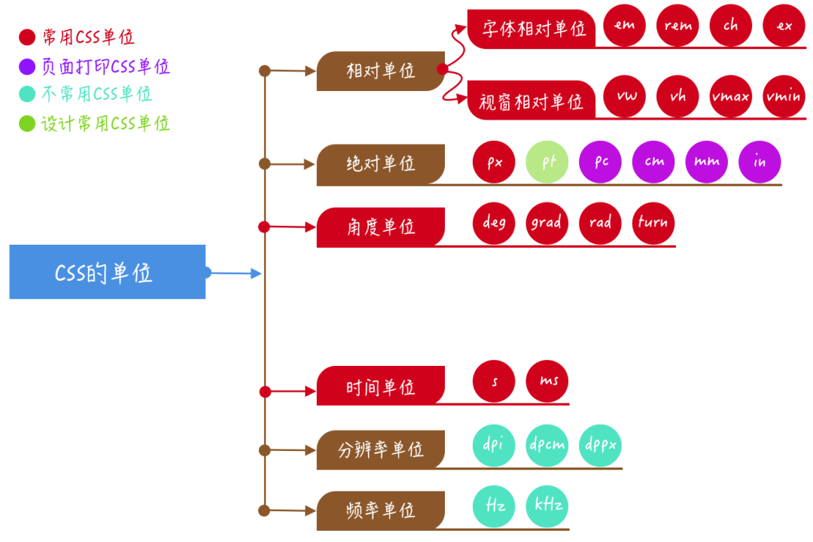

<div align="center">

## 前端基础 - 丙篇

  

</div>

---

#### 关于 Ref

##### Vue

    只要想要在 Vue 中直接操作 DOM 元素，就必须用 ref 属性进行注册.先在 DOM 中使用 ref 标签进行了注册，然后便可以通过 this.$refs 再跟注册时的名称来引用 DOM 元素了

##### React

    ref 用在处理表单空间聚焦，文本选择，媒体播放以及触发动画效果等等. ref 是一个 React 的非常特殊的属性，这个属性一定是接受一个回调函数，这个回调函数会在组件渲染时进行执行一遍，在从视图中撤出来时会执行一遍

#### 关于 Set 和 Map

##### Set

`ES6`新的数据结构，类似数组但是内容唯一

```javascript
var set = new Set([1, 2, 3, 4, 4]);

[...set]; // [1, 2, 3, 4]
```

有四个操作方法：

- add(value)：添加某个值，返回 Set 结构本身。
- delete(value)：删除某个值，返回一个布尔值，表示删除是否成功。
- has(value)：返回一个布尔值，表示该值是否为 Set 的成员。
- clear()：清除所有成员，没有返回值

```javascript
// 可以结合 Array.from 深拷贝数组
var newArr = Array.from(new Set(arr));
var obj = { name: "test", age: 19, brother: ["jane", "john", "Mary"] };

// Array.from()方法可以将类数组对象和可遍历对象(key 为字符串)转换为真正的数组
Array.from(obj); // ['test',19,['jane','john','Mary']]

// Object.keys()可以取得数组对象的 key 集合
Object.keys(obj); // ['name','age','brother']
```

##### Map

Map 结构提供了`值--值`的对应，是一种更完善的`hash`结构的实现。类似`Object`,也是键值对的集合，但是『 键 』的范围不限于字符串，各种类型的值（包括对象）都可以成为『 键 』

```javascript
var m = new Map();
var o = { p: "Hello World" };
m.set(o, "content");
m.get(o); // "content"
m.has(o); // true
m.delete(o); // true
m.has(o); // false

// 只有对同一个对象的引用，Map结构才将其视为同一个键。这一点要非常小心
m.set(["a"], 233);
m.get(["a"]); // undefined。表面键相同但是内存地址不一样
```

> 实例属性和方法：**size**、**set**、**get**、**has**、**delete**、**clear**  
> 遍历方法：`keys()`、`values()`、`entries()`、`forEach()`

##### Map VS Object

|          | Map                                   | Object                                                                 |
| -------- | ------------------------------------- | ---------------------------------------------------------------------- |
| 默认值   | 默认不包含任何值，只包含显式插入的键  | 一个 `Object` 有一个原型，原型上的键名有可能和自己对象上设置的键名冲突 |
| 键名类型 | `Any`                                 | `String` 或 `Symbol`                                                   |
| 迭代器   | `forEach` 或者 `for...of...`          | 不可直接迭代                                                           |
| 长度     | 键值对个数通过 `size` 属性获取 `O(1)` | 键值对个数只能手动计算 `O(n)`                                          |
| 性能     | 频繁增删键值对的场景下表现更好        | 频繁添加和删除键值对的场景下未作出优化                                 |

###### Object/Map 何为最佳实践

- 『 Map 』始终保持按插入顺序返回键名。但『 Object 』却不是。从 `ES6` `开始，String` 和 `Symbol` 键是按顺序保存起来的，但是通过隐式转换保存成 `String` 的键就是乱序的，当插入顺序是你解决问题时需要考虑的，那么 『 Map 』 就是个最佳解决方案
- 并且当前需要使用除 `String` 和 `Symbol` 以外的键名时，比如正则表达式，选择『 Map 』 作为解决方案。

- 如果需要遍历键值对（并且需要考虑顺序）,优先考虑 『 Map 』。`Map` 是一个纯哈希结构，而 `Object` 不是（它拥有自己的内部逻辑）。`Map` 在频繁增删键值对的场景下表现更好，性能更高。因此当你需要频繁操作数据的时候也可以优先考虑 『 Map 』

- 再举一个实际的例子，比如有一个自定义字段的用户操作功能，用户可以通过表单自定义字段，那么这时候最好是使用 Map，因为很有可能会破坏原有的对象。

  ```javascript
  // 此时用户自定义的 toString 就会破坏到原有的对象而 Map 键名接受任何类型，没有影响
  const userCustomFields = {
    color: "blue",
    size: "medium",
    toString: "A blue box"
  };
  ```

- 当你需要处理一些属性，那么 『 Object 』 是完全受用的，尤其是需要处理 `JSON` 数据的时候。由于 『 Map 』 可以是任意类型，因此没有可以将其转化为 `JSON` 的原生方法。

  ```javascript
  var map = new Map();
  map.set("key", "value");
  JSON.stringify(map); // "{}"
  ```

#### 同源策略

```
源（origin）就是协议、域名和端口号。
绕过同源策略:
  代理、
  Cors(跨域资源共享):
    浏览器发送跨域请求时，设置Http Request Header Origin = Current URI
    服务器若不接受该网站的跨域请求，则返回错误
    服务器若接受其跨域请求，则在Response Header中设置Access-Control-Allow-Origin属性
    浏览器看到Access-Control-Allow-Origin属性，同意解析返还结果。
  Jsonp:
    HTML中的script标签可以加载并执行其他域的javascript，于是我们可以通过script标记来动态加载其他域的资源
```

#### CSS 的单位

<div align=center>



</div>

#### CSS 中 white-space、word-break、word-wrap

- white-space: 用来控制空白符的显示，同时控制是否自动换行。常用`normal`(正常换行)、`nowrap`(不换行)
- word-break: 控制单纯如何被拆分换行。`normal`、`break-all`、`keep-all`
- word-wrap(overflow-wrap)：控制长度超过一行的单纯是否被拆分换行，是 word-break 的一个补充。`normal`、`break-word`
  > 配合`text-overflow：ellipsis`实现[文本溢出](#单行文本溢出)

#### CSS3 动画

```css
.animation {
  position: absolute;
  animation: move 1.2s ease-in 80ms infinite alternate;
}
/* 其中属性
  animation-name: move; // 动画名称
  animation-duration: 5s; // 完成一周期需要时间
  animation-timing-function: linear; // 速度曲线
  animation-delay: 2s; // 开始动画延迟
  animation-iteration-count: infinite; // 播放次数
  animation-direction: alternate; // 下一周播放顺序
 */
@keyframes move {
  0% {
  }
  50% {
  }
  100% {
  }
}
```

#### CSS 怎么实现单、多行文本溢出

##### 单行文本溢出

```css
.ellipsis {
  overflow: hidden;
  white-space: nowrap;
  text-overflow: ellipsis;
}
```

##### 多行文本溢出：

```css
.ellipsis {
  display: -webkit-box;
  -webkit-line-clamp: 3; /* 行数 */
  -webkit-box-orient: vitical; /* 水平排列方式 */
  text-overflow: ellipsis;
}
```

#### BFC 布局 （块级格式化上下文）

##### 应用

- 解决 `margin-top` 和 `margin-bottom` 叠加
- 用于布局（比如两栏布局）
- 用于清除浮动
- 计算 BFC 高度

##### 触发 BFC

- 设置除 `float:none` 以外的属性值（如：left | right）就会触发 BFC
- 设置除 `overflow: visible` 以外的属性值（如： hidden | auto | scroll）就会触发 BFC
- 设置 `display` 为表格布局或者弹性布局: inline-block | flex | inline-flex | table-cell | table-caption 就会触发 BF Ｃ
- 设置 `position` 为绝对定位：absolute | fixed 就会触发 BFC
- 使用 `fieldset` 元素（可以给表单元素设置环绕边框的 html 元素）也会触发 BFC

#### CSS 实现三角形

```css
.triangle {
  width: 0px;
  height: 0px;
  border-left: 10px solid transparent;
  border-right: 10px solid transparent;
  border-bottom: 10px solid blue;
}
```

#### CSS 垂直水平居中

```css
.plan-a {
  position: absolute;
  margin: auto;
  top: 0;
  left: 0;
  right: 0;
  bottom: 0;
}
.plan-b {
  position: absolute;
  top: 50%;
  left: 50%;
  width: 100%;
  transform: translate(-50%, -50%);
  text-align: center;
}
.plan-c {
  display: flex;
  justify-content: center;
  align-items: center;
}
```

#### 权重计算规则

1. 第一等：代表内联样式，如: style=””，权值为 `1000`。

2. 第二等：代表 ID 选择器，如：#content，权值为 `0100`。

3. 第三等：代表类，伪类和属性选择器，如.content，权值为 `0010`。

4. 第四等：代表类型选择器和伪元素选择器，如 div p，权值为 `0001`。

5. 通配符、子选择器、相邻选择器等的。如\*、>、+,权值为 `0000`。

6. 继承的样式没有权值。

#### 浏览器渲染原理

1. DOM Tree：浏览器将 `HTML` 解析成树形的数据结构。
2. CSS Rule Tree：浏览器将 `CSS` 解析成树形的数据结构。
3. Render Tree: `DOM` 和 `CSSOM` 合并后生成 `Render Tree`。
4. layout：有了 `Render Tree`，浏览器已经能知道网页中有哪些节点、各个节点的 `CSS` 定义以及他们的从属关系，从而去计算出每个节点在屏幕中的位置。
5. painting: 按照算出来的规则，通过显卡，把内容画到屏幕上。

##### 回流 重绘

- reflow（回流）：当浏览器发现某个部分发生了点变化影响了布局，需要倒回去重新渲染。这个过程也叫重排。
- repaint（重绘）：改变某个元素的背景色、文字颜色、边框颜色等等不影响它周围或内部布局时，屏幕需要一部分重画，但是元素尺寸没有改变。

#### DNS 解析过程

当一个用户在地址栏输入http://www.taobao.com时，DNS解析过程大致如下：

1. 浏览器首先检查缓存中有没有这个域名对应的 ip 地址
2. 如果浏览器缓存中没有找到，会在操作系统中检查有没有缓存（检查 hosts 文件中是否设置）
3. 如果还没有命中域名，才会向根域名服务器进行迭代查询获取 DNS IP 地址
4. 本地域名服务器把返回的结果保存到缓存，以备下一次使用
5. 将该结果反馈给浏览器，发起 TCP 连接

#### 对比 TCP 和 UDP

| 参数     | TCP（类似打电话）                        | UDP（类似喇叭喊人）                        |
| -------- | ---------------------------------------- | ------------------------------------------ |
| 特点     | 面向连接（收发数据前，必须建立可靠连接） | 面向无连接（不可靠的协议，无状态传输机制） |
| 建立基础 | 三次握手                                 | 无连接                                     |
| 应用场景 | HTTP 请求、FTP 文件传输、邮件收发        | 消息收发、语音通话、直播                   |
| 优点     | 稳定、重传机制、拥塞控制机制、断开连接   | 速度块、安全                               |
| 缺点     | 速度慢、效率低、占用资源、易被攻击       | 不可靠、不稳定、容易丢包                   |
