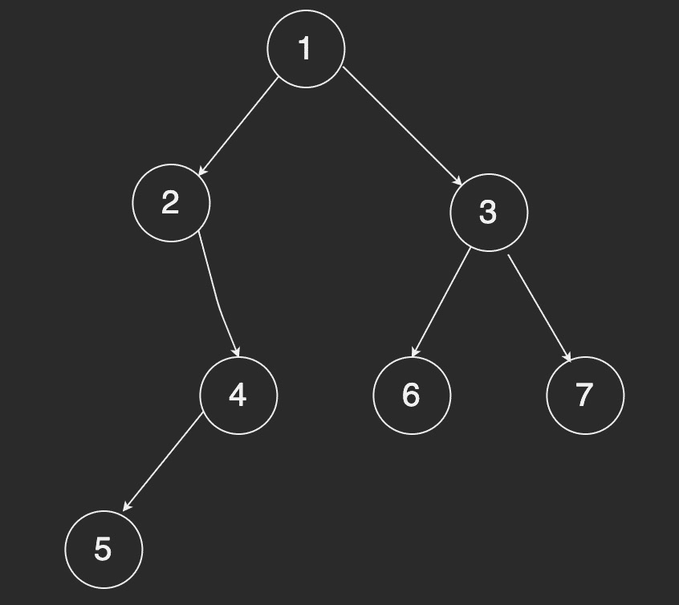

<div align="center">

## 前端进阶 - 丙篇

  

</div>

---

#### javascript 工厂模式函数、构造函数、原型模式

##### 工厂函数

> 工厂模式中的函数中会创建一个对象，最后 `return` 这个对象，通过每次调用时传入的参数不同来 **解决创建多个相似对象的问题**。

```javascript
// 工厂模式
function creatPerson(name, age, job) {
  var o = {};
  o.name = name;
  o.age = age;
  o.job = job;
  o.sayName = function () {
    console.log(this.name);
  };
  return o;
}
var tianjiao = creatPerson("tj", 22, "fe");
console.log(tianjiao);
```

##### 构造函数

> 构造函数本身也是函数，只不过是一个 **创建对象** 的函数

```javascript
// 构造函数
function Person(name, age) {
  this.name = name;
  this.age = age;
  this.sayName = function () {
    console.log(this.name);
  };
}
var tj2 = new Person("tj2", 23);
console.log(tj2);
```

##### 原型模式

> 每个函数都有一个 `prototype` 属性，这个属性是一个指针，指向一个对象，这个对象的好处是可以 **让所有对象实例共享他所包含的属性和方法**。

```javascript
// 原型方法
function Person() {}
Person.prototype.name = "tj3";
Person.prototype.age = 24;
Person.prototype.sayName = function () {
  alert(this.name);
};
var tj3 = new Person();
console.log(tj3);
```

#### 关于 this 指向

1. 如果 `this` 是 在一个函数中，并且被用作方法来使用，那么这个时候的 `this` 就指向了父级对象;
2. 如果 `this` 是在匿名函数，或者全局环境的函数中，那么这个时候的 `this` 就是 `undefined`;
3. 如果 `this` 是在构造函数中，那么这个时候的 `this` 就指向了即将生成的那个对象

#### 事件轮询机制 bind、apply、call 的区别

`call` 和 `apply` 都是对函数的直接调用，**改变 this 指针指向即改变作用域**

```javascript
// 传参方式不一样，call必须将参数从第二位一个个塞进去
call(obj, arg1, arg2, arg3);
apply(obj, [arg1, arg2, arg3]);
```

```javascript
function sum(num1, num2) {
  return num1 + num2;
}
function callFun(a, b) {
  return sum.call(this, a, b);
}
function applyFun(a, b) {
  return sum.apply(this, [a, b]);
  // 或者
  // return sum.apply(this,arguments);
}
function bindFun(a, b) {
  //bind 方法返回的仍然是一个函数
  return sum.bind(this, a, b)();
}
alert(callFun(10, 10)); //20
alert(applyFun(10, 10)); //20
alert(bindFun(10, 10)); //20
```

##### 手写 call

```javascript
Funtion.prototype.mycall = function (context, ...args) {
  const cxt = context ? Object(context) : window; // 返回 this 参数或者 window,this 参数可能为基本数据类型，通过 Object 转换一下
  cxt.fn = this;
  const res = cxt.fn(...args);
  delete cxt.fn;
  return res;
};
```

##### 手写 apply

```javascript
Function.prototype.myapply = function (context, arr = []) {
  const cxt = context ? Object(context) : window;
  cxt.fn = this;
  const res = cxt.fn(...arr);
  delete cxt.fn;
  return res;
};
```

##### 手写 bind

```javascript
Function.prototype.mybind = function (ctx, ...args) {
  // return (...a)=> this.call(ctx, ...args, ...a);
  return (...a) => this.apply(ctx, [...args, ...a]);
};
```

测试脚本

```javascript
const w = { name: "wgc" };
function testW() {
  console.log(this.name);
  console.log(...arguments);
}
const bindF = testW.mybind(w, "WGC");
bindF("hello");
testW.mycall(w, "nihao", "wgc");
testW.myapply(w, ["NIHAO", "WGC"]);
```

##### 手写 new

```javascript
const myNew = function () {
  let Constructor = Array.prototype.shift.call(arguments); // Constructor 就是 new 时传入的第一个参数，剩余的 arguments 是其他的参数
  let obj = {};
  obj.__proto__ = Constructor.prototype; // 使用obj.__proto__ = Constructor.prototype 继承原型上的方法
  let res = Constructor.apply(obj, arguments); // 将剩余的 arguments 传给 Contructor ，绑定 this 指向为 obj，并执行
  return res instanceof Object ? res : obj; // 如果构造函数返回的是引用类型，直接返回该引用类型，否则返回 obj
};

// 测试
function Person(name, age) {
  this.name = name;
  this.age = age;
  this.sayName = function () {
    console.log(this.name);
  };
}

const newFun = new Person("WGC", 23);
const myNewFun = myNew(Person, "WGC", 23);

console.log("newFun:", newFun);
console.log("myNewFun:", myNewFun);
```

##### 手写 instanceOf

```javascript
const myInstanceof = function (left, right) {
  // 首先获取类型的原型
  const prototype = right.prototype;
  // 然后获得对象的原型
  left = left.__proto__;
  // 然后一直循环判断对象的原型是否等于类型的原型，直到对象原型为 null，因为原型链最终为 null
  while (true) {
    if (left === null || left === undefined) {
      return false;
    }
    if (left === prototype) {
      return true;
    }
    left = left.__proto__;
  }
};

// 测试
console.log(myInstanceof([], Object));
console.log(myInstanceof(1, Number));
console.log(myInstanceof("wgc", String));
console.log(myInstanceof(undefined, Boolean));
```

#### 手写函数柯里化

```javascript
// 柯里化实现多参累加
add(1)(3, 4)(3, 5); // 16
add(2)(2)(3, 5); // 12
function add() {
  // 1 把所有参数转换成数组
  let args = Array.prototype.slice.call(arguments);
  // 2 再次调用add函数，传递合并当前与之前的参数
  let fn = function () {
    let arg_fn = Array.prototype.slice.call(arguments);
    return add.apply(null, args.concat(arg_fn));
  };
  // 3 最后一次执行会默认调用，并返回合并的值
  // 重写toString(): 这个方法会把该对象的原始值以字符串形式返回
  fn.toString = function () {
    return args.reduce(function (a, b) {
      return a + b;
    });
  };
  return fn;
}

// ES6写法
function add() {
  let args = [...arguments];
  let fn = function () {
    return add.apply(null, args.concat([...arguments]));
  };
  fn.toString = () => args.reduce((a, b) => a + b);
  return fn;
}
```

#### 手写函数合成

```javascript
function compose(...funcs) {
  return (value) => funcs.reduce((prev, next) => next(prev), value);
}

function lowerCase(value) {
  return value && typeof value === "string" ? value.toLowerCase() : value;
}

function trim(value) {
  return typeof value === "string" ? value.trim() : value;
}

function split(value, delimiter = ",") {
  return typeof value === "string" ? value.split(delimiter) : value;
}

const func = compose(trim, lowerCase, split);

func(" a,B,C "); // " a,B,C " -> "a,B,C" -> 'a,b,c' -> ["a", "b", "c"]
```

#### 手写 函数防抖、函数节流

- 函数防抖：(任务触发的间隔超过指定间隔的时候，任务才会执行)
  - 定义：多次触发事件后，事件处理函数只执行一次，并且是在触发操作结束时执行。
  - 原理：对处理函数进行延时操作，若设定的延时到来之前，再次触发事件，则清除上一次的延时操作定时器，重新定时。
  - 手写代码:
  ```javascript
  function debounce(fn, wait = 500) {
    let timer = null;
    return function () {
      clearTimeout(timer);
      timer = setTimeout(() => {
        fn.apply(this, arguments);
      }, wait);
    };
  }
  ```
- 函数节流：(指定时间间隔内只会执行一次任务)
  - 定义：触发函数事件后，短时间间隔内无法连续调用，只有上一次函数执行后，过了规定的时间间隔，才能进行下一次的函数调用
  - 原理：设置状态，对处理函数进行延时操作，若下一次事件触发设定的延时到来之前，状态还没更新，事件无效。
  - 手写代码：
  ```javascript
  function throttle(fn, wait = 500) {
    var timerStatus = true;
    return function () {
      if (!timerStatus) return;
      timerStatus = false;
      setTimeout(() => {
        fn.apply(this, arguments);
        timerStatus = true;
      }, wait);
    };
  }
  ```

#### 手写 深度遍历

```javascript
// 方案一
let deepTraversal1 = (node, nodeList = []) => {
  if (node !== null) {
    nodeList.push(node);
    let children = node.children || [];
    for (let i = 0; i < children.length; i++) {
      deepTraversal1(children[i], nodeList);
    }
  }
  console.log(nodeList);
  return nodeList;
};
```

```javascript
// 方案二
let deepTraversal2 = (node) => {
  let nodes = [];
  if (node !== null) {
    nodes.push(node);
    let children = node.children || [];
    for (let i = 0; i < children.length; i++) {
      nodes = nodes.concat(deepTraversal2(children[i]));
    }
  }
  console.log(nodes);
  return nodes;
};
```

```javascript
// 方案三。非递归
let deepTraversal3 = (node) => {
  let stack = [];
  let nodes = [];
  if (node) {
    // 推入当前处理的node
    stack.push(node);
    while (stack.length) {
      let item = stack.pop();
      let children = item.children || [];
      nodes.push(item);
      // nodes = [] stack = [parent]
      // nodes = [parent] stack = [child3,child2,child1]
      // nodes = [parent, child1] stack = [child3,child2,child1-2,child1-1]
      // nodes = [parent, child1-1] stack = [child3,child2,child1-2]
      for (let i = children.length - 1; i >= 0; i--) {
        stack.push(children[i]);
      }
    }
  }
  console.log(nodes);
  return nodes;
};
```

#### 手写 广度遍历

```javascript
let widthTraversal = (node) => {
  let nodes = [];
  let stack = [];
  if (node) {
    stack.push(node);
    while (stack.length) {
      let item = stack.shift();
      let children = item.children || [];
      nodes.push(item);
      // 队列，先进先出
      // nodes = [] stack = [parent]
      // nodes = [parent] stack = [child1,child2,child3]
      // nodes = [parent, child1] stack = [child2,child3,child1-1,child1-2]
      // nodes = [parent,child1,child2]
      for (let i = 0; i < children.length; i++) {
        stack.push(children[i]);
      }
    }
  }
  console.log(nodes);
  return nodes;
};
```

#### 手写 二叉树遍历

对于如下二叉树，求解前序遍历、中序遍历、后序遍历结果

<div align=center width=100>



</div>

```javascript
/**
 * Definition for a binary tree node.
 * function TreeNode(val, left, right) {
 *     this.val = (val===undefined ? 0 : val)
 *     this.left = (left===undefined ? null : left)
 *     this.right = (right===undefined ? null : right)
 * }
 */
const root = {
  val: 1,
  left: {
    val: 2,
    right: {
      val: 4,
      left: { val: 5 }
    }
  },
  right: {
    val: 3,
    left: { val: 7 },
    right: { val: 8 }
  }
};
```

###### 前序遍历（根在前，从左往右，一棵树的根永远在左子树前面，左子树又永远在右子树前面 ）

```javascript
/**
 * @param {TreeNode} root
 * @return {number[]}
 * @description 递归方式
 */
var pre_order = function (root) {
  let res = [];
  const traversal = (node) => {
    if (!node || !node.val) return;
    res.push(node.val);
    traversal(node.left);
    traversal(node.right);
  };
  traversal(root);
  return res;
};
// [ 1, 2, 4, 5, 3, 7, 8 ]
```

```javascript
/**
 * @param {TreeNode} root
 * @return {number[]}
 * @description 非递归方式
 */
var pre_order = function (root) {
  let stack = [];
  let nodes = [];
  if (root) {
    stack.push(root);
    while (stack.length) {
      const currentNode = stack.pop();
      nodes.push(currentNode.val);
      if (currentNode.right) stack.push(currentNode.right);
      if (currentNode.left) stack.push(currentNode.left);
    }
  }
  return nodes;
};
// [ 1, 2, 4, 5, 3, 7, 8 ]
```

###### 中序遍历（根在中，从左往右，一棵树的左子树永远在根前面，根永远在右子树前面）

```javascript
/**
 * @param {TreeNode} root
 * @return {number[]}
 * @description 递归方式
 */
var mid_order = function (root) {
  let res = [];
  const traversal = (node) => {
    if (!node || !node.val) return;
    traversal(node.left);
    res.push(node.val);
    traversal(node.right);
  };
  traversal(root);
  return res;
};
// [ 2, 5, 4, 1, 7, 3, 8 ]
```

```javascript
/**
 * @param {TreeNode} root
 * @return {number[]}
 * @description 非递归方式
 */
var mid_order = function (root) {
  let stack = [];
  let nodes = [];
  while (stack.length || root) {
    while (root) {
      stack.push(root);
      root = root.left;
    }
    root = stack.pop();
    nodes.push(root.val);
    root = root.right;
  }
  return nodes;
};
// [ 2, 5, 4, 1, 7, 3, 8 ]
```

###### 后序遍历（根在后，从左往右，一棵树的左子树永远在右子树前面，右子树永远在根前面）

```javascript
/**
 * @param {TreeNode} root
 * @return {number[]}
 * @description 递归方式
 */
var post_order = function (root) {
  let res = [];
  const traversal = (node) => {
    if (!node || !node.val) return;
    traversal(node.left);
    traversal(node.right);
    res.push(node.val);
  };
  traversal(root);
  return res;
};
// [ 5, 4, 2, 7, 8, 3, 1 ]
```

```javascript
/**
 * @param {TreeNode} root
 * @return {number[]}
 * @description 非递归方式
 */
var post_order = function (root) {
  let stack = [];
  let nodes = [];
  if (root) {
    stack.push(root);
    while (stack.length) {
      const currentNode = stack.pop();
      nodes.unshift(currentNode.val);
      if (currentNode.left) stack.push(currentNode.left);
      if (currentNode.right) stack.push(currentNode.right);
    }
  }

  return nodes;
};
// [ 5, 4, 2, 7, 8, 3, 1 ]
```

###### 层序遍历（一层一层遍历）

```javascript
/**
 * @param {TreeNode} root
 * @return {number[]}
 * @description 递归方式
 */
var level_order = function (root) {
  let res = [];
  const traversal = (node, index) => {
    if (!node) return;
    if (!res[index]) res[index] = [];
    res[index].push(node.val);
    traversal(node.left, index + 1);
    traversal(node.right, index + 1);
  };
  traversal(root, 0);
  return res;
};
// [ [ 1 ], [ 2, 3 ], [ 4, 7, 8 ], [ 5 ] ]
```

```javascript
/**
 * @param {TreeNode} root
 * @return {number[]}
 * @description 非递归方式
 */
var level_order = function (root) {
  let nodes = [];
  let stack = [];
  if (root) {
    stack.push(root);
    while (stack.length) {
      const { length } = stack;
      nodes.push([]);
      for (let i = 0; i < length; i++) {
        const node = stack.shift();
        nodes[nodes.length - 1].push(node.val);
        if (node.left) stack.push(node.left);
        if (node.right) stack.push(node.right);
      }
    }
  }
  return nodes;
};
// [ [ 1 ], [ 2, 3 ], [ 4, 7, 8 ], [ 5 ] ]
```

#### 手写 Promise 及相关

```javascript
// 我们先来构建一个超级简单的 Promise 结构
class MyPromise {
  constructor(executor) {
    this.value = null;

    const resolve = (value) => {
      this.value = value;
    };

    const reject = (err) => {
      this.err = err;
    };

    // 如果executor执行报错，直接执行reject
    try {
      executor(resolve, reject);
    } catch (err) {
      reject(err);
    }
  }

  then(success) {
    const result = success(this.value);
    const mp = new MyPromise();
    mp.value = result;
    return mp;
  }
}

// 构建一个 MyPromise 对象
const promise = new MyPromise((resolve, reject) => {
  resolve(10);
});

// 链式调用求值
promise
  .then((r) => {
    console.log("mp1 r => ", r); // 结果: 10
    return r + 3;
  })
  .then((r) => {
    console.log("mp2 r => ", r); // 结果: 13
    return r + 5;
  })
  .then((r) => {
    console.log("mp3 r => ", r); // 结果: 18
  });
```

`Promise` 应用解析：[原文](https://juejin.cn/post/6844903625769091079#heading-0)

- `Promise` 存在三个状态（state）`pending`、`fulfilled`、`rejected`

- `pending`（等待态）为初始态，并可以转化为 `fulfilled`（成功态）和 `rejected`（失败态）

- 成功时，不可转为其他状态，且必须有一个不可改变的值（`value`）

- 失败时，不可转为其他状态，且必须有一个不可改变的原因（`reason`）

- `new Promise((resolve, reject)=>{resolve(value)})` `resolve` 为成功，接收参数 `value`，状态改变为 `fulfilled`，不可再次改变。

- `new Promise((resolve, reject)=>{reject(reason)})` `reject` 为失败，接收参数 `reason`，状态改变为 `rejected`，不可再次改变。

- 若是 `executor` 函数报错 直接执行 `reject()`;

`Promise` 有一个叫做 `then` 的方法，里面有两个参数：`onFulfilled`,`onRejected`,成功有成功的值，失败有失败的原因

- 当状态 `state` 为 `fulfilled`，则执行 `onFulfilled`，传入 `this.value`。当状态 `state` 为 `rejected`，则执行 `onRejected`，传入 `this.reason`

- `onFulfilled`,`onRejected` 如果他们是函数，则必须分别在 `fulfilled`，`rejected` 后被调用，`value` 或 `reason` 依次作为他们的第一个参数

当 `resolve` 在 `setTomeout` 内执行，`then` 时 `state` 还是 `pending` 等待状态 我们就需要在 `then` 调用的时候，将成功和失败存到各自的数组，一旦 `reject` 或者 `resolve`，就调用它们

为了达成链式，我们默认在第一个 `then` 里返回一个 `promise`。秘籍规定了一种方法，就是在 `then` 里面返回一个新的 `promise`,称为 `promise2：promise2 = new Promise((resolve, reject)=>{})`

```javascript
class Promise {
  constructor(executor) {
    // `pending`（等待态）为初始态
    this.state = "pending";
    // 成功，接收参数 `value`
    this.value = undefined;
    // 失败，接收参数 `reason`
    this.reson = undefined;
    // 成功存放的数组
    this.onResolvedCallbacks = [];
    // 失败存放法数组
    this.onRejectedCallbacks = [];

    const resolve = (value) => {
      // state改变,resolve调用就会失败
      if (this.state == "pending") {
        // resolve调用后，state转化为成功态
        this.state = "fulfilled";
        this.value = value;
        // 一旦resolve执行，调用成功数组的函数
        this.onResolvedCallbacks.forEach((func) => func());
      }
    };

    const reject = (reason) => {
      // state改变,reject调用就会失败
      if (this.state === "pending") {
        // reject调用后，state转化为失败态
        this.state = "rejected";
        this.reason = reason;
        // 一旦reject执行，调用失败数组的函数
        this.onRejectedCallbacks.forEach((func) => func());
      }
    };

    // 如果executor执行报错，直接执行reject
    try {
      executor(resolve, reject);
    } catch (err) {
      reject(err);
    }
  }

  // then 方法 有两个参数onFulfilled onRejected
  then(onFulfilled, onRejected) {
    // onFulfilled如果不是函数，就忽略onFulfilled，直接返回value
    onFulfilled =
      typeof onFulfilled === "function" ? onFulfilled : (value) => value;
    // onRejected如果不是函数，就忽略onRejected，直接扔出错误
    onRejected =
      typeof onRejected === "function"
        ? onRejected
        : (err) => {
            throw err;
          };

    // 声明返回的promise2
    const promise2 = new Promise((resolve, reject) => {
      // 状态为fulfilled，执行onFulfilled，传入成功的值
      if (this.state === "fuifilled") {
        // 异步
        setTimeout(() => {
          try {
            const x = onFulfilled(this.value);
            // resolvePromise函数，处理自己return的promise和默认的promise2的关系
            this.resolvePromise(promise2, x, resolve, reject);
          } catch (e) {
            reject(e);
          }
        }, 0);
      }

      // 状态为fulfilled，执行onFulfilled，传入成功的值
      if (this.state === "rejected") {
        // 异步
        setTimeout(() => {
          // 如果报错
          try {
            const x = onRejected(this.reason);
            this.resolvePromise(promise2, x, resolve, reject);
          } catch (e) {
            reject(e);
          }
        }, 0);
      }

      // 当状态state为pending时
      if (this.state === "pending") {
        // onFulfilled传入到成功数组
        this.onResolvedCallbacks.push(() => {
          // 异步
          setTimeout(() => {
            try {
              const x = onFulfilled(this.value);
              this.resolvePromise(promise2, x, resolve, reject);
            } catch (e) {
              reject(e);
            }
          }, 0);
        });
        // onRejected传入到失败数组
        this.onRejectedCallbacks.push(() => {
          // 异步
          setTimeout(() => {
            try {
              const x = onRejected(this.reason);
              this.resolvePromise(promise2, x, resolve, reject);
            } catch (e) {
              reject(e);
            }
          }, 0);
        });
      }
    });

    // 返回promise，完成链式
    return promise2;
  }

  resolvePromise(promise2, x, resolve, reject) {
    // 循环引用报错
    if (x === promise2) {
      // reject报错
      return reject(new TypeError("Chaining cycle detected for promise"));
    }
    // 防止多次调用
    let called;
    // x不是null 且x是对象或者函数
    if (x != null && (typeof x === "object" || typeof x === "function")) {
      try {
        // A+规定，声明then = x的then方法
        let then = x.then;
        // 如果then是函数，就默认是promise了
        if (typeof then === "function") {
          // 就让then执行 第一个参数是this   后面是成功的回调 和 失败的回调
          then.call(
            x,
            (y) => {
              // 成功和失败只能调用一个
              if (called) return;
              called = true;
              // resolve的结果依旧是promise 那就继续解析
              resolvePromise(promise2, y, resolve, reject);
            },
            (err) => {
              // 成功和失败只能调用一个
              if (called) return;
              called = true;
              reject(err); // 失败了就失败了
            }
          );
        } else {
          resolve(x); // 直接成功即可
        }
      } catch (e) {
        // 也属于失败
        if (called) return;
        called = true;
        // 取then出错了那就不要在继续执行了
        reject(e);
      }
    } else {
      resolve(x);
    }
  }
}
```

```javascript
// Promise.all/race/allSettled 的使用示例
function test(num) {
  return new Promise((resolve, reject) => {
    if (num < 5) {
      setTimeout(() => {
        resolve(`执行成功${num}小于5`);
      }, 1000);
    }
    if (num > 5) {
      setTimeout(() => {
        reject(`执行失败${num}大于5`);
      }, 500);
    }
  });
}
let p1 = test(3);
let p2 = test(8);
let p3 = Promise.reject("执行结束");

Promise.all([p1, p2])
  .then((result) => {
    console.log(result);
  })
  .catch((error) => {
    console.error(error); // 执行失败8大于5
  });

Promise.race([p1, p3, p2])
  .then((result) => {
    console.log(result);
  })
  .catch((error) => {
    console.error(error); // 执行结束
  });

// [
//     {
//         "status": "fulfilled",
//         "value": "执行成功3小于5"
//     },
//     {
//         "status": "rejected",
//         "reason": "执行结束"
//     },
//     {
//         "status": "rejected",
//         "reason": "执行失败8大于5"
//     }
// ]
Promise.allSettled([p1, p3, p2])
  .then((result) => {
    console.log(result);
  })
  .catch((error) => {
    console.error(error);
  });
```

> `Promise.all` 可以将多个 `Promise` 实例包装成一个新的 `Promise` 实例。同时，成功和失败的返回值是不同的，成功的时候返回的是一个结果数组，而失败的时候则返回最先被 reject 失败状态的值。

> `Promise.race` 就是赛跑的意思，意思就是说，`Promise.race([p1, p2, p3])`里面哪个结果获得的快，就返回那个结果，不管结果本身是成功状态还是失败状态。

> `Promise.allSettled` 方法返回一个在所有给定的 `promise` 都已经 `fulfilled` 或 `rejected` 后的 `promise`，并带有一个对象数组，每个对象表示对应的 `promise` 结果。

```javascript
Promise._all = (list) =>
  new Promise((resolve, reject) => {
    const data = [];
    let count = 0;
    list.forEach((index, item) => {
      item
        .then((res) => {
          count++;
          data[index] = res;
          if (count == list.length) resolve(data);
        })
        .catch((err) => {
          reject(err);
        });
    });
  });

Promise._race = (list) =>
  new Promise((resolve, reject) => {
    list.forEach((item) => {
      item.then(((res) => resolve(res)).catch((err) => reject(err)));
    });
  });

Promise.allSettled = function (promises) {
  return Promise.all(
    promises.map((p) =>
      Promise.resolve(p).then(
        (res) => {
          return { status: "fulfilled", value: res };
        },
        (error) => {
          return { status: "rejected", reason: error };
        }
      )
    )
  );
};
```

##### 异步题的一些坑点

###### 链式调用：

1. `Promise` 可以链式调用，不过 `promise` 每次调用 `.then` 或者 `.catch` 都会返回一个新的 `promise`
2. `Promise` 内部只有 `resolve` 或者 `reject` 后链式回调才会响应
3. `Promise` 的状态一旦改变就无法改变（只认可第一个 `resolve` 或者 `reject` ）

###### finally：

1. `finally()` 方法不管 `Promise` 对象最后的状态如何都会执行
2. `finally()` 方法回调函数不接受如何参数，`finally((res)=> console.log(res))` 这里的 `res` 会一直为 `undefined`

###### 返回值会自动包装

```js
async function fn() {
  // return await 123
  // 等同于
  // return Promise.resolve(123)
  // 等同于
  return 123;
}
fn().then((res) => console.log(res));
```

###### .then 函数中的参数期待的是函数，如果不是函数的话会发生透传

```js
Promise.resolve(1).then(2).then(Promise.resolve(3)).then(console.log); // 1
```

#### JS 异步解决方案的发展历程以及优缺点

##### 1.回调函数 callback

```javascript
setTimeout(() => {
  // callback 函数体
}, 1000);
```

缺点：回调地狱，不能用 `try catch` 捕获错误，不能 `return`
优点：解决了同步问题

---

##### 2.Promise

```javascript
ajax("XXX1")
  .then((res) => {
    // 操作逻辑
    return ajax("XXX2");
  })
  .then((res) => {
    // 操作逻辑
    return ajax("XXX3");
  })
  .then((res) => {
    // 操作逻辑
  });
```

缺点：无法取消 `promise`，错误需要通过 `catch` 回调函数来捕获
优点：解决了回调地狱

---

##### 3.Generator

```javascript
function* fetch() {
  yield ajax("XXX1", () => {});
  yield ajax("XXX2", () => {});
  yield ajax("XXX3", () => {});
}
let it = fetch();
let result1 = it.next();
let result2 = it.next();
let result3 = it.next();
```

优点：可以控制函数的执行

---

##### 4.Async/await 异步的终极解决方案

```javascript
async function test() {
  // 以下代码没有依赖性的话，完全可以使用 Promise.all 的方式
  // 如果有依赖性的话，其实就是解决回调地狱的例子了
  await fetch("XXX1");
  await fetch("XXX2");
  await fetch("XXX3");
}
```

优点：代码清晰，处理了回调地狱，不用写一大堆 `then` 回调
缺点：将异步代码改造为回调，如果多个异步之间没有依赖会降低性能

#### HTTP2 多路复用

`HTTP2` 采用二进制格式传输，取代了 `HTTP1` 的文本格式，二进制解析更高效。多路复用代替了 `HTTP1` 的序列和阻塞机制，所有相同域名下的请求都在统一 `TCP` 连接并发完成。在 `HTTP1` 中，每一个请求需要建立一个 `TCP` 链接。`HTTP2` 中：

- 同域名下所有通信都在同一 `TCP` 连接下完成，消除了多个 `TCP` 连接带来的延时和内存消耗。
- 单个连接可以并行交错的请求和响应，之间互不干扰。

#### 回流和重绘（reflow，repaint）

##### 回流：

> 当 `render tree` 中的一部分或全部因为元素的规模尺寸，布局，隐藏等改变而需要重新构建。这就称为回流。

##### 重绘：

> 当 `render tree` 中的一些元素需要更新属性，而这些属性只是影响元素的外观，风格，而不会影响布局的，比如 `background-color`。则就叫称为重绘。

回流一定会发生重绘，而重绘不一定有回流（比如元素颜色改变、滚动条滑动）

##### 减少重绘与回流：

- CSS:
  - 使用 transform 替代 top
  - 使用 visibility 替换 display: none
  - 避免使用 table 布局
  - 避免设置多层内联样式
  - 避免使用 CSS 表达式
  - ......
- JavaScript
  - 避免频繁操作样式
  - 避免频繁操作 DOM
  - 对复杂动画脱离文档流使用绝对定位

#### TS 的一些实用工具泛型

##### 一、Partial 将传入的属性变为可选项

首先我们理解两个关键字 `keyof` 和 `in` , `keyof` 可以获取一个对象接口中所有的 `key` 值。比如：

```ts
interface Foo {
  name: string;
  age: number;
}
type T = keyof Foo; // -> "name" | "age"
```

而 `in` 则可以遍历枚举类型，比如：

```ts
type Keys = "a" | "b";
type Obj = {
  [p in Keys]: any;
}; // -> { a: any, b: any }
```

结合上述知识我们看下 `Partial` 源码是如何将传人属性变为可选项的：

```ts
type Partial<T> = { [P in keyof T]?: T[P] };
```

##### 二、Required 将传入属性变为必选项

意义上是和 `Partial` 的反向操作，看下源码：

```ts
type Required<T> = { [P in keyof T]-?: T[P] };
```

##### 三、Record 将 K 中所有属性的值转化为 T 类型

比如我需要一个对象，有 `"A" | "B" | "C"` 三个属性，属性的值必须是数字，那么就这么写：

```ts
type keys = "A" | "B" | "C";
const result: Record<keys, number> = {
  A: 1,
  B: 2,
  C: 3
};
```

很好理解，Record 后面的泛型就是对象键和值的类型。看下源码：

```ts
type Record<K extends keyof any, T> = { [P in K]: T };
```

##### 四、Pick 从 T 中取出一系列 K 的属性

比如从一个符合类型中，想取出几个想要的类型组合，我们会如何做：

```ts
interface State {
  name: string;
  age: number;
  favorite: string[];
}

// 只想要 name 和 favarite
interface NFState {
  name: string;
  favorite: string[];
}

// 上面会造成类型冗余，需要维护多份类型。可以用下面的方式代替
type NFState = Pick<State, "name" | "favorite">;
```

##### 五、Omit 从 T 中取出非 K 的一系列属性

还是上述例子

```ts
// 代替方案可以改为
type NFState = Omit<State, "age">;
```

跟 `Pick` 的操作有反向作用，实际应用中如何选择看我们如何能更简单的拿到我们的结果。源码：

```ts
type Omit<T, K> = Pick<T, Exclude<keyof T, K>>;
```

##### 六、ReturnType 见名知意，取到函数的返回类型

```ts
function foo(x: number): Array<number> {
  return [x];
}
type fn = ReturnType<typeof foo>; // Array<number>
```

看下源码实现：

```ts
type ReturnType<T> = T extends (...args: any[]) => infer R ? R : any;
```
