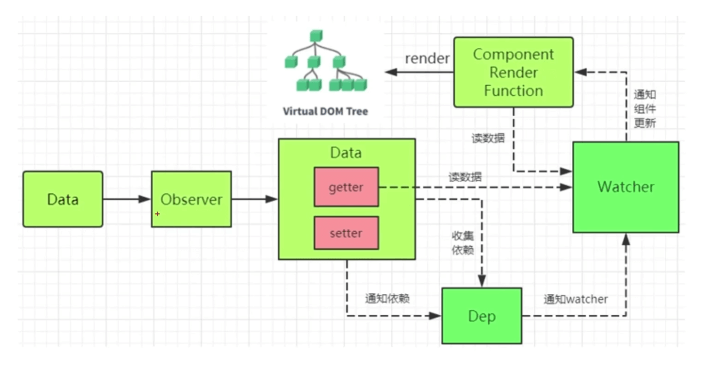
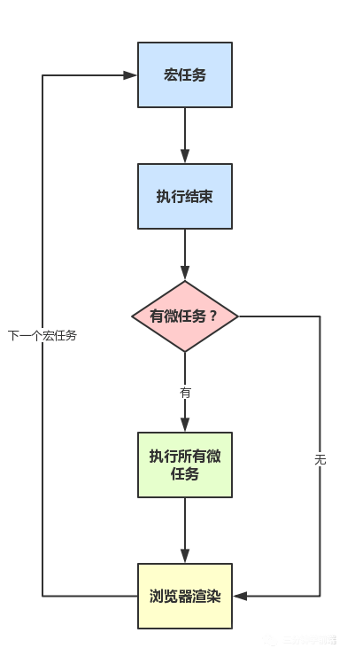

<div align="center">

## 前端进阶 - 乙篇

  

</div>

---

### Vue 父子组件通过 props 传值示例

```javascript
var childNode = {
  template:'<div>{{myMessage}}的类型是{{type}}</div>'，
  props:{'myMessage':Number},
  computed:{
    type(){
      return typeof this.myMessage;
    }
  }
}
var parentNode = {
  template :`
    <div class="parent">
      <my-child :my-message="num"></my-child>
    </div>`,
  components:{
    'myChild': childNode
  },
  data() {
    return {
      num: 1234567,
    }
  }
}

new Vue{(
  el: '#app',
  components: {
    'Home': parentNode
  }
)}
```

### Vue 父子组件生命周期执行顺序

#### 加载渲染过程

> 父 beforeCreate -> 父 created -> 父 beforeMount -> 子 beforeCreate -> 子 created -> 子 beforeMount -> 子 mounted -> 父 mounted

#### 子组件更新过程

> 父 beforeUpdate -> 子 beforeUpdate -> 子 updated -> 父 updated

#### 父组件更新过程

> 父 beforeUpdate -> 父 updated

#### 父组件销毁过程

> 父 beforeDestroy -> 子 beforeDestroy -> 子 destroyed -> 父 destroyed

### Vue/React/Angular 组件间通信

#### VUE

- 兄弟组件：创建一个事件总线 `bus`
  > 在需要传值的组件中用 `bus.$emit` 触发一个自定义事件，并传递参数  
  > 在需要接收数据的组件中用 `bus.$on` 监听自定义事件，并在回调函数中处理传递过来的参数
- 父向子传值：在组件中绑定属性，子组件中 `props` 就可以获取
- 子向父传值：通过在子组件方法中调用`$emit(方法名, 参数)`,方法名父组件中用 `on` 绑定
- 跨级传参：`Vuex`、`$attrs、$listeners`、`Provide、inject`

#### REACT

- 兄弟组件：`context`（也可以很好的适用跨级传值，和 `Vue` 中的 `bus` 属性一样都应该是高作用域的参数）
  > 两个属性：一个是 `Context` 生产者『 Provider 』，通常是一个父节点，另外是一个 `Context` 的消费者『 Consumer 』，通常是一个或者多个子节点。所以 `Context` 的使用基于生产者消费者模式
- 父向子传值：在组件中绑定属性，子组件中 `props` 就可以获取
- 子向父传值：通过在子组件方法中通过 `props` 获取方法名，回调的方式传值
- 跨级传参：外部库比如`redux`、`Provider、Consumer`

#### Angular

- 兄弟组件:
  > `service`。某个 `module` 中注入 `service`,所有这个 `module` 的 `component` 都可以拿到这个 `service` 的属性,方法,是共享的
  > `Rxjs` 的 `Observalbe`
- 父向子传参：
  > 父组件中通过属性值绑定，子组件通过 `@input` 获取。
  > 父组件中通过 `@ViewChild()` 绑定子组件，可以调用子组件的方法。
- 子向父传参：
  > 子组件中绑定通过 `@output` 绑定一个 `EventEmitter`, 然后 `EventEmitter.emit(value)` 可以在父组件中监听。
- 跨级传参：同兄弟组件。

### Vue 2.X 源码之『 VNode 』:checkered_flag:

其实 `VNode` 是对真实 `DOM` 的一种抽象描述，它的核心定义无非就几个关键属性，标签名、数据、子节点、键值等，其它属性都是都是用来扩展 `VNode` 的灵活性以及实现一些特殊 `feature` 的。由于 `VNode` 只是用来映射到真实 `DOM` 的渲染，不需要包含操作 `DOM` 的用法，因此它是非常轻量和简单的。`VirtualDOM` 除了它的数据结构的定义，映射到真实的 `DOM` 实际上要经历 `VNode` 的 **_create_**、**_diff_**、**_patch_** 等过程。

```javascript
/**
 * @param context 表示 VNode 的上下文环境，它是 Component 类型
 * @param tag 表示标签，它可以是一个字符串，也可以是一个 Component
 * @param data 表示 VNode 的数据，它是一个 VNodeData 类型
 * @param children 表示当前 VNode 的子节点，它是任意类型的
 * @param normalizationType 表示子节点规范的类型，类型不同规范的方法也就不一样，主要是参考 render 函数是编译生成还是用户手写的
 */
createElement (
  context: Component,
  tag?: string | Class<Component> | Function | Object,
  data?: VNodeData,
  children?: any,
  normalizationType?: number
){
  // 生成 VNode 的过程...
}
```

`Vue` 的 `update` 是实例的一个私有方法，被调用的时机有两个，一个是首次渲染，一个是数据更新的时候。`update` 方法的作用是把 `VNode` 渲染成真实的 `DOM`。

update 的核心就是调用 `vm.patch` 方法，这个方法在不同平台（服务器端、浏览器端）的定义是不一样的

```javascript
update (vnode: VNode, hydrating?: boolean)
```

### Vue 2.X 源码之『 响应式对象 』:checkered_flag:

**核心是利用 ES5 的 Object.defineProperty**,这也是 `Vue.js` 为什么不能兼容 `IE8` 及以下浏览器的原因。

`Object.defineProperty` 方法会直接在一个对象上定义一个新属性，或者修改一个对象的现有属性，并返回这个对象。

```javaScript
Object.defineProperty(
  obj, // 定义属性的对象
  prop, // 要定义或修改的属性的名称
  descriptor, // 将被定义或修改属性的描述符【核心】
)
```

> **observe** 这个方法的功能就是用来监测数据的变化。实现方式是给非 `VNode` 的对象类型数据添加 `Observer`对象实例,如果存在`__ob__`属性表示已经添加过则直接返回，否则在满足一定条件下去实例化一个 `Observer` 对象实例。

Observer 是一个类,它的作用是给对象属性添加 『 getter 』和『 setter 』,用于 **依赖收集** 和 **派发更新**



**依赖收集 getter**（重点关注以下两点）

- `*const dep = new Dep() // 实例化一个Dep实例`
- `*在 get 函数中通过 dep.depend 做依赖收集`

`Dep` 是一个 `Class`,它定义了一些属性和方法，它有一个静态属性 `target`，这是一个全局唯一 `Watcher`(同一时间内只能有一个全局的 `Watcher` 被计算)`。Dep` 实际上就是对 `Watcher` 的一种管理，`Dep` 脱离 `Watcher` 单独存在是没有意义的。`Watcher` 和 `Dep` 就是典型的 观察者设计模式，也叫做 `发布-订阅模式`。

`Watcher` 是一个 `Class`,在它的构造函数中定义了一些和 `Dep` 相关的属性：

```javascript
this.deps = [];
this.newDeps = [];
this.depIds = new Set();
this.newDepIds = new Set();
```

**收集过程**：当我们实例化一个渲染 `watcher` 的时候，首先进入 `watcher` 的构造函数逻辑，然后执行他的`this.get()`方法，进入 `get` 函数把 `Dep.target` 赋值为当前渲染 `watcher` 并压栈（为了恢复用）。接着执行`vm._render()`方法，生成渲染 `VNode`,并且在这个过程对 `vm` 上的数据访问，这个时候就触发数据对象的 `getter`（在此期间执行`Dep.target.addDep(this)`方法，将 `watcher` 订阅到这个数据持有的 `dep` 的 `subs` 中，为后续数据变化时通知到哪些 `subs` 做准备）。然后递归遍历添加所有子项的 `getter。`

> `Watcher` 在构造函数中初始化两个 `Dep` 实例数组。`newDeps` 代表新添加的 `Dep` 实例数组，`deps` 代表上一次添加的 `Dep` 实例数组。  
> 依赖清空：在执行清空依赖（`cleanupDeps`）函数时，会首先遍历 `deps`,移除对 `dep` 的订阅，然后把 `newDepsIds` 和 `depIds` 交换，`newDeps` 和 `deps` 交换，并把 `newDepIds` 和 `newDeps` 清空。考虑场景，在条件渲染时，及时对不需要渲染数据的订阅移除，减少性能浪费。

考虑到 Vue 是数据驱动的，所以每次数据变化都会重写 Render,那么`vm._render()`方法会再次执行，并再次触发数据。

收集依赖的目的是为了当这些响应式数据发生变化，触发它们的 setter 的时候，能知道应该通知哪些订阅者去做相应的逻辑处理【**派发更新**】

---

**派发更新 setter**（重点关注以下两点）

- `*childOb = !shallow && observe(newVal) // 如果shallow为false的情况，会对新设置的值变成一个响应式对象`
- `*dep.notify() // 通知所有订阅者`

**派发过程**：当我们组件中对响应的数据做了修改，就会触发 `setter` 的逻辑，最后调用`dep.notify()`方法，它是 `Dep` 的一个实例方法。具体做法是遍历依赖收集中建立的 `subs`，也就是 `Watcher` 的实例数组【`subs` 数组在依赖收集 `getter` 中被添加，期间通过一些逻辑处理判断保证同一数据不会被添加多次】，然后调用每一个 `watcher` 的 `update` 方法。

`update` 函数中有个`queueWatcher(this)`方法引入了队列的概念，是 `vue` 在做派发更新时优化的一个点，它并不会每次数据改变都会触发 `watcher` 回调，而是把这些 `watcher` 先添加到一个队列中，然后在 nextTick 后执行 `watcher` 的 `run` 函数
**队列排序保证：**

1. 组件的更新由父到子。父组件创建早于子组件，`watcher` 的创建也是
2. 用户自定义 `watcher` 要早于渲染 `watcher` 执行，因为用户自定义 `watcher` 是在渲染 `watcher` 前创建的
3. 如果一个组件在父组件 `watcher` 执行期间被销毁，那么它对应的 `watcher` 执行都可以被跳过，所以父组件的 `watcher` 应该先执行。

- 队列遍历：排序完成后，对队列进行遍历，拿到对应的 `watcher`,执行`watcher.run()`。

**run 函数解析**：先通过`this.get()`得到它当前的值，然后做判断，如果满足新旧值不等、新值是对象类型、deep 模式任何一个条件，则执行 `watcher` 的回调，注意回调函数执行的时候会把第一个参数和第二个参数传入新值 `value` 和旧值 `oldValue`。<u>_这就是当我们自己添加 watcher 时候可以在参数中取到新旧值的来源_</u>。对应渲染 `watcher` 而言，在执行`this.get()`方法求值的时候，会执行 `getter` 方法。因此在我们修改组件相关数据时候，会触发组件重新渲染，接着重新执行 `patch` 的过程

---

#### 手写一个数据绑定：

```javascript
<input id="input" type="text" />
<div id="text"></div>

let input = document.getElementById("input");
let text = document.getElementById("text");
let data = { value: "" };
Object.defineProperty(data, "value", {
  set: function(val) {
    text.innerHTML = val;
    input.value = val;
  },
  get: function() {
    return input.value;
  }
});
input.onkeyup = function(e) {
  data.value = e.target.value;
};
```

### Vue 2.X 源码之『 NextTick 』:checkered_flag:

JS 执行是单线程的，它基于`事件循环`。事件大致分为以下几个步骤：

1. 所有同步任务都是在主线程上执行，形成一个执行栈。
2. 主线程之外，还存在一个『 任务队列 』。只要异步任务有了运行结果，就在『 任务队列 』中放置一个事件。
3. 一旦执行栈中所有同步任务执行完毕，系统就会读取『 任务队列 』，看看里面有哪些事件。那些对应的异步执行任务就会结束等待状态，进入执行栈，开始执行。
4. 主线程不断重复上面操作。

> 结合 `setter` 分析，数据的变化到 `Dom` 的重新渲染是一个异步的过程，发生在下一个 `tick`。开发过程中，比如在服务端接口异步获取数据时候，如果某些方法是依赖数据修改后的 `DOM`，就必须将方法写在 `nextTick` 后执行。

> `NextTick` 根据执行环境分别尝试采用 `Promise`、`MutationObserver`、`setImmediate`，如果以上都不行则采用 `setTimeout` 定义了一个异步方法，多次调用 `nextTick` 会将方法存入队列中，通过这个异步方法清空当前队列。

```javascript
getNames(res).then(() => {
  this.userNames = res.data;
  console.log(this.$refs.userNames); // userNames并没有被更新
  this.$nextTick(() => {
    console.log(this.$refs.userNames); // 获取渲染更新后的userNames
  });
});
```

> 就在今天，2.0 刚刚整理完毕，3.0 正式推出。:point_right:[快乐就完事了](https://vue-composition-api-rfc.netlify.com/#api-introduction):point_left:

### Vue 2.X 的编译过程

#### parse

> 解析模板字符串生成 AST `const ast = parse(template.trim(), options)`

parse 的目标是将`template`模板字符串转换成 AST 树，它是一种用 Javascript 对象的形式来描述整个模板。AST 元素节点总共有 3 种类型，用 type 表示：

- 1 表示普通元素
- 2 表示表达式
- 3 表示纯文本

当 AST 树构造完毕，下一步就是 `optimize` 优化这棵树。

#### optimize

> 优化语法树 `optimize(ast, options)`

`optimize` 的过程，其实就是深度遍历这个 AST 树，去检测它的每一个子树是不是静态节点，如果是静态节点则它们生成的 DOM 永远不需要改变，这对运行时对模板的更新起到极大的优化作用。

#### codegen

> 生成代码 `const code = generate(ast, options)`

```js
export function generate(
  ast: ASTElement | void,
  options: CompilerOptions
): CodegenResult {
  const state = new CodegenState(options);
  const code = ast ? genElement(ast, state) : '_c("div")';
  return {
    render: `with(this){return ${code}}`,
    staticRenderFns: state.staticRenderFns
  };
}
```

generate 函数首先通过 `genElement(ast, state)` 生成 code，再把 code 用 `with(this){return ${code}}}` 包裹起来。对 `v-if`、`v-for` 等指令的处理就是在 `genElement` 函数中完成的。

### macro/micro task 宏任务、微任务

在事件循环中，每进行一次循环操作称为 `tick`，每一次 `tick` 的任务处理模型是比较复杂的，但关键步骤如下：

- 执行一个宏任务（栈中没有就从事件队列中获取）
- 执行过程中如果遇到微任务，就将它添加到微任务的任务队列中
- 宏任务执行完毕后，立即执行当前微任务队列中的所有微任务（依次执行）
- 当前宏任务执行完毕，开始检查渲染，然后 `GUI` 线程接管渲染
- 渲染完毕后，`JS` 线程继续接管，开始下一个宏任务（从事件队列中获取）



- 宏任务（macro task）主要包含：
  - script
  - setTimeout
  - setInterval
  - I/O、UI 交互事件
  - postMessage
  - MessageChannel
  - setImmediate(Node.js)

微任务`micro task`：可以理解是当前 `task` 执行结束后立即执行的任务，也就是在 `macro task` 和 `渲染 DOM`之间执行的内容。

- 微任务（micro task）主要包括：
  - Promise.then
  - MutaionObserver
  - process.nextTick(Node.js)

### React 中 setState 更新数据

```javascript
class Example extends React.Component {
  constructor() {
    super();
    this.state = {
      val: 0
    };
  }
  componentDidMount() {
    this.setState({ val: this.state.val + 1 });
    // 第 1 次 log
    console.log(this.state.val);
    this.setState({ val: this.state.val + 1 });
    // 第 2 次 log
    console.log(this.state.val);
    setTimeout(() => {
      this.setState({ val: this.state.val + 1 });
      // 第 3 次 log
      console.log(this.state.val);
      this.setState({ val: this.state.val + 1 });
      // 第 4 次 log
      console.log(this.state.val);
    }, 0);
  }
  render() {
    return null;
  }
}
// 结果 0 0 2 3；
```

在 React 中，两种调用 `this.setState` 的方式：

> a.通过 `addEventListener` 引发的事物处理（比如 `onClick` 引发的)。  
> b.通过 `setTimeout`/`setInterval` 产生的异步调用。

在 `setState` 的实现中，会根据一个变量 `isBatchingUpdates` 判断是直接更新 `this.state` 还是放到 `task` 中下次再说。以上两种情况：

a 情况是放到下次队列中合并 `setState` 一起执行，产生异步执行。
b 情况会同步执行 `setState`

### 对比 Redux 和 Vuex

#### Flux

> View --> Action --> Dispatcher --> state --> View

#### Redux

> View --> action --> Reducer --> state --> View(同步异步一样)

#### Vuex

> View --> commit --> mutations --> state --> View(同步)  
> View --> dispatch --> action --> mutations --> state --> View(异步)

#### 共同点

首先两者都是处理全局状态的工具库，大致实现思想都是：

> _全局 state 保存状态_ --> _dispatch(action)_ --> _reducer(Vuex 里的 mutation)_ --> _生成 newState_;

整个状态为同步操作。

#### 区别

最大的区别在于处理异步的不同，『 Vuex 』里面多了一步 `commit` 操作，在 `action` 之后 `commit(mutation)`之前处理异步，而 『 redux 』里面则是通过中间件处理

### Vue/React 的 diff 优化

优化的表现为：**时间复杂度从 O(N<sup>3</sup>)降到 O(N)**

React 和 Vue 做的假设是：

- 检测 VDOM 的变化只发生在同一层
- 检测 VDOM 的变化依赖于用户指定的 `key`

> 如果变化发生在不同层或者同样的元素用户指定了不同的 `key` 或者不同元素用户指定同样的 `key`，React 和 Vue 都不会检测到，就会发生莫名其妙的问题。

但是 React 认为，前端碰到上面的第一种情况概率很小，第二种情况又可以通过提示用户，让用户去解决，因此这个取舍是值得的。没有牺牲空间复杂度，却换来了在大多数情况下时间上的巨大提升。

### React diff 介绍:checkered_flag:

React Diff 的入口函数是 reconcileChildFibers 出发的，该函数会根据 newChild（即 JSX 对象）类型调用不同的处理函数。

你可以从[这里](https://github.com/facebook/react/blob/1fb18e22ae66fdb1dc127347e169e73948778e5a/packages/react-reconciler/src/ReactChildFiber.new.js#L1280)看到 reconcileChildFibers 的源码。

```javascript
// 根据newChild类型选择不同diff函数处理
function reconcileChildFibers(
  returnFiber: Fiber,
  currentFirstChild: Fiber | null,
  newChild: any
): Fiber | null {
  const isObject = typeof newChild === "object" && newChild !== null;

  if (isObject) {
    // object类型，可能是 REACT_ELEMENT_TYPE 或 REACT_PORTAL_TYPE
    switch (newChild.$$typeof) {
      case REACT_ELEMENT_TYPE:
      // 单节点 diff，调用 reconcileSingleElement 处理
      // // ...省略其他case
    }
  }

  if (typeof newChild === "string" || typeof newChild === "number") {
    // 调用 reconcileSingleTextNode 处理
    // ...省略
  }

  if (isArray(newChild)) {
    // 多节点 diff，调用 reconcileChildrenArray 处理
    // ...省略
  }

  // 一些其他情况调用处理函数
  // ...省略

  // 以上都没有命中，删除节点
  return deleteRemainingChildren(returnFiber, currentFirstChild);
}
```

我们可以从同级的节点数量将 Diff 分为两类：

- **单节点 diff**： 当 newChild 类型为 object、number、string，代表同级只有一个节点

- **多节点 diff**：当 newChild 类型为 Array，同级有多个节点

#### 单节点 diff

对于单个节点，我们以类型 object 为例，会进入 reconcileSingleElement。这个函数会做如下事情：


让我们看看第二步**判断 DOM 节点是否可以复用**是如何实现的。

```javascript
function reconcileSingleElement(
  returnFiber: Fiber,
  currentFirstChild: Fiber | null,
  element: ReactElement
): Fiber {
  const key = element.key;
  let child = currentFirstChild;

  // 首先判断是否存在对应DOM节点
  while (child !== null) {
    // 上一次更新存在DOM节点，接下来判断是否可复用

    // 首先比较key是否相同
    if (child.key === key) {
      // key相同，接下来比较type是否相同

      switch (child.tag) {
        // ...省略case

        default: {
          if (child.elementType === element.type) {
            // type相同则表示可以复用
            // 返回复用的fiber
            return existing;
          }

          // type不同则跳出switch
          break;
        }
      }
      // 代码执行到这里代表：key相同但是type不同
      // 将该fiber及其兄弟fiber标记为删除
      deleteRemainingChildren(returnFiber, child);
      break;
    } else {
      // key不同，将该fiber标记为删除
      deleteChild(returnFiber, child);
    }
    child = child.sibling;
  }

  // 创建新Fiber，并返回 ...省略
}
```

##### 考虑如下例子：

当前页面有 3 个 li，我们要全部删除，再插入一个 p。

```javascript
// 当前页面显示的
ul > li * 3;

// 这次需要更新的
ul > p;
```

由于本次更新时只有一个 p，属于单一节点的 Diff，会走上面介绍的代码逻辑。

在 reconcileSingleElement 中遍历之前的 3 个 fiber（对应的 DOM 为 3 个 li），寻找本次更新的 p 是否可以复用之前的 3 个 fiber 中某个的 DOM。

当 key 相同且 type 不同时，代表我们已经找到本次更新的 p 对应的上次的 fiber，但是 p 与 li type 不同，不能复用。既然唯一的可能性已经不能复用，则剩下的 fiber 都没有机会了，所以都需要标记删除。

当 key 不同时只代表遍历到的该 fiber 不能被 p 复用，后面还有兄弟 fiber 还没有遍历到。所以仅仅标记该 fiber 删除。

#### 多节点 diff

对于 `isArray(newChild)` newChild 为多节点时，会调用 reconcileChildrenArray 进行处理，我们先看以下几种节点更新的情况：

```javascript
// 之前
<ul>
  <li key="0">0<li>
  <li key="1">1<li>
</ul>

// 之后 情况1 —— 节点更新
<ul>
  <li key="0" className="after">0<li>
  <li key="1">1<li>
</ul>

<ul>
  <div key="0">0</div>
  <li key="1">1<li>
</ul>

// 之后 情况2 —— 新增或减少节点
<ul>
  <li key="0">0<li>
  <li key="1">1<li>
  <li key="2">2<li>
</ul>

<ul>
  <li key="1">1<li>
</ul>

// 之后 情况3 —— 节点位置变化
<ul>
  <li key="1">1<li>
  <li key="0">0<li>
</ul>
```

Diff 算法的工作内容就是处理以上几种情况了：

**1.** 判断当前节点的更新属于哪种情况

**2.** 如果是新增，执行新增逻辑

**3.** 如果是删除，执行删除逻辑

**4.** 如果是更新，执行更新逻辑

在日常开发中，相较于新增和删除，更新组件发生的频率更高。所以 Diff 会优先判断当前节点是否属于更新，整体逻辑会经历两轮遍历：

- [第一轮遍历](https://github.com/facebook/react/blob/1fb18e22ae66fdb1dc127347e169e73948778e5a/packages/react-reconciler/src/ReactChildFiber.new.js#L818)：处理更新的节点。

- [第二轮遍历](https://github.com/facebook/react/blob/1fb18e22ae66fdb1dc127347e169e73948778e5a/packages/react-reconciler/src/ReactChildFiber.new.js#L893)：处理剩下的不属于更新的节点。

##### 第一轮遍历

**1.** `let i = 0`，遍历 `newChildren`，将 `newChildren[i]`与 `oldFiber` 比较，判断 DOM 节点是否可复用。

**2.** 如果可复用，`i++`，继续比较 `newChildren[i]`与 `oldFiber.sibling`，可以复用则继续遍历。

**3.** 如果不可复用，分两种情况：

- `key` 不同导致不可复用，立即跳出整个遍历，第一轮遍历结束。

- `key` 相同 `type` 不同导致不可复用，会将 `oldFiber` 标记为 DELETION，并继续遍历

**4.** 如果 `newChildren` 遍历完（即 `i === newChildren.length - 1`）或者 `oldFiber` 遍历完（即 `oldFiber.sibling === null`），跳出遍历，第一轮遍历结束。

然后带着第一轮遍历的结果，开始第二轮遍历。

##### 第二轮遍历

**_newChildren 与 oldFiber 同时遍历完_**

那就是最理想的情况：只需在第一轮遍历进行组件更新 (opens new window)。此时 Diff 结束。

**_newChildren 没遍历完，oldFiber 遍历完_**

已有的 DOM 节点都复用了，这时还有新加入的节点，意味着本次更新有新节点插入，我们只需要遍历剩下的 newChildren 为生成的 workInProgress fiber 依次标记 Placement。

**_newChildren 遍历完，oldFiber 没遍历完_**

意味着本次更新比之前的节点数量少，有节点被删除了。所以需要遍历剩下的 oldFiber，依次标记 Deletion。

**_newChildren 与 oldFiber 都没遍历完_**

这意味着有节点在这次更新中改变了位置。这是 Diff 算法最精髓也是最难懂的部分。我们接下来重点讲解**如何标记节点是否移动**：

既然我们的目标是寻找移动的节点，那么我们需要明确：节点是否移动是以什么为参照物？

我们的参照物是：最后一个可复用的节点在 `oldFiber` 中的位置索引（用变量 `lastPlacedIndex` 表示）。

由于本次更新中节点是按 `newChildren` 的顺序排列。在遍历 `newChildren` 过程中，每个遍历到的可复用节点一定是当前遍历到的所有可复用节点中最靠右的那个，即一定在 `lastPlacedIndex` 对应的可复用的节点在本次更新中位置的后面。

那么我们只需要比较遍历到的可复用节点在上次更新时是否也在 `lastPlacedIndex` 对应的 `oldFiber` 后面，就能知道两次更新中这两个节点的相对位置改变没有。

我们用变量 `oldIndex` 表示遍历到的可复用节点在 `oldFiber` 中的位置索引。如果 `oldIndex < lastPlacedIndex`，代表本次更新该节点需要向右移动。

`lastPlacedIndex` 初始为 `0`，每遍历一个可复用的节点，如果` oldIndex >= lastPlacedIndex`，则 `lastPlacedIndex = oldIndex`。

单纯文字表达比较晦涩，这里提供一个 Demo，可以对照着理解，demo 中我们简化下书写，每个字母代表一个节点，字母的值代表节点的 `key`。

```javascript
// 之前
abcd

// 之后
acdb

===第一轮遍历开始===
a（之后）vs a（之前）
key不变，可复用
此时 a 对应的oldFiber（之前的a）在之前的数组（abcd）中索引为0
所以 lastPlacedIndex = 0;

继续第一轮遍历...

c（之后）vs b（之前）
key改变，不能复用，跳出第一轮遍历
此时 lastPlacedIndex === 0;
===第一轮遍历结束===

===第二轮遍历开始===
newChildren === cdb，没用完，不需要执行删除旧节点
oldFiber === bcd，没用完，不需要执行插入新节点

将剩余oldFiber（bcd）保存为map

// 当前oldFiber：bcd
// 当前newChildren：cdb

继续遍历剩余newChildren

key === c 在 oldFiber中存在
const oldIndex = c（之前）.index;
此时 oldIndex === 2;  // 之前节点为 abcd，所以c.index === 2
比较 oldIndex 与 lastPlacedIndex;

如果 oldIndex >= lastPlacedIndex 代表该可复用节点不需要移动
并将 lastPlacedIndex = oldIndex;
如果 oldIndex < lastplacedIndex 该可复用节点之前插入的位置索引小于这次更新需要插入的位置索引，代表该节点需要向右移动

在例子中，oldIndex 2 > lastPlacedIndex 0，
则 lastPlacedIndex = 2;
c节点位置不变

继续遍历剩余newChildren

// 当前oldFiber：bd
// 当前newChildren：db

key === d 在 oldFiber中存在
const oldIndex = d（之前）.index;
oldIndex 3 > lastPlacedIndex 2 // 之前节点为 abcd，所以d.index === 3
则 lastPlacedIndex = 3;
d节点位置不变

继续遍历剩余newChildren

// 当前oldFiber：b
// 当前newChildren：b

key === b 在 oldFiber中存在
const oldIndex = b（之前）.index;
oldIndex 1 < lastPlacedIndex 3 // 之前节点为 abcd，所以b.index === 1
则 b节点需要向右移动
===第二轮遍历结束===

最终acd 3个节点都没有移动，b节点被标记为移动
```

### React v15 和 v16 比较

#### React15 架构可以分为两层：

- **Reconciler（协调器）** —— 负责找出变化的组件
- **Renderer（渲染器）** —— 负责将变化的组件渲染到页面上

**Reconciler（协调器）** ：我们知道，在 React 中可以通过 this.setState、this.forceUpdate、ReactDOM.render 等 API 触发更新。每当有更新发生时，Reconciler 会做如下工作：

- 调用函数组件、或 class 组件的 render 方法，将返回的 JSX 转化为虚拟 DOM
- 将虚拟 DOM 和上次更新时的虚拟 DOM 对比
- 通过对比找出本次更新中变化的虚拟 DOM
- 通知 Renderer 将变化的虚拟 DOM 渲染到页面上

**Renderer（渲染器）**：由于 React 支持跨平台，所以不同平台有不同的 Renderer。我们前端最熟悉的是负责在浏览器环境渲染的 Renderer —— ReactDOM (opens new window)。除此之外，还有：

- ReactNative (opens new window)渲染器，渲染 App 原生组件
- ReactTest (opens new window)渲染器，渲染出纯 Js 对象用于测试
- ReactArt (opens new window)渲染器，渲染到 Canvas, SVG 或 VML (IE8)

**React15 架构的缺点**

- Reconciler 和 Renderer 是交替工作
- 同步更新，无法中断

在 Reconciler 中，mount 的组件会调用 mountComponent (opens new window)，update 的组件会调用 updateComponent (opens new window)。这两个方法都会递归更新子组件。由于递归执行，所以更新一旦开始，中途就**无法中断**。当层级很深时，递归更新时间超过了 16ms，用户交互就会卡顿。

#### React16 架构可以分为三层：

- **Scheduler（调度器）** —— 调度任务的优先级，高优任务优先进入 Reconciler
- **Reconciler（协调器）** —— 负责找出变化的组件
- **Renderer（渲染器）** —— 负责将变化的组件渲染到页面上

**Scheduler（调度器）**：既然我们以浏览器是否有剩余时间作为任务中断的标准，那么我们需要一种机制，当浏览器有剩余时间时通知我们。React 自己实现了类似浏览器 requestIdleCallback Api 的方法来实现这一机制。

**Reconciler（协调器）**：协调器重构的一大目的是将老的同步更新的架构变为异步可中断更新。异步可中断更新可以理解为：更新在执行过程中可能会被打断（浏览器时间分片用尽或有更高优任务插队），当可以继续执行时恢复之前执行的中间状态。

    <!-- 时间切片 requestIdleCallback -->

    一个 task(宏任务) -- 队列中全部 job(微任务) -- requestAnimationFrame -- 浏览器重排/重绘 -- requestIdleCallback

```javascript
let nextUnitOfWork = null;

/**
 * workInProgress 表示fiber对象
 *  type 类型
 *  key
 *  props
 *  stateNode
 *  child 第一个子节点
 *  sibling 下一个兄弟节点
 *  return 父节点
 */
function performUnitOfWork(workInProgress) {
  // step1 执行任务
  const { type } = workInProgress;
  if (typeof type === "function") {
    type.prototype.isReactComponent
      ? updateClassComponent(fiber)
      : updateFunctionComponent(fiber);
  } else {
    updateHostComponent(fiber);
  }

  // step2 返回下一个执行任务
  if (workInProgress.child) {
    return workInProgress.child;
  }
  let nextFiber = workInProgress;
  while (nextFiber) {
    if (nextFiber.sibling) {
      return nextFiber.sibling;
    }
    nextFiber = nextFiber.return;
  }
}

let wipRoot; // ...根节点 ...

function workLoop(IdleDeadline) {
  //  IdleDeadline.timeRemaining() 获取浏览器空闲时间
  while (nextUnitOfWork && IdleDeadline.timeRemaining() > 1) {
    // 执行任务，并且返回下一个执行任务
    workInProgress = performUnitOfWork(workInProgress);
  }

  // 提交
  if (!nextUnitOfWork && wipRoot) commitRoot();
}

// 提交更新
function commitRoot() {
  commitWorker(wipRoot.child);
  wipRoot = null;
}

window.requestIdleCallback(workLoop);
```

在 React16 中，Reconciler 与 Renderer 不再是**交替工作**。当 Scheduler 将任务交给 Reconciler 后，Reconciler 会为变化的虚拟 DOM 打上代表**增/删/更新**的标记。整个 Scheduler 与 Reconciler 的工作都在内存中进行。只有当所有组件都完成 Reconciler 的工作，才会统一交给 Renderer。

**Renderer（渲染器）**：Renderer 根据 Reconciler 为虚拟 DOM 打的标记，同步执行对应的 DOM 操作。

### React Fiber 的设计理念:checkered_flag:

可以把 `React Fiber` 理解为 React 内部实现的一套状态更新机制。支持任务的不同优先级，可中断和恢复，并且能在恢复后可以调用之前的中间状态。

其中每个虚拟 Dom 的更新单元就是一个 Fiber 节点，每个 Fiber 节点对应一个 React element，保存了该组件的类型（函数组件/类组件/原生组件...）、对应的 DOM 节点等信息。可以从这里看到所有[Fiber 节点的属性定义](https://github.com/facebook/react/blob/1fb18e22ae66fdb1dc127347e169e73948778e5a/packages/react-reconciler/src/ReactFiber.new.js#L117)。

#### Fiber 🌲🌲

每个 Fiber 节点有个对应的 React element，多个 Fiber 节点是如何连接形成树呢？靠如下三个属性：

```javascript
// 指向父级Fiber节点
this.return = null;
// 指向子Fiber节点
this.child = null;
// 指向右边第一个兄弟Fiber节点
this.sibling = null;
```

举个例子，如下的组件结构，对应的 fiber 树为下图：

```javascript
function App() {
  return (
    <div>
      i am
      <span>KaSong</span>
    </div>
  );
}
```


> 这里需要提一下，为什么父级指针叫做 return 而不是 parent 或者 father 呢？因为作为一个工作单元，return 指节点执行完 completeWork 后会返回的下一个节点。子 Fiber 节点及其兄弟节点完成工作后会返回其父级节点，所以用 return 指代父级节点。

#### 双缓存

当我们用 canvas 绘制动画，每一帧绘制前都会调用 ctx.clearRect 清除上一帧的画面。如果当前帧画面计算量比较大，导致清除上一帧画面到绘制当前帧画面之间有较长间隙，就会出现白屏。为了解决这个问题，我们可以在内存中绘制当前帧动画，绘制完毕后直接用当前帧替换上一帧画面，由于省去了两帧替换间的计算时间，不会出现从白屏到出现画面的闪烁情况。这种在内存中构建并直接替换的技术叫做[双缓存](https://baike.baidu.com/item/双缓冲)。

React 使用“双缓存”来完成 Fiber 树的构建与替换——对应着 DOM 树的**创建**与**更新**。在 React 中最多会同时存在两棵 Fiber 树。当前屏幕上显示内容对应的 Fiber 树称为 current Fiber 树，正在内存中构建的 Fiber 树称为 workInProgress Fiber 树。

current Fiber 树中的 Fiber 节点被称为 current fiber，workInProgress Fiber 树中的 Fiber 节点被称为 workInProgress fiber，他们通过 alternate 属性连接。

```javascript
currentFiber.alternate === workInProgressFiber;
workInProgressFiber.alternate === currentFiber;
```

即当 workInProgress Fiber 树构建完成交给 Renderer 渲染在页面上后，应用根节点的 current 指针指向 workInProgress Fiber 树，此时 workInProgress Fiber 树就变为 current Fiber 树。每次状态更新都会产生新的 workInProgress Fiber 树，通过 current 与 workInProgress 的替换，完成 DOM 更新。

#### JSX 与 Fiber 节点

JSX 会被编译为 React.createElement 是一种描述当前组件内容的数据结构，他不包含组件 schedule、reconcile、render 所需的相关信息。

比如如下信息就不包括在 JSX 中：

- 组件在更新中的优先级
- 组件的 state
- 组件被打上的用于 Renderer 的标记

这些内容都包含在 Fiber 节点中。

所以，在组件 mount 时，Reconciler 根据 JSX 描述的组件内容生成组件对应的 Fiber 节点。

在 update 时，Reconciler 将 JSX 与 Fiber 节点保存的数据对比，生成组件对应的 Fiber 节点，并根据对比结果为 Fiber 节点打上标记。

### React hook 原理

对于 useState Hook，考虑如下例子：

```javascript
function App() {
  const [num, updateNum] = useState(0);

  return <p onClick={() => updateNum((num) => num + 1)}>{num}</p>;
}
```

可以将工作分为两部分：

**1.** 通过一些途径产生更新，更新会造成组件 `render`。

**2.** 组件 `render` 时 `useState` 返回的 `num` 为更新后的结果。

其中步骤 1 的更新可以分为 `mount` 和 `update`：

1.调用 `ReactDOM.render` 会产生 `mount` 的更新，更新内容为 `useState` 的 `initialValue`（即 0）。

2.点击 `p` 标签触发 `updateNum` 会产生一次 `update` 的更新，更新内容为 `num => num + 1`。

useState，大体逻辑如下：

```javascript
function useState(initialState) {
  // 当前useState使用的hook会被赋值该该变量
  let hook;

  if (isMount) {
    // ...mount时需要生成hook对象
  } else {
    // ...update时从workInProgressHook中取出该useState对应的hook
  }

  let baseState = hook.memoizedState;
  if (hook.queue.pending) {
    // ...根据queue.pending中保存的update更新state
  }
  hook.memoizedState = baseState;

  return [baseState, dispatchAction.bind(null, hook.queue)];
}
```

调用 `updateNum` 实际调用的是 `dispatchAction.bind(null, hook.queue)`

```javascript
function dispatchAction(queue, action) {
  // ...创建update

  // ...环状单向链表操作

  // 模拟React开始调度更新
  schedule();
}
```

```javascript
// 首次render时是mount
isMount = true;

function schedule() {
  // 更新前将workInProgressHook重置为fiber保存的第一个Hook
  workInProgressHook = fiber.memoizedState;
  // 触发组件render
  fiber.stateNode();
  // 组件首次render为mount，以后再触发的更新为update
  isMount = false;
}
```

### React 官方 Hooks 总结

首先我们要清楚 `Hook` 的两个额外规则：

1. 只能在顶层调用 `HOOK`，不要在循环、条件或嵌套函数中调用 `Hook` 。
2. 仅从 `React` 函数式组件中调用 `Hook`，不要从常规 JavasScript 函数调用 `Hook`。

#### useState

`usetState` 使我们可以在函数组件中来更新本地 `state` (状态)。类似类组件中的 `this.state` 。返回两个参数，第一个参数是带有响应式的 `state`，第二个是可以更新 `state` 的函数。

```js
const [num, setNum] = useState(0);
```

#### useEffect

可以把 `useEffect` Hook 看做 `componentDidMount`，`componentDidUpdate` 和 `componentWillUnmount` 这三个函数的组合。可以利用这个函数来执行一些副作用，比如 `ajax` 请求、访问原生 `dom` 元素、本地持久化缓存、绑定/解绑事件、添加订阅、设置定时器、记录日志等。

##### 模拟 componentDidMount 和 componentDidUpdate

```javascript
useEffect(() => {
  document.title = `你点击了${number}次`;
});
```

##### 清除副作用

```js
// 方式一： 返回一个清除副作用的函数
useEffect(() => {
  console.log("开启一个新的定时器");
  let $timer = setInterval(() => {
    setNumber((number) => number + 1);
  }, 1000);

  // useEffect 如果返回一个函数的话，该函数会在组件卸载和更新时调用
  return () => {
    console.log("destroy effect");
    clearInterval($timer);
  };
});

// 方式二： 第一个参数传空数组
useEffect(() => {
  console.log("开启一个新的定时器");
  let $timer = setInterval(() => {
    setNumber((number) => number + 1);
  }, 1000);
}, []); // 或者在这里传入一个空的依赖项数组，这样就不会去重复执行
```

##### 性能优化

类似清除副作用的方式二，第二个参数的入参决定是否执行 `useEffect` 的第一个参数函数。

```js
const [text, setText] = useState("");

useEffect(() => {
  console.log("useEffect");
  let $timer = setInterval(() => {
    setNumber((number) => number + 1);
  }, 1000);
}, [text]); // 数组表示 effect 依赖的变量，只有当这个变量发生改变之后才会重新执行 efffect 函数
```

##### 使用多个 Effect 实现关注点分离

简而言之就是我们可以在函数内使用多个 useEffect 来包裹不同业务的逻辑。

```js
// Hooks 版
function FriendStatusWithCounter(props) {
  const [count, setCount] = useState(0);
  useEffect(() => {
    document.title = `You clicked ${count} times`;
  });

  const [isOnline, setIsOnline] = useState(null);
  useEffect(() => {
    function handleStatusChange(status) {
      setIsOnline(status.isOnline);
    }

    ChatAPI.subscribeToFriendStatus(props.friend.id, handleStatusChange);
    return () => {
      ChatAPI.unsubscribeFromFriendStatus(props.friend.id, handleStatusChange);
    };
  });
  // ...
}
```

#### useReducer

`useState` 的替代方案，`rudex` 的一个应用场景。它接收一个形如 `（state, action） => newSate` 的 `reducer`。在某些场景下，`useReducer` 会比 `useState` 更适用，例如 `state` 逻辑复杂且包含多个子值，或者下一个 `state` 依赖于之前的 `state` 等。

#### useMemo

类似类组件中的 `React.memo` 功能，**关注对函数执行结果的缓存**。

#### useCallback

`useCallback(fn, deps)` 类似 `useMemo(() => fn, deps)` ,**关注对函数的缓存**。

#### useRef

返回一个可变的 `ref` 对象，其 `.current` 属性被初始化为传入的参数（initialValue）。返回的 `ref` 对象在组件的整个生命周期内持续存在。**变更 `.current` 不会引发组件的重新渲染**。

#### useImperativeHandle

比如 `input` 子组件通过 `useImperativeHandle` 可以控制只暴露 `focus` 方法给父组件。**建议 `useImperativeHandle` 和 `forwardRef` 同时使用**，减少暴露给父组件的属性，避免使用 `ref` 这样的命令式代码。

### React 性能优化

#### PureComponent/shouldComponentUpdate

类组件的两种对 props 比较判断来决定是否应该 `render` 的优化方式。使用 PureComponent/ShouldComponentUpdate 时，需要注意几点：

1. PureComponent 会对 props 与 state 做浅比较，所以一定要保证 props 与 state 中的数据是 immutable 的。
2. 如果你的数据不是 immutable 的，或许你可以自己手动通过 ShouldComponentUpdate 来进行深比较。当然深比较的性能一般都不好，不到万不得已，最好不要这样搞。

#### React.memo

作用类似 PureComponent ，但它是为函数式组件服务的。`React.memo` 会对 props 进行**浅比较**，如果一致，则不会再执行了。

#### 善用 React.useMemo

`React.useMemo` 是 React 内置 hook 之一，主要为了解决组件函数在频繁 `render` 时，无差别频繁触发无用的昂贵计算，一般会作为性能优化的手段之一。

```js
const App = (props) => {
  const [boolean, setBoolean] = useState(false);
  const [start, setStart] = useState(0);

  // 这是一个非常耗时的计算
  const result = computeExpensiveFunc(start);
  // const result = useMemo(()=>computeExpensiveFunc(start), [start]);
};
```

上述代码中，每次 `state` 变化后就会重新计算 `result`，但是应用 `useMemo` 后就会根据第二个参数中变化去决定是否执行计算。所以推荐 `React.useMemo` 要多用。

#### 合理使用 React.useCallback

函数组件中， `React.useCallback` 也是性能优化的手段之一。

```js
const OtherComponent = React.memo(()=>{
	...
});

const App = (props)=>{
  const [boolan, setBoolean] = useState(false);
  const [value, setValue] = useState(0);

  const onChange = (v) => {
		axios.post(`/api?v=${v}&state=${state}`)
  }

  return (
  	<div>
    	{/* OtherComponent 是一个非常昂贵的组件 */}
    	<OtherComponent onChange={onChange}/>
    </div>
  )
}
```

上述例子中，我们要避免无用的 render, 虽然 `OtherComponent` 已经用 `React.memo` 包裹起来了，但是 setBoolean 的仍然会触发组件的 `render`，因为 `onChange` 函数在每一次 `render` 时，都是新生成的，导致了子组件浅比较失败。通过 `React.useCallback`，我们可以让 `onChange` 只有在 `state` 变化时，才重生成。

```js
const onChange = React.useCallback(
  (v) => {
    axios.post(`/api?v=${v}&state=${state}`);
  },
  [state]
);
```

#### 谨慎使用 Context

Context 是跨组件传参的一种方案，但我们需要知道，我们无法阻止 `Context` 触发的 `render`。
不像 `props` 和 `state`,React 提供了 API 进行浅比较，避免我们无用的 `render`, `Context` 完全没有任何方案可以避免无用的渲染。

有几点关于 `Context` 的建议：

- `Context` 只放置必要的、关键的、被大多数组件共享的状态。
- 对非常昂贵的组件，建议在父级获取 Context 数据后，通过 `props` 传入再做节能处理。

#### 小心使用 Redux

`Redux` 中的一些细节，稍不注意，就会触发无用的 `render`, 或者其它的坑。

##### 精细化依赖

```js
const App = (props)=>{
  return (
    <div>
      {props.project.id}
    </div>
  )
}
export default connect((state)=>{
  // layout: state.layout,
  project: state.project,
  // user: state.user
})(App);
```

对于 `connect` 中的 `layout`、`user` 我们在组件中完全没有应用，但是数据变化会触发组件的 `render`，应当删掉。所以精细化依赖可以避免无效的 `render`，是一种有效的优化手段。

##### 不可变数据

我们经常会小心直接操作 `redux` 源数据，导致意料之外的 BUG。
例如，JS 中的数组、对象是地址引用的。就算我们直接操作数组，也不会改变数据地址。

```js
const list = ["1"];
const oldList = list;
list.push("a");

list === oldList; //true
```

在 `Redux` 中，就可能发生这样的错误。

```js
let initState = {
  list: ["1"]
};

function counterReducer(state, action) {
  switch (action.type) {
    case "PUSH":
      state.list.push("2");
      return {
        list: state.list
      };
    default:
      return state;
  }
}
```

如果组件中使用了 `ShouldComponentUpdate` 或者 `React.memo` 对 `list` 进行浅比较，则会判断相等阻止组件更新，导致意料之外的 BUG。

如果项目中大量应用了 `ShouldComponentUpdate` 或者 `React.memo`，则一定要保证依赖数据的不可变性！建议使用 [immer.js](https://github.com/immerjs/immer) 来操作复杂数据。

### Vue 3.X 新特性 :checkered_flag:

#### 监测机制的改变

- 3.0 将带来基于代理 `Proxy` 的 `observer` 实现，提供全语言覆盖的反应性跟踪。
- 消除了 Vue 2 当中基于 `Object.defineProperty` 的实现所存在的很多监测限制：

  - 可以检测属性的添加和删除；
  - 可以检测数组索引和长度的变更；
  - 支持了 `Map`、`Set`、`WeakMap` 和 `WeakSet`。

#### 模板

- 模板方面没有大的变更，只改了作用域插槽，2.x 的机制导致作用域插槽变了，父组件会重新渲染，而 3.0 把作用域插槽改成了函数的方式，这样只会影响子组件的重新渲染，提升了渲染的性能。
- 同时，对于 `render` 函数的方面，vue3.0 也会进行一系列更改来方便习惯直接使用 `api` 来生成 `vdom` 。

#### 对象式的组件声明方式

- vue2.x 中的组件是通过声明的方式传入一系列 `option`，和 `TypeScript` 的结合需要通过一些装饰器的方式来做，虽然能实现功能，但是比较麻烦。
- 3.0 修改了组件的声明方式，改成了类式的写法，这样使得和 `TypeScript` 的结合变得很容易

#### 其它方面的更改

- 支持自定义渲染器，从而使得 `weex` 可以通过自定义渲染器的方式来扩展，而不是直接 `fork` 源码来改的方式。
- 支持 `Fragment`（多个根节点）和 `Protal`（在 dom 其他部分渲染组建内容）组件，针对一些特殊的场景做了处理。
- 基于 `tree shaking` 优化，提供了更多的内置功能。
