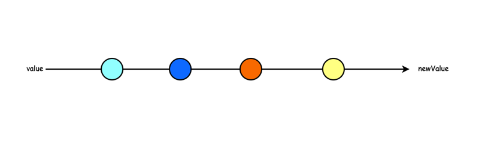

见名知意，`Proxy` 的功能非常类似于设计模式中的代理模式，该模式常用于三个方面：

- 拦截和监视外部对对象的访问。
- 降低函数或类的复杂度。
- 在复杂操作前对操作进行校验或对所需资源进行管理。

在支持 `ES6` 的浏览器环境下，`Proxy` 作为一个全局对象可以直接使用。`Proxy(target, handler)` 是一个构造函数，`target` 是被代理的对象，`handler` 是一个配置对象，提供了拦截方法，即使这个配置对象为空对象，返回的 Proxy 实例也不是原来的目标对象。外界每次访问被代理的对象时，都会经过 `handler` 对象，从这个流程来看，代理对象很类似 `middleware` （中间件）。

```javascript
const person = {
  name: "tom"
};
// 如果第二个参数为空对象
const proxy_A = new Proxy(person, {});
proxy_A === person; // false

// 第二个参数不为空
const proxy_B = new Proxy(person, {
  get(target, prop) {
    console.log(`${prop} is ${target[prop]}`);
    return target[prop];
  }
});
proxy_B.name; // 'name is tom'
```

`Proxy` 支持 `get`、`set`、`apply`、`construct` 等 **13** 种拦截操作，另外还提供了一个 `revoke` 方法，可以随时注销所有的代理操作。在我们正式介绍 `Proxy` 之前，建议你对 `Reflect` 有一定的了解，它也是一个 `ES6` 新增的全局对象，详细信息请参考 [MDN Reflect](https://developer.mozilla.org/zh-CN/docs/Web/JavaScript/Reference/Global_Objects/Reflect)。

**一、get(target, prop, receiver)**：拦截对象属性的访问。

**二、set(target, prop, value, receiver)**：拦截对象属性的设置，最后返回一个布尔值。

**三、apply(target, object, args)**：用于拦截函数的调用，比如 `proxy()`。

**四、construct(target, args)**：方法用于拦截 new 操作符，比如 `new proxy()`。为了使 `new` 操作符在生成的 Proxy 对象上生效，用于初始化代理的目标对象自身必须具有 `[[Construct]]` 内部方法（即 `new target` 必须是有效的）。

**五、has(target, prop)**：拦截例如 `prop in proxy` 的操作，返回一个布尔值。

**六、deleteProperty(target, prop)**：拦截例如 `delete proxy[prop]` 的操作，返回一个布尔值。

**七、ownKeys(target)**：拦截 `Object.getOwnPropertyNames(proxy)`、
`Object.keys(proxy)`、`for in 循环`等等操作，最终会返回一个数组。

**八、getOwnPropertyDescriptor(target, prop)**：拦截 Object.- getOwnPropertyDescriptor(proxy, propKey)，返回属性的描述对象。

**九、defineProperty(target, propKey, propDesc)**：拦截 Object.
defineProperty(proxy, propKey, propDesc）、Object.
defineProperties(proxy, propDescs)，返回一个布尔值。

**十、preventExtensions(target)**：拦截 Object.preventExtensions(proxy)，返回一个布尔值。

**十一、getPrototypeOf(target)**：拦截 Object.getPrototypeOf(proxy)，返回一个对象。

**十二、isExtensible(target)**：拦截 Object.isExtensible(proxy)，返回一个布尔值。

**十三、setPrototypeOf(target, proto)**：拦截 Object.setPrototypeOf(proxy, proto)，返回一个布尔值。如果目标对象是函数，那么还有两种额外操作可以拦截。

> 在 `Proxy` 出现之前，JavaScript 中就提供过`Object.defineProperty`，允许对对象的 `getter/setter` 进行拦截。既然有新的技术出现，`Object.defineProperty` 肯定有他的不足。

#### `Object.defineProperty` 的不足

##### 1.无法监听到数组的变化

Vue 官方文档说明可以监听到数组的变动，但限于 `pop`, `shift`, `unshift`, `sort`, `reverse`, `splice`, `push`方法，实际上是他们对这几种方法进行了重写。在定义变量的时候，判断其是否为数组，如果是数组，那么就修改它的 `__proto__`，将其指向 `subArrProto`，从而实现重写原型链。

```javascript
const arrayProto = Array.prototype;
const subArrProto = Object.create(arrayProto);
const methods = [
  "pop",
  "shift",
  "unshift",
  "sort",
  "reverse",
  "splice",
  "push"
];
methods.forEach((method) => {
  /* 重写原型方法 */
  subArrProto[method] = function () {
    arrayProto[method].call(this, ...arguments);
  };
  /* 监听这些方法 */
  Object.defineProperty(subArrProto, method, {
    set() {},
    get() {}
  });
});
```

##### 2.不能监听所有属性

`Object.definePreperty`监听的是对象的属性，当一个对象为深层嵌套时，只能通过递归遍历添加监听。而且 `Proxy` 可以监听到新增加的属性，而 `Object.defineProperty` 不可以，需要你手动再去做一次监听。因此，在 `Vue` 中想动态监听属性，一般用 `Vue.set(person, "sex", "women")` 这种形式来添加。

#### `Proxy` vs `Object.defineProperty`

##### 优点

###### `Proxy` 可以劫持整个对象，这样一来操作便利程度远远优于`Object.defineProperty`。

```javascript
let person = {
  name: "test",
  age: 22
};
// Proxy 监听整个对象
const person_proxyA = new Proxy(person, {
  get(target, key) {
    console.log("Proxy 数据被读取");
    return Reflect.get(target, key);
  },
  set(target, key, val) {
    console.log("Proxy 数据被更新");
    return Reflect.set(target, key, val);
  }
});

const person_proxyB = {};
Object.keys(person).forEach((key) => {
  Object.defineProperty(person_proxyB, key, {
    get: function () {
      console.log("Object.defineProperty 数据被读取");
      return person[key];
    },
    set: function (newValue) {
      console.log("Object.defineProperty 数据被更新");
      person[key] = newValue;
    }
  });
});
// Proxy set触发，Object.defineProperty set没有触发
person_proxyA.sex = "male";
person_proxyB.sex = "female";
```

###### `Proxy` 可以直接监听数组的变化，无需进行数组方法重写。

```javascript
const arr = [1, 2, 3];
const arr_proxyA = new Proxy(arr, {
  get(target, key) {
    console.log("Proxy 数据被读取");
    return Reflect.get(target, key);
  },
  set(target, key, val) {
    console.log("Proxy 数据被更新");
    return Reflect.set(target, key, val);
  }
});

const arr_proxyB = [];
arr.forEach((item, index) => {
  Object.defineProperty(arr_proxyB, index, {
    get: function () {
      console.log("Object.defineProperty 数据被读取");
      return arr[index];
    },
    set: function (newValue) {
      console.log("Object.defineProperty 数据被更新");
      arr[index] = newValue;
    }
  });
});

arr_proxyA[0] = 10; // Proxy 生效
arr_proxyB[0] = 10; // Object.defineProperty 生效
arr_proxyA[3] = 20; // Proxy 生效
arr_proxyB[3] = 20; // Object.defineProperty 不生效
arr_proxyA.push(30); // Proxy 生效
arr_proxyB.push(30); // Object.defineProperty 不生效
```

###### `Proxy` 提供了 **13** 种拦截方式。

##### 不足

`Proxy` 的兼容性不是太好，不兼容 `IE`，且无法通过 `polyfill` 提供兼容。

#### Proxy 的拦截方法

##### get 方法拦截对目标对象属性的读取

`get` 方法接收三个参数：目标对象、属性名和 `Proxy` 实例本身。基于 `get` 方法的特性，可以实现很多实用的功能，比如设置私有属性（一般定义私有属性我们使用 `_` 开头），实现禁止访问私有属性的功能。

```javascript
const person = {
  name: "test",
  age: 22,
  _sex: "male"
};

const person_proxy = new Proxy(person, {
  get(target, prop) {
    if (prop[0] === "_") {
      throw new Error(`${prop} is private attribute.`);
    }
    return target[prop];
  }
});
person_proxy.name; // test
person_proxy._sex; // Uncaught Error: _sex is private attribute.
```

##### set 方法拦截对属性的赋值操作

`set` 方法接收四个参数：目标对象、属性名、新属性值和 `Proxy` 实例本身。使用 `Proxy` 可以在填写表单的时候，拦截其中的字段进行格式校验。

```javascript
// 验证方法
function validator(obj, validators) {
  return new Proxy(obj, {
    set(target, key, value) {
      const validator = validators[key];
      if (!validator) {
        target[key] = value;
      } else if (validator.validate(value)) {
        target[key] = value;
      } else {
        console.error(validator.message || "");
      }
    }
  });
}

// 定义验证规则
const validators = {
  name: {
    validate(value) {
      return value.length > 6;
    },
    message: "用户名长度不能小于六"
  },
  password: {
    validate(value) {
      return value.length > 10;
    },
    message: "密码长度不能小于十"
  },
  moblie: {
    validate(value) {
      return /^1(3|5|7|8|9)[0-9]{9}$/.test(value);
    },
    message: "手机号格式错误"
  }
};

const form_proxy = validator({}, validators);
form_proxy.name = "test"; // 用户名长度不能小于六
form_proxy.password = "113123123123123";
```

##### apply 方法拦截函数的调用

`apply` 方法接收三个参数，分别是`目标对象`、`上下文对象`（this）、`参数数组`。通过 `apply` 方法可以获取到函数的执行次数，也可以打印出函数执行消耗的时间，常常可以用来做性能分析。

```javascript
function log() {}

const log_proxy = new Proxy(log, {
  _count: 0,
  apply(target, context, args) {
    target.apply(context, args);
    console.log(`this function has been called ${++this._count} times.`);
  }
});
log_proxy();
```

##### construct 方法拦截 new 操作符

`apply` 方法接收三个参数，分别是`目标对象`、`构造函数的参数列表`、`Proxy 对象`，最后需要返回一个对象。

```javascript
function Person(name, age) {
  this.name = name;
  this, (age = age);
}
const person_proxy = new Proxy(Person, {
  construct(target, args, newTarget) {
    console.log(`new Person: ${args}.`);
    return new target(...args);
  }
});

const personTest = new person_proxy("Tom", 23); // new Person: Tom,23.
```

如果构造函数没有返回任何值或者返回了原始类型的值，那么默认返回的就是 `this`，如果返回的是一个引用类型的值，那么最终 `new` 出来的就是这个值。因此，我们可以代理一个空函数，然后返回一个新的对象。

```javascript
function noop() {}

const Person = new Proxy(noop, {
  construct(target, args, newTarget) {
    return {
      name: args[0],
      age: args[1]
    };
  }
});

const person_proxy = new Person("Tom", 21); // {name: "Tom", age: 21}
```

#### Proxy 实现代理类

类的本质也是构造函数和原型（对象）组成的，完全可以对其进行代理。考虑有这么一个需求，需要拦截对属性的访问，以及计算原型上函数的执行时间，这样该怎么去做就比较清晰了。可以对属性设置 `get` 拦截，对原型函数设置 `apply` 拦截。

先考虑对下面的 `Person` 类的原型函数进行拦截。使用 `Object.getOwnPropertyNames` 来获取原型上面所有的函数，遍历这些函数并对其使用 `apply` 拦截。再通过 `construct` 方法的作用，在 `new` 的时候对所有属性的访问执行拦截。

```javascript
class Person {
  constructor(name, age) {
    this.name = name;
    this.age = age;
  }
  say() {
    console.log("my name is %s,and my age is %s.", this.name, this.age);
  }
}
const proxyTrack = (targetClass) => {
  const { prototype } = targetClass;
  Object.getOwnPropertyNames(prototype).forEach((name) => {
    targetClass.prototype[name] = new Proxy(prototype[name], {
      apply(target, context, args) {
        console.time(`function ${target.name} runing`);
        target.apply(context, args);
        console.timeEnd(`function ${target.name} runing`);
      }
    });
  });

  return new Proxy(targetClass, {
    construct(target, args) {
      // console.log(`new Class: ${args}.`);
      // return new target(...args);
      const obj = new target(...args);
      return new Proxy(obj, {
        get(target, prop) {
          console.log(`${target.name}.${prop} is being getting.`);
          return target[prop];
        }
      });
    }
  });
};

const MyClass = proxyTrack(Person);
const myclass = new MyClass("Tom", 23);
myclass.name;
myclass.say();
// Tom.name is being getting.
// Tom.say is being getting.
// Tom.name is being getting.
// Tom.age is being getting.
// my name is Tom,and my age is 23.
// say function runing: 0.318ms
```

#### 实现一个类似 pipe 的功能

<div align="center">

  

</div>

```javascript
const pipe = (value, opration) => {
  const stack = [];
  const proxy = new Proxy(
    {},
    {
      get(target, prop) {
        const index = prop.indexOf("()");
        if (prop === "done") {
          return stack.reduce(function (val, fn) {
            return fn(val);
          }, value);
        }
        stack.push(opration[prop]);
        return proxy;
      }
    }
  );
  return proxy;
};

// 计算函数集合
const calculateFun = {
  double: (n) => n * 2,
  pow: (n) => n * n
};

pipe(3, calculateFun).double.pow.done; // 36
```
