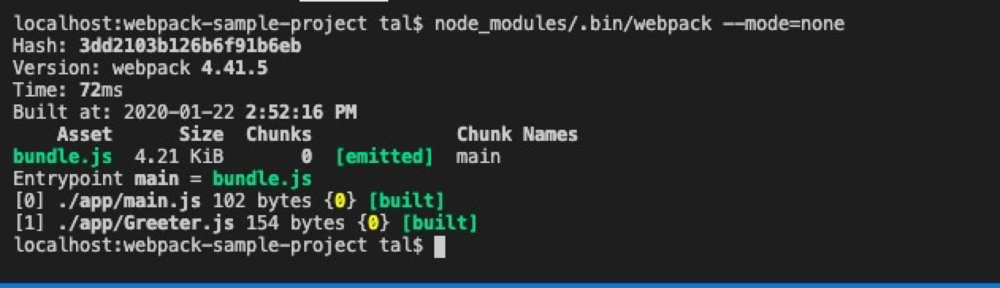

### 写在前面的话

> 阅读本文之前，先看下面这个 webpack 的配置文件，如果每一项你都懂，那本文能带给你的收获也许就比较有限，你可以快速浏览或直接跳过；如果你对很多选项存在着疑惑，那花一段时间慢慢阅读本文，你的疑惑一定一个一个都会消失；如果你以前没怎么接触过 Webpack，而你又你对 webpack 感兴趣，那么动手跟着本文中那个贯穿始终的例子写一次，写完以后你会发现你已明明白白的走进了 Webpack 的大门。

```javascript
// 一个常见的`webpack`配置文件
const webpack = require("webpack"); // 访问内置的插件

module.exports = {
  entry: __dirname + "/app/main.jsx", // 已多次提及的唯一入口文件
  output: {
    path: __dirname + "/public", // 打包后的文件存放的地方
    filename: "bundle.js" // 打包后输出文件的文件名
  },
  devtool: "eval-source-map",
  devServer: {
    contentBase: "./public", // 本地服务器所加载的页面所在的目录
    historyApiFallback: true, // 不跳转
    inline: true, // 实时刷新
    hot: true // 启用模块热替换功能
  },
  module: {
    rules: [
      {
        test: /(\.jsx|\.js)$/,
        use: {
          loader: "babel-loader"
        },
        exclude: /node_modules/
      },
      {
        test: /\.css$/,
        use: [
          {
            loader: "style-loader"
          },
          {
            loader: "css-loader",
            options: {
              // 启用css modules
              modules: {
                localIdentName: "[name]__[local]___[hash:base64:5]" // 命名规则
              }
            }
          }
        ]
      }
    ]
  },
  plugins: [
    new webpack.BannerPlugin("版权所有，翻版必究！"),
    new webpack.ProgressPlugin() // webpack提供的一种自定义编译期间如何报告进度的方法
  ]
};
```

#### 为什要使用 WebPack

现今的很多网页其实可以看做是功能丰富的应用，它们拥有着复杂的 JavaScript 代码和一大堆依赖包。为了简化开发的复杂度，前端社区涌现出了很多好的实践方法

- 模块化，让我们可以把复杂的程序细化为小的文件。
- 类似于 TypeScript 这种在 JavaScript 基础上拓展的开发语言：使我们能够实现目前版本的 JavaScript 不能直接使用的特性，并且之后还能转换为 JavaScript 文件使浏览器可以识别。
- Scss，less 等 CSS 预处理器。
- ...

这些改进确实大大的提高了我们的开发效率，但是利用它们开发的文件往往需要进行额外的处理才能让浏览器识别,而手动处理又是非常繁琐的。

这就为 WebPack 类的工具的出现提供了需求，可以把它看做是模块打包机：它做的事情是，分析你的项目结构，找到 JavaScript 模块以及其它的一些浏览器不能直接运行的拓展语言（Scss，TypeScript 等），并将其转换和打包为合适的格式供浏览器使用。

#### WebPack 和 Grunt 以及 Gulp 相比有什么特性

其实 Webpack 和另外两个并没有太多的可比性，Gulp/Grunt 是一种能够优化前端的开发流程的工具，而 WebPack 是一种模块化的解决方案，不过 Webpack 的优点使得 Webpack 在很多场景下可以替代 Gulp/Grunt 类的工具。

Grunt 和 Gulp 的工作方式是：在一个配置文件中，指明对某些文件进行类似编译，组合，压缩等任务的具体步骤，工具之后可以自动替你完成这些任务。

Webpack 的工作方式是：把你的项目当做一个整体，通过一个给定的主文件（如：index.js），Webpack 将从这个文件开始找到你的项目的所有依赖文件，使用 loaders 处理它们，最后打包为一个（或多个）浏览器可识别的 JavaScript 文件。

如果实在要把二者进行比较，Webpack 的处理速度更快更直接，能打包更多不同类型的文件。

### 开始使用 Webpack

#### 使用 Webpack 前的准备

1. 新建文件夹。（此处命名为 webpack-sample-project）

2. 初始化项目。（生成 `package.json`，一路回车完成即可）

   ```bash
   npm init
   ```

3. 安装 Webpack 依赖。

   ```bash
   npm install --save-dev webpack
   npm install --save-dev webpack-cli
   ```

4. 新建以下文件。

   - index.html --放在 public 文件夹中。
   - Greeter.js-- 放在 app 文件夹中。
   - main.js-- 放在 app 文件夹中。

<div align="center">

  

  <p>项目结构</p>

</div>

5. 在 `index.html` 文件中写入最基础的 html 代码，它在这里目的在于引入打包后的 js 文件（这里我们先把之后打包后的 js 文件命名为 `bundle.js`，之后我们还会详细讲述）

   ```html
   <!-- index.html -->
   <!DOCTYPE html>
   <html lang="en">
     <head>
       <meta charset="utf-8" />
       <title>Webpack Sample Project</title>
     </head>
     <body>
       <div id="root"></div>
       <script src="bundle.js"></script>
     </body>
   </html>
   ```

6. 在 Greeter.js 中定义一个返回包含问候信息的 html 元素的函数,并导出这个函数为一个模块：

   ```javascript
   // Greeter.js
   export default function () {
     var greet = document.createElement("div");
     greet.textContent = "Hi there and greetings!";
     return greet;
   }
   ```

7. main.js 文件中我们写入下述代码，用以把 Greeter 模块返回的节点插入页面。

   ```javascript
   // main.js
   import greeter from "./Greeter.js";
   document.querySelector("#root").appendChild(greeter());
   ```

#### 正式使用 Webpack

在当前练习文件夹的根目录下新建一个名为 `webpack.config.js` 的文件，我们在其中写入如下所示的简单配置代码，目前的配置主要涉及到的内容是入口文件路径和打包后文件的存放路径。

```javascript
module.exports = {
  entry: __dirname + "/app/main.js", //已多次提及的唯一入口文件
  output: {
    path: __dirname + "/public", //打包后的文件存放的地方
    filename: "bundle.js" //打包后输出文件的文件名
  }
};
```

> 注：「\_\_dirname」是 node.js 中的一个全局变量，它指向当前执行脚本所在的目录。

有了这个配置之后，再打包文件，只需在终端里运行 `node_modules/.bin/webpack --mode=none` 命令就可以了，这条命令会自动引用 `webpack.config.js` 文件中的配置选项，示例如下：

<div align="center">

  

</div>

关于后面加的 `mode=none` 配置可以在 webpack 的 [mode](https://webpack.docschina.org/configuration/mode/)了解到它的作用

#### 更快捷的执行打包任务

在命令行中输入命令需要代码类似于`node_modules/.bin/webpack`这样的路径其实是比较烦人的，不过值得庆幸的是 npm 可以引导任务执行，对 npm 进行配置后可以在命令行中使用简单的 `npm start` 命令来替代上面略微繁琐的命令。在 `package.json` 中对 scripts 对象进行相关设置即可，设置方法如下。

<div align="center">

  

</div>

> 注：`package.json` 中的 script 会安装一定顺序寻找命令对应位置，本地的 `node_modules/.bin` 路径就在这个寻找清单中，所以无论是全局还是局部安装的 Webpack，你都不需要写前面那指明详细的路径了。

npm 的 start 命令是一个特殊的脚本名称，其特殊性表现在，在命令行中使用 npm start 就可以执行其对于的命令，如果对应的此脚本名称不是 start，想要在命令行中运行时，需要这样用 `npm run {script name}`如 `npm run build`，我们在命令行中输入 `npm start` 跟之前输入`node_modules/.bin/webpack --mode=none`效果是一样的。

#### Webpack 的强大功能

开发总是离不开调试，方便的调试能极大的提高开发效率，不过有时候通过打包后的文件，你是不容易找到出错了的地方，对应的你写的代码的位置的，Source Maps 就是来帮我们解决这个问题的。

通过简单的配置，webpack 就可以在打包时为我们生成的 source maps，这为我们提供了一种对应编译文件和源文件的方法，使得编译后的代码可读性更高，也更容易调试。

在 webpack 的配置文件中配置 source maps，需要配置 devtool，各具优缺点，详细介绍请戳 [官方介绍](https://webpack.docschina.org/configuration/devtool/#root)。对小到中型的项目中，`eval-source-map` 是一个很好的选项，再次强调你只应该开发阶段使用它，我们继续对上文新建的 `webpack.config.js`，进行如下配置:

```javascript
module.exports = {
  entry: __dirname + "/app/main.js",
  output: {
    path: __dirname + "/public",
    filename: "bundle.js"
  },
  devtool: "eval-source-map"
};
```

> `cheap-module-eval-source-map` 方法构建速度更快，但是不利于调试，推荐在大型项目考虑时间成本时使用。

#### 使用 webpack 构建本地服务器

想不想让你的浏览器监听你的代码的修改，并自动刷新显示修改后的结果，其实 Webpack 提供一个可选的本地开发服务器，这个本地服务器基于 node.js 构建，可以实现你想要的这些功能，不过它是一个单独的组件，在 webpack 中进行配置之前需要单独安装它作为项目依赖。

```bash
npm install --save-dev webpack-dev-server
```

devserver 作为 webpack 配置选项中的一项，以下是它的一些配置选项，更多配置可参考 [这里](https://webpack.docschina.org/configuration/dev-server/)。更新完的配置文件 `webpack.config.js` 如下所示:

```javascript
module.exports = {
  entry: __dirname + "/app/main.jsx", // 已多次提及的唯一入口文件
  output: {
    path: __dirname + "/public", // 打包后的文件存放的地方
    filename: "bundle.js" // 打包后输出文件的文件名
  },
  devtool: "eval-source-map",

  devServer: {
    contentBase: "./public", // 本地服务器所加载的页面所在的目录
    historyApiFallback: true, // 不跳转
    inline: true, // 实时刷新
    hot: true // 启用模块热替换功能
  }
};
```

在 `package.json` 中的 scripts 对象中添加如下命令，用以开启本地服务器：

```javascript
"scripts": {
    "start": "webpack --mode=production",
    "server": "webpack-dev-server --open"
  },
```

在终端中输入 `npm run server` 即可在运行热更新的项目了。

```bash
npm run server
```

#### Loaders

Loaders 是 webpack 提供的最激动人心的功能之一了。通过使用不同的 loader，webpack 有能力调用外部的脚本或工具，实现对不同格式的文件的处理，比如说分析转换 scss 为 css，或者把下一代的 JS 文件（ES6，ES7)转换为现代浏览器兼容的 JS 文件，对 React 的开发而言，合适的 Loaders 可以把 React 的中用到的 JSX 文件转换为 JS 文件。

```javascript
// webpack.config.js
module.exports = {
  module: {
    rules: [
      { test: /\.js$/, use: "babel-loader" },
      {
        test: /\.css$/,
        use: [
          { loader: "style-loader" },
          { loader: "css-loader" },
          { loader: "postcss-loader" }
        ]
      }
    ]
  }
};
```

Loaders 需要单独安装并且需要在 webpack.config.js 中的 modules 关键字下进行配置，Loaders 的配置包括以下几方面：

- test：一个用以匹配 loaders 所处理文件的拓展名的正则表达式（必须）
- loader：loader 的名称（必须）
- include/exclude:手动添加必须处理的文件（文件夹）或屏蔽不需要处理的文件（文件夹）（可选）；
- query：为 loaders 提供额外的设置选项（可选）

不过在配置 loader 之前，我们把 Greeter.js 里的问候消息放在一个单独的 JSON 文件里,并通过合适的配置使 Greeter.js 可以读取该 JSON 文件的值，各文件修改后的代码如下：

在 app 文件夹中创建带有问候信息的 JSON 文件(命名为 config.json)

```javascript
{
  "greetText": "Hi there and greetings from JSON!"
}
```

更新后的 Greeter.js

```javascript
import { greetText } from "./config.json";

export default function () {
  var greet = document.createElement("div");
  greet.textContent = greetText;
  return greet;
}
```

#### Loader api

所谓 Loader，也只是一个符合 commonjs 规范的 node 模块，它会导出一个可执行函数。loader runner 会调用这个函数，将文件的内容或者上一个 Loader 处理的结果传递进去。同时，webpack 还为 Loader 提供了一个上下文 this，其中有很多有用的 api，我们找几个典型的来看看。

- **this.context**: 当前处理文件的所在目录，假如当前 Loader 处理的文件是 `/src/main.js`，则 this.context 就等于 `/src`。
- **this.resource**: 当前处理文件的完整请求路径，包括 querystring，例如 `/src/main.js?name=1`。
- **this.resourcePath**: 当前处理文件的路径，例如 `/src/main.js`。
- **this.resourceQuery**: 当前处理文件的 `querystring`。
- **this.target**: 等于 Webpack 配置中的 `Target`
- **this.loadModule**: 但 Loader 在处理一个文件时，如果依赖其它文件的处理结果才能得出当前文件的结果时， 就可以通过 - - - `this.loadModule(request: string, callback: function(err, source, sourceMap, module))` 去获得 `request` 对应文件的处理结果。
- **this.resolve**: 像 require 语句一样获得指定文件的完整路径，使用方法为 r`esolve(context: string, request: string, callback: function(err, result: string))`。
- **this.addDependency**: 给当前处理文件添加其依赖的文件，以便再其依赖的文件发生变化时，会重新调用 Loader 处理该文件。使用方法为 `addDependency(file: string)`。
- **this.addContextDependency**: 和 addDependency 类似，但 addContextDependency 是把整个目录加入到当前正在处理文件的依赖中。使用方法为 `addContextDependency(directory: string)`。
- **this.clearDependencies**: 清除当前正在处理文件的所有依赖，使用方法为 `clearDependencies()`。
- **this.emitFile**: 输出一个文件，使用方法为 `emitFile(name: string, content: Buffer|string, sourceMap: {...})`。
- **this.async**: 返回一个回调函数，用于异步执行。

#### Plugin

`webpack` 整个构建流程有许多钩子，开发者可以在指定的阶段加入自己的行为到 `webpack` 构建流程中。插件由以下构成:

- 一个 `JavaScript` 命名函数。
- 在插件函数的 `prototype` 上定义一个 `apply` 方法。
- 指定一个绑定到 `webpack` 自身的事件钩子。
- 处理 `webpack` 内部实例的特定数据。
- 功能完成后调用 `webpack` 提供的回调。

整个 `webpack` 流程由 `compiler` 和 `compilation` 构成,`compiler` 只会创建一次，`compilation` 如果开起了 `watch` 文件变化，那么会多次生成 `compilation`. 那么这 2 个类下面生成了需要事件钩子

[compiler hooks 文档 compilation hooks 文档](https://webpack.js.org/api/compiler-hooks/)

#### Babel

在看如何具体使用 loader 之前我们先看看 Babel 是什么？

Babel 其实是一个编译 JavaScript 的平台，它可以编译代码帮你达到以下目的：

- 让你能使用最新的 JavaScript 代码（ES6，ES7...），而不用管新标准是否被当前使用的浏览器完全支持；
- 让你能使用基于 JavaScript 进行了拓展的语言，比如 React 的 JSX；
  Babel 的安装与配置

Babel 其实是几个模块化的包，其核心功能位于称为 babel-core 的 npm 包中，webpack 可以把其不同的包整合在一起使用，对于每一个你需要的功能或拓展，你都需要安装单独的包（用得最多的是解析 Es6 的 babel-env-preset 包和解析 JSX 的 babel-preset-react 包）

我们先来一次性安装这些依赖包

```bash
# npm一次性安装多个依赖模块，模块之间用空格隔开
npm install --save-dev babel-loader@7 babel-core@  babel-preset-env babel-preset-react
```

现在你的 webpack 的配置已经允许你使用 ES6 以及 JSX 的语法了。继续用上面的例子进行测试，不过这次我们会使用 React，记得先安装 React 和 React-DOM

```bash
npm install --save react react-dom
```

接下来我们使用 ES6 的语法，更新 Greeter.js （文件名修改为 Greeter.jsx） 并返回一个 React 组件

```javascript
//Greeter.jsx
import React, { Component } from "react";
import config from "./config.json";

class Greeter extends Component {
  render() {
    return <div>{config.greetText}</div>;
  }
}

export default Greeter;
```

修改 main.js （文件名修改为 main.jsx）如下，使用 ES6 的模块定义和渲染 Greeter 模块

```javascript
// main.jsx
import React from "react";
import { render } from "react-dom";
import Greeter from "./Greeter.jsx";

render(<Greeter />, document.getElementById("root"));
```

当然 `webpack.config.js` 中也得修改入口文件

```javascript
entry: __dirname + "/app/main.jsx", // 已多次提及的唯一入口文件
```

重新使用 npm run server，你应该可以在 localhost:8080 下看到与之前一样的内容，这说明 react 和 es6 被正常打包了。

#### 分包策略

在 `webpack` 打包过程中，经常出现` vendor.js`， `app.js` 单个文件较大的情况，这偏偏又是网页最先加载的文件，这就会使得加载时间过长，从而使得白屏时间过长，影响用户体验。所以我们需要有合理的分包策略。

在 `Webapck4.x` 版本之前，我们都是使用 `CommonsChunkPlugin` 去做分离。`webpack 4` 最大的改动就是废除了 `CommonsChunkPlugin` 引入了 `optimization.splitChunks`。如果你的 `mode` 是 `production`，那么 `webpack4` 就会自动开启 `Code Splitting`。它内置的代码分割策略是这样的：

- 新的 `chunk` 是否被共享或者是来自 `node_modules` 的模块
- 新的 `chunk` 体积在压缩之前是否大于 `30kb`
- 按需加载 `chunk` 的并发请求数量小于等于 `5` 个
- 页面初始加载时的并发请求数量小于等于 `3` 个

虽然在 `webpack4` 会自动开启 `Code Splitting`，但是随着项目工程的最大，这往往不能满足我们的需求，我们需要再进行个性化的优化。
