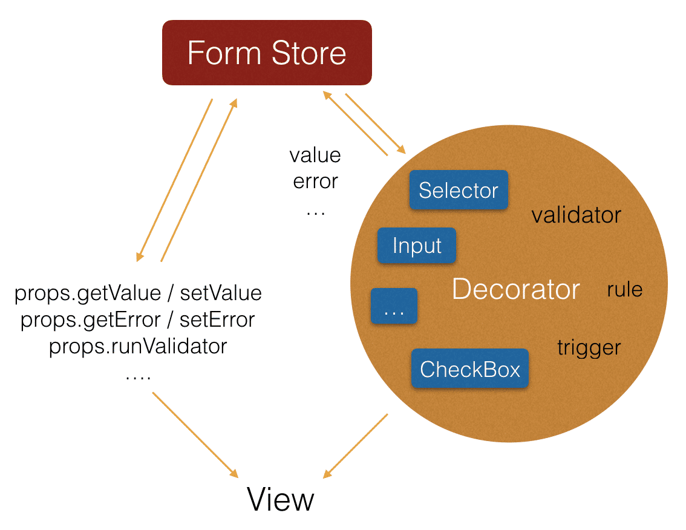

> 高阶组件（文中我们称呼 **HOC**）是 `React` 中用于复用组件逻辑的一种高级技巧。**HOC** 自身不是 `React API` 的一部分，它是一种基于 `React` 的组合特性而形成的设计模式，众多的 `React` 库已经证明了它的价值，例如耳熟能详的 [react-redux](https://github.com/reduxjs/react-redux)。

高阶组件的概念其实并不难，我们能通过类比高阶函数迅速掌握。高阶函数是把函数作为参数传入到函数中并返回一个新的函数。这里我们把函数替换为组件，就是高阶组件了。

```javascript
const EnhancedComponent = higherOrderComponent(WrappedComponent);
```

官方之前建议使用 `mixins` 用于解决横切关注点相关的问题。但 `mixins` 会产生[很多麻烦](https://react.docschina.org/blog/2016/07/13/mixins-considered-harmful.html)。现在抛弃 `mixins` 使用 **HOC** 来作为替代方案。

#### 使用方式一：Props Proxy

`Props Proxy` 能够对 `WrappedComponent` 的 `props` 进行操作，提取 `WrappedComponent state` 以及使用其他元素来包裹 `WrappedComponent`。`Props Proxy` 作为一层代理，具有隔离的作用，因此传入 `WrappedComponent` 的 `ref` 将无法访问到其本身，需要在 `Props Proxy` 内完成中转，`react-redux` 也是这样实现的，具体可参考以下代码。

此外各个 Props Proxy 的默认名称是相同的，需要根据 WrappedComponent 来进行不同命名。

```javascript
function testHOC(WrappedComponent) {
  class TestHOC extends React.Component {
    // 实现 **HOC** 不同命名
    TestHOC.displayName = `**HOC**(${this.getDisplayName(WrappedComponent)})`;

    getDisplayName() {
      return WrappedComponent.displayName || WrappedComponent.name || "Component";
    }

    getWrappedInstance() {
      return this.wrappedInstance;
    }

    // 实现 ref 的访问
    setWrappedInstance(ref) {
      this.wrappedInstance = ref;
    }

    render() {
      return <WrappedComponent {
        ...this.props,
        ref: this.setWrappedInstance.bind(this),
      } />
    }
  }
  return TestHOC;
}

@testHOC
class Example extends React.Component {
  static displayName = 'Example';
  handleClick() {
    // ...
  }
  // ...
}

class App extends React.Component {
  handleClick() {
    this.refs.example.getWrappedInstance().handleClick();
  }
  render() {
    return (
      <div>
        <button onClick={this.handleClick.bind(this)}>按钮</button>
        <Example ref="example" />
      </div>
    );
  }
}
```

#### 使用方式二：Inheritance Inversion

**HOC** 类继承了 `WrappedComponent`，意味着可以访问到 `WrappedComponent` 的 `state`、`props`、`生命周期`和 `render` 等方法。如果在 **HOC** 中定义了与 `WrappedComponent` 同名方法，将会发生覆盖，就必须手动通过 `super` 进行调用了。通过完全操作 `WrappedComponent` 的 `render` 方法返回的元素树，可以真正实现渲染劫持。这种方案依然是继承的思想，对于 `WrappedComponent` 也有较强的侵入性，因此并不常见。

```javascript
function testHOC(WrappedComponent) {
  class TestHOC extends WrappedComponent {
    // ...
    componentDidMount() {
      super.componentDidMount();
    }
    componentWillUnmount() {
      super.componentWillUnmount();
    }
    render() {
      // ...
      return super.render();
    }
  }
  return TestHOC;
}
```

#### 适用范围

对比 **HOC** 范式 `compose(render)(state)` 与父组件的范式 `render(render(state))`，如果完全利用 **HOC** 来实现 React 的 `implement`，将操作和 `view` 分离，也未尝不可，但却不优雅。 **HOC** 本质上是统一功能抽象，强调逻辑与 UI 分离。但在实际开发中，前端无法逃离 DOM，而逻辑与 DOM 的相关性主要呈现 3 种关联形式：

- 与 DOM 相关，建议使用父组件，类似于原生 HTML 编写。
- 于 DOM 不相干，如校验、权限、请求发送、数据转换这类，通过数据变化间接控制 DOM，可以使用 **HOC** 抽象。
- 交叉的部分， DOM 相关，但可以做到完全内聚，即这些 DOM 不会和外部有关联，均可。

DOM 的渲染使用父组件，这是 React JSX 原生支持的方式，清晰易懂。 **HOC** 适合做 DOM 不相干又是多个组件共性的操作。如 Form 中， `validator` 校验操作就是纯数据操作的，放在 **HOC** 中。但 `validator` 信息没有放到 **HOC** 中。如果能把 Error 信息展示这些逻辑能够完全隔离，也可以放到 **HOC** 中。数据请求是另一类 DOM 不相干的场景， [react-refetch](https://github.com/heroku/react-refetch) 的实现就是使用了 **HOC** ，做到了高效和优雅：

```javascript
connect(props => ({
  usersFetch: `/users?status=${props.status}&page=${props.page}`,
  userStatsFetch: { url: `/users/stats`, force: true }
}))(UsersList);
```

#### HOC 在 Form 上的具体实践

> Form 中会包含各种不同的组件，常见的有 `Input`、`Selector`、`Checkbox` 等等，也会有根据业务需求加入的自定义组件。Form 灵活多变，从功能上看，表单校验可能为单组件值校验，也可能为全表单值校验，可能为常规检验，比如：非空、输入限制，也可能需要与服务端配合，甚至需要根据业务特点进行定制。从 UI 上看，检验结果显示的位置，可能在组件下方，也可能是在组件右侧。

直接裸写 Form，无疑是机械而又重复的。将 Form 中组件的 `value` 经过 `validator`，把 `value`，`validator` 产生的 `error` 信息储存到 `state` 或 `redux store` 中，然后在 `view` 层完成显示。这条路大家都是相同的，可以进行复用，只是我们面对的事不同的组件，不同的 `validator`，不同的 `view` 而已。对于 Form 而言，既要满足通用，又要满足个性化的需求，以往单纯的配置化只会让使用愈加繁琐，我们所需要抽取的是 Form 功能而非 UI，因此通过 **HOC** 针对 Form 的功能进行提取就成为了必然。

<div align=center>



</div>

至于 **HOC** 在 Form 上的具体表现，首先将表单中的组件 （Input、Selector ...）与相对应 `validator` 与组件值回调函数名（`tigger`）传入 `Decorator`，将 `validator` 与 `tigger` 相绑定。`Decorator` 完成了各种不同组件与 Form 内置 Store 间 `value` 的传递、校验功能的抽象，即上文中提到 `Props Proxy` 方式的其中两种作用： `提取 state` 与 `操作 props`。

```javascript
function formFactoryFactory({
  validator,
  trigger = 'onChange',
  // ...
}) {
  return FormFactory(WrappedComponent) {
    return class Decorator extends React.Component {
      getBind(trigger, validator) {
        // ...
      }
      render() {
        const newProps = {
          ...this.props,
          [trigger]: this.getBind(trigger, validator),
          // ...
        }
        return <WrappedComponent {...newProps} />
      }
    }
  }
}

// 调用
formFactoryFactory({
  validator: (value) => {
    return value !== '';
  }
})(<Input placeholder="请输入..." />)
```

React 始终强调组合优于继承，期望通过复用小组件来构建大组件来使开发变得简单而又高效，与传统面向对象思想是截然不同的，建议大家认真读一遍 [官方文档](#https://react.docschina.org/docs/higher-order-components.html)。
