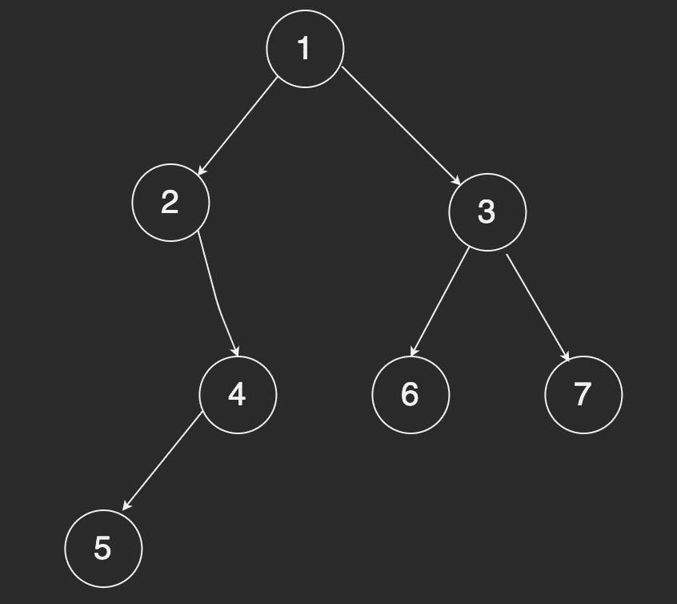

> leetcode 已经 200+，收藏了一些需要回顾的题目，分享给大家。

### [5. 最长回文子串](https://leetcode-cn.com/problems/longest-palindromic-substring/)

#### 解法一： 暴力

```javascript
// babad
var longestPalindrome = function (s) {
  var ans = "";
  var max = 0;
  var len = s.length;
  for (var i = 0; i < len; i++) {
    for (var r = i + 1; r <= len; r++) {
      var tmpStr = s.substring(i, r);
      if (isPalindrome(tmpStr) && tmpStr.length > max) {
        ans = s.substring(i, r);
        max = tmpStr.length;
      }
    }
  }
  return ans;
};

function isPalindrome(str) {
  var len = str.length;
  var middle = parseInt(len / 2);
  for (var i = 0; i < middle; i++) {
    if (str[i] != str[len - i - 1]) {
      return false;
    }
  }
  return true;
}

longestPalindrome("babad");
```

#### 解法二： 动态规划

```javascript
// babad
var longestPalindrome = function (s) {
  const { length } = s;
  let res = "";
  let dp = Array.from({ length }, () => new Array(length).fill(false));
  // 倒着循环，保证 dp[i+1][j-1] 存在
  for (let i = length - 1; i >= 0; i--) {
    for (let j = i; j < length; j++) {
      if (s[i] == s[j]) {
        // length 为 1 或 2 的子字符串，一定是回文子串
        if (j - i < 2) dp[i][j] = true;
        // 判断从 i+1 到 j-1 是否满足回文
        else if (dp[i + 1][j - 1]) dp[i][j] = true;
      }

      if (dp[i][j] && j - i + 1 > res.length) res = s.slice(i, j + 1);
    }
  }

  return res;
};

longestPalindrome("babad");
```

### [32. 最长有效括号](https://leetcode-cn.com/problems/longest-valid-parentheses/)

```javascript
// ")()())"
var longestValidParentheses = function (s) {
  const stack = [-1]; // 初始化参照
  let max = 0;
  for (let i = 0; i < s.length; i++) {
    if (s[i] == "(") stack.push(i);
    // 左括号入栈
    else {
      stack.pop(); // 遍历到右括号，出栈
      if (stack.length) max = Math.max(max, i - stack[stack.length - 1]);
      // 栈未空，计算有效长度
      else stack.push(i); // 入栈作为参照
    }
  }

  return max;
};

longestValidParentheses(")()())");
```

### [39. 组合总和](https://leetcode-cn.com/problems/combination-sum/)

```javascript
// [2,3,6,7]  7
var combinationSum = function (candidates, target) {
  const ans = [];
  const dfs = (rest, path, index) => {
    if (index >= candidates.length || rest < 0) return;
    if (rest === 0) return ans.push(path);

    dfs(rest, path, index + 1); // 直接跳过
    dfs(rest - candidates[index], path.concat(candidates[index]), index); // 选择当前数
  };

  dfs(target, [], 0);

  return ans;
};

combinationSum([2, 3, 6, 7], 7);
```

### [17. 电话号码的字母组合](https://leetcode-cn.com/problems/letter-combinations-of-a-phone-number/)

#### 解法一： DFS

```javascript
// 235
var letterCombinations = function (digits) {
  if (!digits.length) return [];
  let res = [];
  const map = {
    2: "abc",
    3: "def",
    4: "ghi",
    5: "jkl",
    6: "mno",
    7: "pqrs",
    8: "tuv",
    9: "wxyz"
  };

  const dfs = (str, index) => {
    if (str.length == digits.length) {
      res.push(str);
      return;
    }

    const letter = map[index];
    for (let i = 0; i < letter.length; i++) {
      dfs(str + letter[i], index + 1);
    }
  };

  dfs("", 0);

  return res;
};

letterCombinations("235");
```

#### 解法二： BFS

```javascript
// 235
var letterCombinations = function (digits) {
  if (!digits.length) return [];
  let res = [""]; // 手动初始化 bfs 序列
  const map = {
    2: "abc",
    3: "def",
    4: "ghi",
    5: "jkl",
    6: "mno",
    7: "pqrs",
    8: "tuv",
    9: "wxyz"
  };

  for (let i = 0; i < digits.length; i++) {
    const letter = map[digits[i]];
    const temp = [];
    for (let j = 0; j < letter.length; j++) {
      for (let k = 0; k < res.length; k++) {
        temp.push(res[k] + letter[j]);
      }
    }
    res = temp;
  }

  return res;
};

letterCombinations("235");
```

### [46. 全排列](https://leetcode-cn.com/problems/permutations/)

```javascript
// [1,2,3]
var permute = function (nums) {
  const res = [];
  const bfs = (path, rest) => {
    if (rest.length === 0) return res.push(path);
    for (let i = 0; i < rest.length; i++) {
      const cloneRest = JSON.parse(JSON.stringify(rest));
      cloneRest.splice(i, 1);
      bfs(path.concat(rest[i]), cloneRest);
    }
  };

  bfs([], nums);

  return res;
};

permute([1, 2, 3]);
```

### [48. 旋转图像](https://leetcode-cn.com/problems/rotate-image/)

```javascript
// [[1,2,3],[4,5,6],[7,8,9]]
var rotate = function (matrix) {
  const n = matrix.length;
  // 水平翻转
  for (let i = 0; i < Math.floor(n / 2); i++) {
    for (let j = 0; j < n; j++) {
      [matrix[i][j], matrix[n - i - 1][j]] = [
        matrix[n - i - 1][j],
        matrix[i][j]
      ];
    }
  }
  // 主对角线翻转
  for (let i = 0; i < n; i++) {
    for (let j = 0; j < i; j++) {
      [matrix[i][j], matrix[j][i]] = [matrix[j][i], matrix[i][j]];
    }
  }
};

rotate([
  [1, 2, 3],
  [4, 5, 6],
  [7, 8, 9]
]);
```

### [54. 螺旋矩阵](https://leetcode-cn.com/problems/spiral-matrix/)

```javascript
// [[1,2,3],[4,5,6],[7,8,9]]
var spiralOrder = function (matrix) {
  const m = matrix.length;
  if (m == 0) return [];
  const n = matrix[0].length;
  let top = 0,
    bottom = m - 1,
    left = 0,
    right = n - 1;
  let res = [];

  // 螺旋加
  while (top <= bottom && left <= right) {
    for (let i = left; i <= right; i++) res.push(matrix[top][i]);
    top++;
    for (let i = top; i <= bottom; i++) res.push(matrix[i][right]);
    right--;
    // 防止有一条边界叠加
    if (top > bottom || left > right) break;
    for (let i = right; i >= left; i--) res.push(matrix[bottom][i]);
    bottom--;
    for (let i = bottom; i >= top; i--) res.push(matrix[i][left]);
    left++;
  }

  return res;
};

spiralOrder([
  [1, 2, 3],
  [4, 5, 6],
  [7, 8, 9]
]);
```

### [二叉树中、前、后遍历](#)



#### 解法一： 递归

```javascript
// 该方法表示前序遍历，中、后序遍历调整 mid/left/right 位置即可
var traversal = function (root) {
  const res = [];
  const helper = (node) => {
    if (!node) return;
    res.push(node.val); // mid
    helper(node.left); // left
    helper(node.right); // right
  };

  helper(root);

  return res;
};
```

#### 解法二： 非递归 + 颜色标记法

```javascript
// 该方法表示前序遍历，中、后序遍历调整相应位置即可
var traversal = function (root) {
  const [WHITE, GRAY] = [0, 1]; // WHITE - 未访问的新结点； GRAY - 已访问的结点
  const res = [];
  const stack = [[WHITE, root]];
  let color, node;
  while (stack.length) {
    [color, node] = stack.pop(); // 若栈中有元素，则按照左节点、根节点、右节点的顺序依次弹出元素
    if (!node) continue;
    if (color === WHITE) {
      // 当前指向的结点是未访问过的结点，将其右节点，根节点，左节点依次入栈
      stack.push([WHITE, node.right]);
      stack.push([GRAY, node]);
      stack.push([WHITE, node.left]);
    } else res.push(node.val);
  }
  return res;
};
```

### [105. 从前序与中序遍历序列构造二叉树](https://leetcode-cn.com/problems/construct-binary-tree-from-preorder-and-inorder-traversal/)

```javascript
var buildTree = function (preorder, inorder) {
  if (preorder.length === 0) return null; // 在数组长度为0时结束递归
  const root = new TreeNode(preorder[0]); // 前序遍历第一个元素为根节点
  const mid = inorder.indexOf(preorder[0]); // 获取根节点中序遍历中的索引
  // 根据索引来切割数组 对子数数组继续递归
  root.left = buildTree(preorder.slice(1, mid + 1), inorder.slice(0, mid));
  root.right = buildTree(preorder.slice(mid + 1), inorder.slice(mid + 1));
  return root;
};
```

### [106. 从中序与后序遍历序列构造二叉树](https://leetcode-cn.com/problems/construct-binary-tree-from-inorder-and-postorder-traversal/)

```javascript
var buildTree = function (inorder, postorder) {
  if (!inorder.length) return null; // 在数组长度为0时结束递归
  const n = postorder.length;
  const root = new TreeNode(postorder[n - 1]); // 中序遍历最后一个元素为根节点
  const mid = inorder.indexOf(postorder[n - 1]); // 获取根节点后序遍历中的索引
  // 根据索引来切割数组 对子数数组继续递归
  root.left = buildTree(inorder.slice(0, mid), postorder.slice(0, mid));
  root.right = buildTree(inorder.slice(mid + 1), postorder.slice(mid, n - 1));
  return root;
};
```

### [236. 二叉树的最近公共祖先](https://leetcode-cn.com/problems/lowest-common-ancestor-of-a-binary-tree/)

```javascript
var lowestCommonAncestor = function (root, p, q) {
  if (!root) return null;
  if (root == p || root == q) return root;

  const left = lowestCommonAncestor(root.left, p, q);
  const right = lowestCommonAncestor(root.right, p, q);

  if (!left) return right;
  if (!right) return left;
  if (left && right) return root;
};
```

### [53. 最大子序和](https://leetcode-cn.com/problems/maximum-subarray/)

```javascript
// [-2,1,-3,4,-1,2,1,-5,4]
var maxSubArray = function (nums) {
  const { length } = nums;
  const dp = new Array(length);
  dp[0] = nums[0];
  for (let i = 1; i < length; i++) {
    dp[i] = Math.max(dp[i - 1] + nums[i], nums[i]);
  }

  return Math.max(...dp);
};

maxSubArray([-2, 1, -3, 4, -1, 2, 1, -5, 4]);
```

### [55. 跳跃游戏](https://leetcode-cn.com/problems/jump-game/)

```javascript
// [2,3,1,1,4]
var canJump = function (nums) {
  let maxL = 0;
  for (let i = 0; i < nums.length - 1; i++) {
    if (nums[i] === 0 && maxL <= i) return false; // 遇到0跳不过去了
    maxL = Math.max(maxL, nums[i] + 1);
  }
  return true;
};
```

### [206. 反转链表](https://leetcode-cn.com/problems/reverse-linked-list/)

```javascript
var reverseList = function (head) {
  if (!head) return head;
  let prev = new ListNode(null);
  prev.next = head;

  while (head.next) {
    const nextNode = head.next;
    head.next = nextNode.next;
    nextNode.next = prev.next;
    prev.next = nextNode;
  }

  return prev.next;
};
```

### [92. 反转链表 II](https://leetcode-cn.com/problems/reverse-linked-list-ii/)

```javascript
// head = [1,2,3,4,5], left = 2, right = 4
var reverseBetween = function (head, left, right) {
  const start = new ListNode(null);
  let prev = start;
  for (let i = 1; i < left; i++) {
    prev = prev.next;
  }
  head = prev.next;
  for (let i = left; i < right; i++) {
    const nextNode = head.next;
    head.next = nextNode.next;
    nextNode.next = prev.next;
    prev.next = nextNode;
  }

  return start.next;
};
```

### [300. 最长递增子序列](https://leetcode-cn.com/problems/longest-increasing-subsequence/)

#### 解法一： 动态规划

```javascript
// [10,9,2,5,3,7,101,18]
var lengthOfLIS = function (nums) {
  const { length } = nums;
  if (length <= 1) return length;
  const dp = new Array(length).fill(1);
  for (let i = 0; i < length; i++) {
    for (let j = 0; j < i; j++) {
      if (nums[i] > nums[j]) dp[i] = Math.max(dp[i], dp[j] + 1);
    }
  }

  return Math.max(...dp);
};

lengthOfLIS([10, 9, 2, 5, 3, 7, 101, 18]);
```

#### 解法二： 贪心 + 二分

```javascript
// [10,9,2,5,3,7,101,18]
var lengthOfLIS = function (nums) {
  const { length } = nums;
  if (length <= 1) return length;
  const res = [nums[0]];

  for (let i = 0; i < length; i++) {
    const current = nums[i];
    let left = 0,
      right = res.length - 1;
    // 直接插入到后面
    if (res[right] < current) {
      res.push(current);
    }
    // 二分比较替换比当前值大的一边最小的那个值
    else {
      while (left < right) {
        const mid = (left + right) >> 1;
        if (current > res[mid]) left = mid + 1;
        else right = mid;
      }

      res[left] = current;
    }
  }

  return res.length;
};

lengthOfLIS([10, 9, 2, 5, 3, 7, 101, 18]);
```

### [72. 编辑距离](https://leetcode-cn.com/problems/edit-distance/)

```javascript
var minDistance = function (word1, word2) {
  const m = word1.length;
  const n = word2.length;
  const arr = Array.from({ length: m + 1 }, () => new Array(n + 1));
  for (let i = 0; i < m + 1; i++) arr[i][0] = i;

  for (let j = 0; j < n + 1; j++) arr[0][j] = j;

  for (let i = 1; i < m + 1; i++) {
    for (let j = 1; j < n + 1; j++) {
      if (word1[i - 1] === word2[j - 1]) arr[i][j] = arr[i - 1][j - 1];
      else
        arr[i][j] =
          Math.min(arr[i - 1][j], arr[i][j - 1], arr[i - 1][j - 1]) + 1;
    }
  }

  return arr[m][n];
};

minDistance("intention", "execution");
```

### [82. 删除排序链表中的重复元素 II](https://leetcode-cn.com/problems/remove-duplicates-from-sorted-list-ii/)

#### 解法一：暴力 + 缓存

```javascript
var deleteDuplicates = function (head) {
  const map = new Map();
  const prev = new ListNode(null, head);
  while (head) {
    const { val } = head;
    const num = map.get(val);
    if (num) map.set(val, num + 1);
    else map.set(val, 1);
    head = head.next;
  }
  let cur = prev;
  while (cur.next) {
    const { val } = cur.next;
    if (map.get(val) > 1) cur.next = cur.next.next;
    else cur = cur.next;
  }

  return prev.next;
};
```

#### 解法二：迭代

```javascript
var deleteDuplicates = function (head) {
  const start = new ListNode(null, head);
  let prev = start;
  while (prev.next && prev.next.next) {
    if (prev.next.val == prev.next.next.val) {
      const temp = prev.next.val;
      while (prev.next && prev.next.val == temp) prev.next = prev.next.next;
    } else {
      prev = prev.next;
    }
  }
};
```

#### 解法三：递归

```javascript
var deleteDuplicates = function (head) {
  if (!head || !head.next) return head;
  if (head.val === head.next.val) {
    while (head.next && head.next.val === head.val) head.next = head.next.next;
    return deleteDuplicates(head.next);
  } else {
    head.next = deleteDuplicates(head.next);
  }

  return head;
};
```

### [131. 分割回文串](https://leetcode-cn.com/problems/palindrome-partitioning/)

```javascript
var partition = function (s) {
  const n = s.length;
  if (n == 0) return [];
  const ans = [];
  const dp = Array.from({ length: n }, () => Array(n).fill(0));
  for (let i = n - 1; i >= 0; i--) {
    for (let j = i; j < n; j++) {
      dp[i][j] = s[i] === s[j] && (j - i < 2 || dp[i + 1][j - 1]);
    }
  }

  const dfs = (path, start) => {
    if (start == n) ans.push([...path]);
    for (let i = start; i < n; i++) {
      if (!dp[start][i]) continue;

      path.push(s.substring(start, i + 1));
      dfs(path, i + 1);
      path.pop();
    }
  };

  dfs([], 0);

  return ans;
};

partition("aab");
```

### [516. 最长回文子序列](https://leetcode-cn.com/problems/longest-palindromic-subsequence/)

```javascript
var longestPalindromeSubseq = function (s) {
  const { length } = s;
  let dp = Array.from({ length }, () => new Array(length).fill(0));

  // 倒着循环，保证 dp[i+1][j-1] 存在
  for (let i = length - 1; i >= 0; i--) {
    for (let j = i; j < length; j++) {
      if (s[i] == s[j]) {
        // length 为 1 或 2 的子序列
        if (j - i < 2) dp[i][j] = j - i + 1;
        else dp[i][j] = dp[i + 1][j - 1] + 2;
      } else {
        dp[i][j] = Math.max(dp[i + 1][j], dp[i][j - 1]);
      }
    }
  }

  return dp[0][length - 1];
};
longestPalindromeSubseq("bbbab");
```

### [51. N 皇后](https://leetcode-cn.com/problems/n-queens/)

```javascript
var solveNQueens = function (n) {
  const grid = Array.from({ length: n }, () => new Array(n).fill("."));
  const res = [];
  const isMatch = (row, col) => {
    for (let i = 0; i < row; i++) {
      // 之前的行
      for (let j = 0; j < n; j++) {
        // 之前的行
        // 发现了皇后，并且和自己同列/对角线
        if (
          grid[i][j] == "Q" &&
          (j == col || i + j === row + col || i - j === row - col)
        )
          return false;
      }
    }

    return true;
  };

  const helper = (row) => {
    if (row == n) {
      const target = grid.map((item) => item.join(""));

      res.push(target);
      return;
    }

    for (let col = 0; col < n; col++) {
      if (isMatch(row, col)) {
        grid[row][col] = "Q";
        helper(row + 1);
        grid[row][col] = ".";
      }
    }
  };

  helper(0); // 从第0行开始放置

  return res;
};

solveNQueens(4);
```

## 套路总结

- 对于「找最近一个比当前值大/小」的问题，都可以使用单调栈来解决。
- 对于「子序列和最值」，那几乎可以肯定，考察的是动态规划技巧，时间复杂度一般都是 O(n^2)。
- 对于「回文子序列」，可以考虑中心扩展法来处理。
